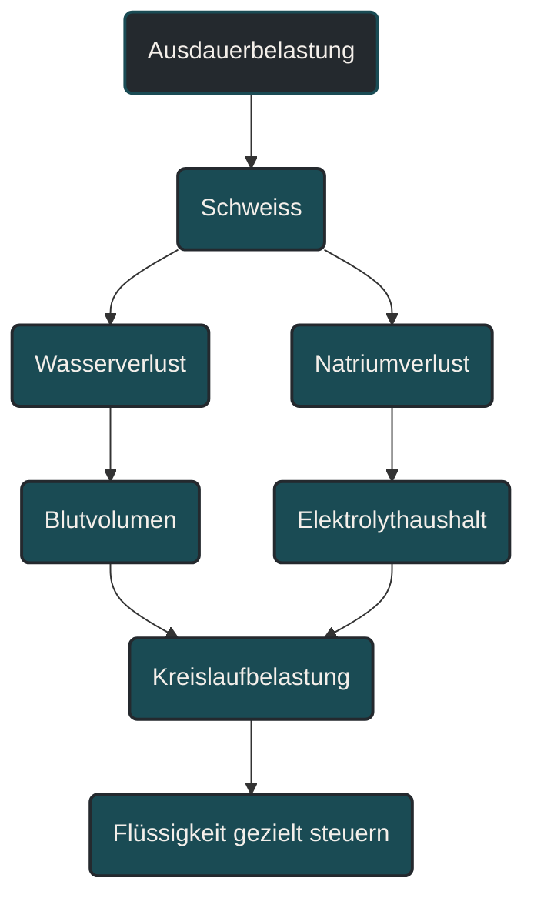
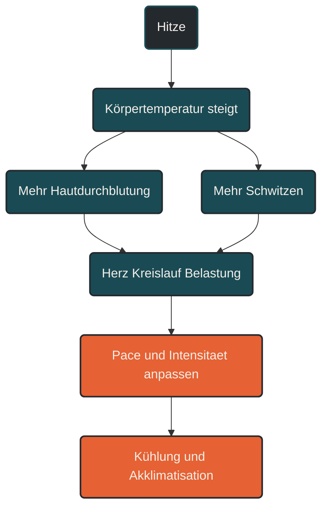

# Flüssigkeit, Elektrolyte und Hitze

Flüssigkeit, Elektrolyte und Hitze beeinflussen im Ausdauersport Kreislauf, Thermoregulation, Muskelfunktion, Belastungsempfinden und Leistungsfähigkeit. Beim Schwitzen verliert der Körper Wasser und Elektrolyte, vor allem Natrium. Entscheidend ist nicht, möglichst viel zu trinken, sondern Flüssigkeitszufuhr, Natrium, Belastungsdauer, Temperatur, Schweißrate und Verträglichkeit sinnvoll aufeinander abzustimmen.

## Was Flüssigkeit, Elektrolyte und Hitze bedeuten

Flüssigkeit ist im Körper wichtig für Blutvolumen, Temperaturregulation, Stoffwechselprozesse und den Transport von Nährstoffen. Beim Training steigt die Wärmeproduktion. Um diese Wärme abzugeben, produziert der Körper Schweiß.

Schweiß besteht nicht nur aus Wasser. Er enthält auch Elektrolyte wie Natrium, Kalium, Chlorid und kleinere Mengen weiterer Mineralstoffe. Für die Praxis ist Natrium besonders wichtig, weil es eng mit Flüssigkeitshaushalt, Blutvolumen und Schweißverlusten verbunden ist.

Hitze verändert die Belastung deutlich. Eine Pace, die bei kühlem Wetter locker wirkt, kann bei hohen Temperaturen deutlich anstrengender sein. Der Körper muss dann nicht nur Bewegung leisten, sondern zusätzlich Wärme abgeben.

## Warum Flüssigkeit im Ausdauersport wichtig ist

Während einer Belastung verliert der Körper Flüssigkeit über Schweiß und Atmung. Wenn diese Verluste zu groß werden, kann das Blutvolumen sinken. Das Herz-Kreislauf-System muss dann stärker arbeiten, um Muskulatur und Haut gleichzeitig zu versorgen.

Das kann sich durch höheren Puls, stärkeres Belastungsempfinden, sinkende Pace, Kopfschmerzen, Konzentrationsprobleme oder frühere Ermüdung zeigen. Diese Symptome sind aber unspezifisch und können auch andere Ursachen haben.

Wichtig ist: Leichter Flüssigkeitsverlust ist bei Ausdauerbelastungen normal. Problematisch wird es, wenn Verluste sehr hoch werden, die Hitze stark ist oder zu wenig Natrium und Energie verfügbar sind.

## Warum Elektrolyte wichtig sind

Elektrolyte unterstützen Flüssigkeitsverteilung, Nervenleitung, Muskelfunktion und Blutvolumen. Beim Schwitzen geht besonders Natrium verloren.

Wie viel Natrium jemand verliert, ist individuell sehr unterschiedlich. Manche Sportler haben eine hohe Schweißrate, andere verlieren besonders salzigen Schweiß. Sichtbare Salzränder auf Kleidung oder Haut können ein Hinweis sein, sind aber keine genaue Messung.

Elektrolyte werden vor allem bei langen Einheiten, Hitze, hoher Luftfeuchtigkeit, starker Schweißrate oder Wettkämpfen relevant. Für kurze lockere Läufe ist meist keine komplizierte Strategie nötig.

## Hitze und Thermoregulation

Bei Hitze muss der Körper mehr Energie in Kühlung investieren. Die Hautdurchblutung steigt, Schweißproduktion nimmt zu und das Herz-Kreislauf-System wird stärker belastet.

Das erklärt, warum die gleiche Geschwindigkeit bei Hitze schwerer fällt. Die Leistung sinkt nicht unbedingt, weil die Fitness schlechter ist, sondern weil die Umgebungsbedingungen den Körper zusätzlich fordern.

Hohe Luftfeuchtigkeit verschärft das Problem. Wenn Schweiß schlechter verdunstet, funktioniert die Kühlung schlechter. Dann kann die Körperkerntemperatur schneller steigen.

## Schweißrate und individuelle Unterschiede

Die Schweißrate beschreibt, wie viel Flüssigkeit jemand während einer Belastung verliert. Sie hängt von Temperatur, Luftfeuchtigkeit, Intensität, Trainingszustand, Körpergröße, Kleidung, Akklimatisation und individueller Veranlagung ab.

Deshalb gibt es keine perfekte Trinkmenge für alle. Zwei Läufer können bei derselben Einheit sehr unterschiedlich viel Flüssigkeit verlieren.

Für die Praxis ist sinnvoll, eigene Muster zu beobachten: Wie stark schwitze ich? Habe ich Salzränder? Wie verändert sich das Körpergewicht nach langen Läufen? Bekomme ich bei Hitze Kopfschmerzen, Magenprobleme oder Leistungseinbrüche? Solche Hinweise helfen, die Strategie besser einzuordnen.

## Trinken während des Trainings

Bei kurzen lockeren Einheiten ist Trinken während des Laufens oft nicht nötig, wenn vorher ausreichend getrunken wurde und keine starke Hitze besteht.

Bei längeren Einheiten, Hitze oder hoher Intensität wird Flüssigkeitszufuhr wichtiger. Dann kann ein geplanter Trinkrhythmus helfen, ohne den Magen zu überlasten.

Zu viel Trinken ist aber ebenfalls problematisch. Wenn sehr viel Wasser ohne ausreichend Natrium aufgenommen wird, kann der Natriumspiegel im Blut ungünstig verdünnt werden. Deshalb sollte Flüssigkeit nicht nach dem Motto „so viel wie möglich“ aufgenommen werden.

## Natrium und Elektrolytgetränke

Natrium kann bei langen oder heißen Belastungen helfen, Flüssigkeit besser zu halten und Schweißverluste auszugleichen. Besonders relevant wird das, wenn sehr lange gelaufen wird, die Schweißrate hoch ist oder der Schweiß sehr salzig ist.

Elektrolytgetränke sind dabei kein Muss für jede Einheit. Sie sind ein Werkzeug für bestimmte Bedingungen. Entscheidend ist, ob sie zur Dauer, Hitze, Schweißrate und Verträglichkeit passen.

Bei Wettkämpfen sollte die Elektrolytstrategie vorher im Training getestet werden. Magen-Darm-Probleme entstehen oft nicht durch einen einzelnen Faktor, sondern durch die Kombination aus Hitze, hoher Intensität, zu viel Flüssigkeit, zu viel Zucker oder ungewohnter Zusammensetzung.

## Kohlenhydrate, Flüssigkeit und Hitze

Bei längeren Einheiten überschneiden sich Flüssigkeits- und Energieversorgung. Sportgetränke können deshalb gleichzeitig Wasser, Natrium und Kohlenhydrate liefern.

Das kann praktisch sein, weil der Körper bei Hitze und langer Belastung nicht nur Flüssigkeit verliert, sondern auch Energie benötigt. Gleichzeitig kann eine zu hohe Konzentration im Getränk den Magen belasten.

Für die Praxis bedeutet das: Flüssigkeit, Elektrolyte und Kohlenhydrate sollten nicht isoliert geplant werden. Sie gehören bei langen oder intensiven Einheiten zusammen.

## Hitzeakklimatisation

Hitzeakklimatisation beschreibt die Anpassung des Körpers an Training bei warmen Bedingungen. Mit wiederholter kontrollierter Hitzeexposition kann der Körper unter anderem früher schwitzen, die Wärme besser abgeben und die Kreislaufbelastung etwas besser tolerieren.

Das heißt aber nicht, dass harte Einheiten bei Hitze automatisch sinnvoll sind. Akklimatisation sollte dosiert erfolgen. Gerade am Anfang sind Intensität und Umfang vorsichtig zu steuern.

Für viele Läufer ist es sinnvoller, bei Hitze Pace und Anspruch zu reduzieren, statt das geplante Tempo um jeden Preis zu erzwingen.

## Kühlung und Belastungssteuerung

Kühlung kann helfen, die Hitzebelastung zu senken. Dazu gehören Schatten, kühlere Tageszeiten, helle Kleidung, Kopfbedeckung, Wasser über Kopf und Nacken oder kühlere Getränke.

Noch wichtiger ist die Belastungssteuerung. Bei Hitze sollte die Einheit nach Belastungsempfinden, Herzfrequenz und äußeren Bedingungen eingeordnet werden. Pace allein ist dann weniger aussagekräftig.

Wenn der Puls ungewöhnlich hoch ist, die Beine schwer wirken oder die Belastung deutlich härter als geplant ist, kann es sinnvoll sein, Tempo, Dauer oder Ziel der Einheit anzupassen.

## Bedeutung für Läufer

Für Läufer ist das Thema besonders wichtig, weil Laufen eine hohe Wärmeproduktion erzeugt. Gleichzeitig gibt es weniger kühlenden Fahrtwind als beim Radfahren und die mechanische Belastung bleibt bestehen.

Bei langen Läufen, Tempodauerläufen, Wettkämpfen und Sommertraining sollten Flüssigkeit, Natrium und Hitze deshalb bewusst geplant werden. Das gilt besonders bei hoher Luftfeuchtigkeit, direkter Sonne oder ungewohnter Wärme.

Praktisch bedeutet das: Nicht jede Einheit braucht eine Trinkstrategie. Aber je länger, heißer und intensiver eine Einheit wird, desto wichtiger wird es, Flüssigkeit, Elektrolyte, Kohlenhydrate und Kühlung mitzudenken.

## Warnsignale

Starke Schwindelgefühle, Verwirrtheit, ungewöhnliche Koordinationsprobleme, Gänsehaut trotz Hitze, Erbrechen, starke Kopfschmerzen oder das Gefühl, die Belastung nicht mehr kontrollieren zu können, sollten ernst genommen werden.

Bei solchen Anzeichen sollte die Belastung beendet, Kühlung gesucht und bei Bedarf medizinische Hilfe geholt werden. Hitzeprobleme sind kein normales Trainingsziel.

## Häufige Fehler

Ein häufiger Fehler ist, Hitze nur als mentale Herausforderung zu sehen. Hohe Temperaturen verändern die physiologische Belastung real.

Ein zweiter Fehler ist, nur Wasser zu trinken und Natrium bei langen heißen Einheiten komplett zu ignorieren. Je nach Schweißrate und Dauer kann das problematisch werden.

Ein dritter Fehler ist, möglichst viel zu trinken. Zu viel Flüssigkeit kann ebenfalls gefährlich sein, besonders wenn sie nicht zur Natriumzufuhr passt.

Ein vierter Fehler ist, Pace-Vorgaben bei Hitze unverändert durchzuziehen. Bei hohen Temperaturen sollte die Belastung angepasst werden.

Ein fünfter Fehler ist, neue Getränke, Gels oder Elektrolytmischungen erstmals im Wettkampf zu testen. Verträglichkeit gehört ins Training.

## Praktische Einordnung

Flüssigkeit, Elektrolyte und Hitze sind im Ausdauersport Teil der Belastungssteuerung. Sie entscheiden mit darüber, wie stabil Kreislauf, Temperaturregulation, Magen, Muskelfunktion und Leistungsfähigkeit bleiben.

Die Grundlage ist eine alltagstaugliche Flüssigkeitsversorgung. Bei längeren oder heißen Einheiten kommen individuelle Schweißrate, Natriumverluste, Kohlenhydrate und Kühlung dazu.

Der wichtigste Merksatz lautet: Bei Hitze zählt nicht die geplante Pace, sondern die reale Belastung des Körpers.

----

----

# Flüssigkeit, Elektrolyte und Hitze

*Hinweis: Dieser Artikel dient der allgemeinen Information und ersetzt keine medizinische, therapeutische oder ernährungsbezogene Beratung. Mehr dazu im [**Gesundheits- und Quellenhinweis**](/ausdauersport/disclaimer/).*

