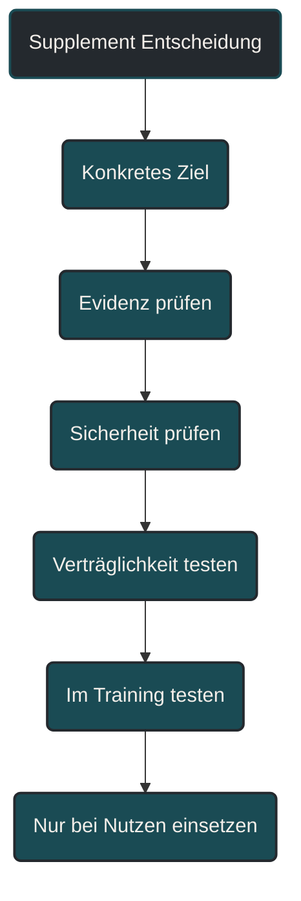
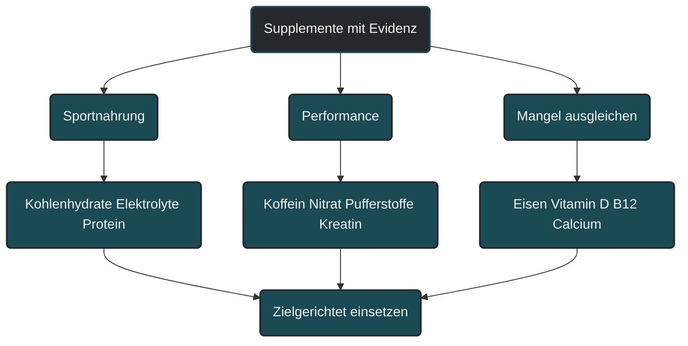

# Supplemente mit Evidenz

Supplemente mit Evidenz sind Produkte oder Substanzen, deren Nutzen für bestimmte Situationen im Sport wissenschaftlich besser belegt ist als bei vielen frei beworbenen Präparaten. Im Ausdauersport betrifft das vor allem Kohlenhydrate, Elektrolyte, Koffein, Nitrat, bestimmte Pufferstoffe, Protein bei Bedarf und einzelne Mikronährstoffe bei nachgewiesenem Mangel. Entscheidend ist aber: Ein Supplement wirkt nur dann sinnvoll, wenn Ernährung, Training, Regeneration, Sicherheit und Zielsetzung zusammenpassen.

## Was Supplemente mit Evidenz bedeuten

Supplemente sind Ergänzungen zur normalen Ernährung. Sie können Nährstoffe liefern, die Versorgung erleichtern oder in bestimmten Situationen die Leistung unterstützen.

„Mit Evidenz“ bedeutet nicht, dass ein Supplement immer wirkt. Es bedeutet, dass es für bestimmte Einsatzbereiche, Dosierungen, Zielgruppen oder Belastungsformen wissenschaftliche Hinweise auf Nutzen gibt.

Im Sport ist diese Unterscheidung wichtig, weil sehr viele Produkte mit großen Versprechen verkauft werden. Nicht jedes Produkt, das sportlich klingt, verbessert auch Training, Regeneration oder Leistung.

## Warum Supplemente im Ausdauersport kritisch eingeordnet werden müssen

Ausdauersportler haben oft einen hohen Energie- und Nährstoffbedarf. Lange Läufe, hohe Wochenumfänge, Hitze, Wettkämpfe und intensive Trainingsphasen können Situationen erzeugen, in denen gezielte Ergänzungen praktisch sein können.

Trotzdem sollte die Reihenfolge klar bleiben. Zuerst kommen Training, Energieverfügbarkeit, Kohlenhydrate, Protein, Fette, Flüssigkeit, Schlaf und Belastungssteuerung. Erst danach sollte ein Supplement als Zusatz betrachtet werden.

Ein Supplement kann eine gute Basis ergänzen. Es kann aber keine schlechte Trainingsplanung, zu wenig Schlaf, zu wenig Energie oder dauerhaft zu hohe Belastung ausgleichen.

## Kategorien sinnvoller Supplemente

### Sportnahrung

Sportnahrung umfasst Produkte wie Sportgetränke, Gels, Riegel oder Kohlenhydratmischungen. Sie sind keine magischen Leistungsbooster, sondern praktische Werkzeuge.

Ihr Nutzen liegt vor allem darin, Energie und Flüssigkeit während langer oder intensiver Belastungen einfacher verfügbar zu machen. Besonders bei langen Läufen, Wettkämpfen, Hitze oder mehreren Einheiten innerhalb kurzer Zeit kann das relevant sein.

Für kurze lockere Einheiten ist Sportnahrung meist nicht notwendig. Für lange oder wettkampforientierte Belastungen kann sie aber helfen, Ermüdung hinauszuzögern und die geplante Intensität stabiler zu halten.

### Elektrolyte

Elektrolyte wie Natrium sind besonders bei langen Einheiten, Hitze und hoher Schweißrate relevant. Sie unterstützen den Flüssigkeitshaushalt und können helfen, größere Verluste besser auszugleichen.

Das bedeutet nicht, dass jede Einheit ein Elektrolytgetränk braucht. Entscheidend sind Dauer, Temperatur, Schweißrate, individuelle Verträglichkeit und Ziel der Einheit.

Bei sehr langen Belastungen ist Flüssigkeit allein nicht immer ausreichend. Gleichzeitig ist auch zu viel Flüssigkeit problematisch. Deshalb sollte die Strategie zur Belastung passen.

### Koffein

Koffein gehört zu den am besten untersuchten leistungsbezogenen Supplementen. Es kann Wachheit, subjektive Belastungswahrnehmung und Leistungsfähigkeit bei bestimmten Ausdauerbelastungen beeinflussen.

Im Ausdauersport ist Koffein vor allem vor oder während wettkampfnaher Belastungen interessant. Die Wirkung ist individuell unterschiedlich. Manche Sportler profitieren, andere reagieren mit Nervosität, Magenproblemen, erhöhtem Puls oder schlechtem Schlaf.

Koffein sollte deshalb im Training getestet werden und nicht erstmals im Wettkampf eingesetzt werden.

### Nitrat

Nitrat wird häufig über Rote-Bete-Saft oder Nitratkonzentrate diskutiert. Es kann über Stickstoffmonoxid-Stoffwechselwege mit Durchblutung, Sauerstoffnutzung und Belastungsökonomie zusammenhängen.

Der mögliche Nutzen hängt von Belastungsform, Trainingszustand, Ernährung und individueller Reaktion ab. Besonders interessant ist Nitrat eher bei bestimmten intensiven oder mittellangen Belastungen, nicht als allgemeiner Garant für bessere Ausdauer.

Auch hier gilt: testen, vertragen, einordnen. Nicht jedes Supplement passt zu jedem Athleten.

### Pufferstoffe

Pufferstoffe wie Natriumbicarbonat werden vor allem bei Belastungen diskutiert, bei denen eine starke Übersäuerungs- beziehungsweise H-Ionen-Belastung entsteht. Das betrifft eher intensive Belastungen als sehr lockere Grundlageneinheiten.

Im Ausdauersport kann das bei kurzen bis mittleren intensiven Wettkämpfen, Intervallen oder wiederholten hochintensiven Abschnitten relevant sein.

Der praktische Nachteil ist die Verträglichkeit. Magen-Darm-Beschwerden sind möglich. Deshalb ist eine ungetestete Anwendung im Wettkampf keine gute Idee.

### Kreatin

Kreatin wird oft mit Kraftsport verbunden, kann aber auch für Ausdauersportler in bestimmten Kontexten interessant sein. Relevant ist es vor allem dort, wo Kraft, Sprints, wiederholte kurze intensive Abschnitte, Krafttraining oder Verletzungsprävention eine Rolle spielen.

Für klassische lange Ausdauerbelastungen ist Kreatin kein direkter Ersatz für Kohlenhydrate, Trainingsumfang oder Ausdauertraining. Es kann aber im Gesamttraining sinnvoll sein, wenn Krafttraining, Sprintanteile oder muskuläre Belastbarkeit eine Rolle spielen.

Eine mögliche Gewichtszunahme durch Wassereinlagerung sollte im Laufsport mitbedacht werden.

### Protein

Proteinpräparate sind keine Pflicht, können aber praktisch sein, wenn der Bedarf über normale Mahlzeiten schwer zu decken ist. Das betrifft zum Beispiel hohe Trainingsumfänge, wenig Zeit, Krafttraining, ältere Sportler oder Phasen mit erhöhter Regenerationsanforderung.

Proteinshakes sind dabei kein Sonderweg. Sie liefern nur Eiweiß in praktischer Form. Ob sie sinnvoll sind, hängt davon ab, ob die normale Ernährung ausreichend Protein liefert.

Protein ersetzt keine Kohlenhydrate nach harten Einheiten und keine ausreichende Gesamtenergiezufuhr.

### Mikronährstoffe bei Mangel

Mikronährstoffe wie Eisen, Vitamin D, Vitamin B12 oder Calcium können im Ausdauersport relevant sein. Besonders wichtig ist aber: Eine Supplementierung ist vor allem dann sinnvoll, wenn ein Bedarf, Risiko oder Mangel besteht.

Eine pauschale Einnahme vieler Mikronährstoffe ist nicht automatisch besser. Manche Stoffe können bei zu hoher Zufuhr problematisch werden.

Bei Müdigkeit, Leistungsabfall, Stressfrakturen, veganer Ernährung oder wiederkehrenden Infekten kann eine gezielte Abklärung sinnvoll sein. Das sollte nicht nur nach Gefühl entschieden werden.

## Was keine gute Evidenz ersetzt

Supplemente können keine Trainingsgrundlagen ersetzen. Ein Läufer wird nicht durch ein Produkt belastbarer, wenn Umfang, Intensität, Erholung und Energiezufuhr nicht zusammenpassen.

Auch eine schwache Alltagsernährung wird nicht automatisch gut, nur weil einzelne Präparate ergänzt werden. Entscheidend bleibt die Basis: ausreichend Energie, passende Kohlenhydrate, genug Protein, hochwertige Fette, Flüssigkeit, Mikronährstoffe, Schlaf und ein sinnvoller Trainingsaufbau.

Supplemente sind deshalb eher die letzte Ebene der Optimierung, nicht die erste.

## Sicherheit und Anti-Doping

Auch für Freizeitsportler ist Sicherheit wichtig. Supplemente können verunreinigt sein, falsch dosiert sein oder Inhaltsstoffe enthalten, die nicht klar deklariert sind.

Für Wettkampfsportler kommt das Anti-Doping-Risiko hinzu. Nicht jedes frei verkäufliche Produkt ist automatisch unproblematisch. Besonders kritisch sind Produkte mit aggressiven Leistungsversprechen, Fettverbrenner, Muskelaufbaupräparate, Pre-Workout-Produkte und Mischpräparate mit sehr langen Zutatenlisten.

Wer an offiziellen Wettkämpfen teilnimmt, sollte nur geprüfte Produkte verwenden und die aktuelle Verbotsliste sowie sportartspezifische Regeln beachten.

## Bedeutung für Läufer

Für Läufer sind Supplemente vor allem in vier Situationen relevant: lange Belastungen, intensive Einheiten, Regeneration und nachgewiesene Mängel.

Bei langen Läufen oder Wettkämpfen können Kohlenhydrate, Flüssigkeit und Natrium praktisch wichtig sein. Bei intensiven Belastungen können Koffein, Nitrat oder Pufferstoffe je nach Situation interessant sein. Bei Regeneration kann Protein helfen, wenn die normale Ernährung nicht reicht. Bei Mangelzuständen können gezielte Mikronährstoffe wichtig sein.

Trotzdem bleibt die wichtigste Frage: Welches konkrete Problem soll das Supplement lösen? Wenn diese Frage nicht klar beantwortet werden kann, ist der Nutzen meist unsicher.

## Häufige Fehler

Ein häufiger Fehler ist, Supplemente als Abkürzung zu betrachten. Sie können Training nicht ersetzen, sondern höchstens unterstützen.

Ein zweiter Fehler ist, viele Produkte gleichzeitig zu nutzen. Dadurch wird unklar, was wirkt, was unverträglich ist und was unnötig ist.

Ein dritter Fehler ist, Supplemente ohne konkretes Ziel einzunehmen. „Für mehr Leistung“ ist zu ungenau. Besser ist: Energie während langer Läufe, Koffein für Wettkampfbelastung, Protein für Regeneration oder Eisen bei abgeklärtem Mangel.

Ein vierter Fehler ist, Sicherheit zu unterschätzen. Frei verkäuflich bedeutet nicht automatisch sinnvoll, wirksam oder risikofrei.

## Praktische Einordnung

Supplemente mit Evidenz sollten im Ausdauersport nüchtern betrachtet werden. Einige können in bestimmten Situationen sinnvoll sein. Viele sind unnötig. Manche sind riskant.

Die beste Reihenfolge lautet: zuerst Ernährung und Training stabil aufbauen, dann konkrete Probleme erkennen, dann ein passendes Supplement gezielt testen und erst danach dauerhaft einsetzen.

Der wichtigste Merksatz lautet: Ein gutes Supplement beantwortet eine konkrete Frage. Ohne klares Ziel bleibt es meistens nur ein teures Versprechen.

----

----

## Häufige Fragen zu Supplementen mit Evidenz

### Was sind Supplemente mit Evidenz?

Supplemente mit Evidenz sind Ergänzungen, für die es in bestimmten Situationen wissenschaftliche Hinweise auf Nutzen gibt. Das bedeutet aber nicht, dass sie immer oder bei jedem Sportler wirken.

### Welche Supplemente sind im Ausdauersport besonders relevant?

Häufig relevant sind Kohlenhydrate, Elektrolyte, Koffein, Nitrat, bestimmte Pufferstoffe, Protein bei Bedarf und einzelne Mikronährstoffe bei nachgewiesenem Mangel.

### Sind Supplemente notwendig?

Nein. Viele Ausdauersportler können sehr gut ohne viele Supplemente trainieren. Sinnvoll werden sie vor allem, wenn ein konkretes Ziel oder ein konkreter Bedarf besteht.

### Macht Koffein schneller?

Koffein kann bei bestimmten Belastungen die Leistungsfähigkeit oder Belastungswahrnehmung verbessern. Die Reaktion ist aber individuell unterschiedlich und sollte im Training getestet werden.

### Sind natürliche Supplemente automatisch sicher?

Nein. Natürlich bedeutet nicht automatisch wirksam oder risikofrei. Auch natürliche Produkte können unverträglich sein, falsch dosiert werden oder problematische Inhaltsstoffe enthalten.

### Was ist ein häufiger Fehler bei Supplementen?

Ein häufiger Fehler ist, Supplemente ohne klares Ziel einzunehmen. Sinnvoller ist es, zuerst Ernährung, Training und Regeneration zu prüfen und dann gezielt zu entscheiden.

----

*Hinweis: Dieser Artikel dient der allgemeinen Information und ersetzt keine medizinische oder therapeutische Beratung. Mehr dazu im [**Gesundheits- und Quellenhinweis**](/ausdauersport/disclaimer/).*

