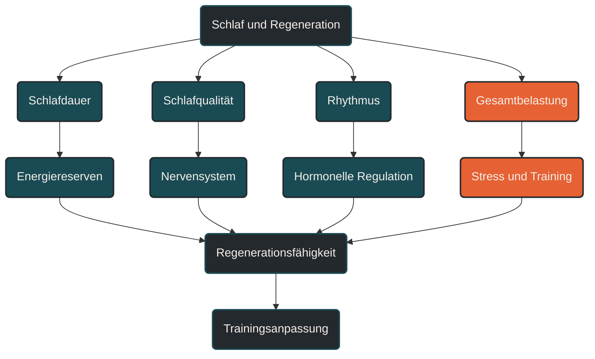

# Schlaf und Regenerationsfähigkeit

Schlaf und Regenerationsfähigkeit beschreiben, wie gut der Körper nach Training, Alltag und mentaler Belastung wieder in einen belastbaren Zustand zurückkehrt. Im Ausdauertraining ist Schlaf wichtig, weil viele Anpassungsprozesse nicht während der Einheit, sondern in der Erholung entstehen. Entscheidend ist nicht nur die Schlafdauer, sondern auch Regelmäßigkeit, Schlafqualität und die gesamte Belastung des Tages.

## Was Schlaf und Regenerationsfähigkeit bedeutet

Schlaf ist kein passiver Zustand. Während des Schlafs laufen Prozesse ab, die für Gehirn, Nervensystem, Hormonregulation, Immunsystem, Gewebereparatur und Stoffwechsel wichtig sind. Für Ausdauersportler bedeutet das: Schlaf beeinflusst nicht nur, ob man sich müde fühlt, sondern auch, wie gut Training verarbeitet wird.

Regenerationsfähigkeit beschreibt die Fähigkeit, nach einer Belastung wieder leistungsbereit zu werden. Dazu gehören muskuläre Erholung, Wiederauffüllung von Energiereserven, mentale Frische, vegetative Balance und die Fähigkeit, den nächsten Trainingsreiz sinnvoll zu beantworten.

Schlaf ist dabei einer der wichtigsten, aber nicht der einzige Faktor. Ernährung, Trainingssteuerung, Stress, Krankheit, Arbeitsbelastung, soziale Verpflichtungen und individuelle Lebensumstände bestimmen mit, wie gut Erholung tatsächlich gelingt.

## Warum Schlaf im Ausdauertraining wichtig ist

Ausdauertraining setzt Reize. Diese Reize können das Herz-Kreislauf-System, die Muskulatur, Sehnen, Knochen, das Nervensystem und das Immunsystem beanspruchen. Damit daraus Anpassung entsteht, braucht der Körper ausreichend Zeit und Bedingungen, um diese Belastung zu verarbeiten.

Schlafmangel kann dazu führen, dass Belastung subjektiv härter empfunden wird, Konzentration und Koordination nachlassen und die Bereitschaft für intensive Einheiten sinkt. Gerade bei hohen Trainingsumfängen kann schlechter Schlaf deshalb ein Warnsignal sein: Nicht zwingend, weil eine einzelne Nacht alles zerstört, sondern weil wiederholt zu wenig Erholung die Belastbarkeit reduziert.

Für Läufer ist das besonders relevant. Lauftraining verbindet metabolische Belastung mit mechanischer Stoßbelastung. Wenn Schlaf, Energiezufuhr und Trainingsdosierung nicht zusammenpassen, steigt das Risiko, dass aus sinnvoller Belastung chronische Ermüdung wird.

## Wie Schlaf im Körper wirkt

Schlaf unterstützt mehrere Ebenen der Regeneration. Die wichtigsten Ebenen sind körperliche Reparatur, neuronale Erholung, Stoffwechselregulation und psychische Belastungsverarbeitung.

### Körperliche Reparatur

Während der Erholung werden belastete Strukturen repariert und angepasst. Dazu gehören Muskelfasern, Bindegewebe, Sehnen, Knochen und andere Gewebe. Schlaf schafft dafür günstige Bedingungen, weil der Körper nicht gleichzeitig hohe äußere Leistung erbringen muss.

Das bedeutet nicht, dass Schlaf allein Anpassung erzeugt. Training, Ernährung und Belastungssteuerung bleiben die Grundlage. Schlaf entscheidet aber mit darüber, ob diese Reize gut verarbeitet werden.

### Nervensystem und mentale Frische

Ausdauertraining fordert nicht nur Muskeln und Herz-Kreislauf-System, sondern auch das Nervensystem. Konzentration, Koordination, Tempogefühl, Motivation und Schmerzverarbeitung hängen stark davon ab, wie erholt das zentrale Nervensystem ist.

Zu wenig Schlaf kann dazu führen, dass sich ein normales Tempo ungewöhnlich hart anfühlt. Auch Entscheidungen im Training werden schlechter: Man startet zu hart, ignoriert Warnsignale oder bewertet Müdigkeit falsch.

### Stoffwechsel und Energieverfügbarkeit

Schlaf beeinflusst auch Stoffwechselprozesse. Für Ausdauersportler ist das wichtig, weil Training häufig mit Energiereserven, Glykogenverfügbarkeit, Hunger, Appetit und hormoneller Regulation zusammenhängt.

Wenn Schlaf dauerhaft schlecht ist, kann es schwieriger werden, Belastung, Ernährung und Erholung sinnvoll auszubalancieren. Besonders problematisch ist die Kombination aus hoher Trainingslast, Alltagsstress, unzureichender Energiezufuhr und schlechtem Schlaf.

### Immunsystem und Entzündungsregulation

Training löst kurzfristig Entzündungs- und Reparaturprozesse aus. Das ist nicht automatisch schlecht, sondern ein normaler Teil der Anpassung. Schlaf hilft dabei, diese Prozesse zu regulieren.

Wenn Schlaf dauerhaft zu kurz oder stark gestört ist, kann die Balance zwischen Belastung und Erholung kippen. Dann fühlt sich Training nicht mehr aufbauend an, sondern zunehmend zehrend.

## Zentrale Einflussfaktoren

### Schlafdauer

Die Schlafdauer ist die offensichtlichste Größe. Viele Erwachsene kommen mit ungefähr sieben bis neun Stunden Schlaf zurecht, Athleten können in intensiven Trainingsphasen aber mehr Schlaf benötigen. Entscheidend ist nicht eine starre Zahl, sondern ob Schlafdauer und Belastung zusammenpassen.

Ein hilfreiches Zeichen ist, ob man über mehrere Tage ohne Wecker ähnlich lange schlafen würde wie geplant. Wenn der Körper am Wochenende deutlich länger schläft oder tagsüber regelmäßig müde ist, kann das ein Hinweis auf Schlafdefizit sein.

### Schlafqualität

Schlafqualität beschreibt, wie erholsam der Schlaf ist. Häufiges Aufwachen, lange Einschlafzeit, unruhiger Schlaf oder frühes Erwachen können die Erholung beeinträchtigen, auch wenn die Zeit im Bett ausreichend wirkt.

Für Sportler ist das wichtig, weil eine lange Bettzeit nicht automatisch gute Regeneration bedeutet. Entscheidend ist, ob der Schlaf tatsächlich stabil und erholsam ist.

### Regelmäßigkeit

Ein regelmäßiger Schlaf-Wach-Rhythmus unterstützt die innere Uhr. Wer ständig zu sehr unterschiedlichen Zeiten schläft, kann trotz ausreichender Gesamtdauer schlechter regenerieren.

Im Ausdauersport ist das besonders relevant bei frühen Einheiten, späten intensiven Trainings, Wettkämpfen, Reisen oder Schichtarbeit. Hier kann nicht immer alles perfekt sein, aber Regelmäßigkeit bleibt ein wichtiger Orientierungsanker.

### Trainingszeitpunkt

Intensives Training am späten Abend kann bei manchen Menschen das Einschlafen erschweren. Das liegt nicht nur an Aktivierung, sondern auch an Körpertemperatur, Stresshormonen, mentaler Erregung und spätem Essen.

Das bedeutet nicht, dass Abendtraining grundsätzlich schlecht ist. Entscheidend ist die individuelle Reaktion. Wer nach späten Intervallen regelmäßig schlecht schläft, sollte Intensität, Uhrzeit oder anschließende Abendroutine prüfen.

### Alltagsstress

Regeneration endet nicht mit dem letzten Trainingskilometer. Beruf, Familie, mentale Belastung, Bildschirmzeit, Sorgen und organisatorischer Druck zählen zur Gesamtbelastung.

Deshalb kann ein Trainingsplan auf dem Papier sinnvoll aussehen und trotzdem nicht funktionieren, wenn der Alltag dauerhaft sehr fordernd ist. Schlaf ist oft der Punkt, an dem diese Gesamtbelastung sichtbar wird.

## Bedeutung für Läufer

Für Läufer ist Schlaf besonders wichtig, weil Lauftraining eine doppelte Belastung erzeugt: eine energetische und eine mechanische. Lange Läufe, Intervalle, Bergläufe und hohe Wochenumfänge beanspruchen nicht nur Herz und Stoffwechsel, sondern auch Muskeln, Sehnen, Knochen und Gelenke.

Guter Schlaf hilft, diese Belastung besser zu verarbeiten. Schlechter Schlaf bedeutet dagegen nicht automatisch, dass man gar nicht trainieren darf. Aber er sollte die Trainingsentscheidung beeinflussen.

Nach einer schlechten Nacht kann ein lockerer Dauerlauf oft sinnvoller sein als eine harte Einheit. Nach mehreren schlechten Nächten in Folge sollte man besonders vorsichtig sein, wenn zusätzlich Muskelkater, erhöhte Reizbarkeit, ungewöhnlich hohe Ruheherzfrequenz, sinkende Motivation oder anhaltende Müdigkeit auftreten.

## Häufige Fehler

Ein häufiger Fehler ist, Schlaf als weichen Faktor zu unterschätzen. Viele Sportler optimieren Schuhe, Uhr, Pace, Ernährung und Trainingszonen, behandeln Schlaf aber wie etwas Nebensächliches.

Ein zweiter Fehler ist, einzelne Nächte zu überbewerten. Eine schlechte Nacht vor einem Wettkampf ist unangenehm, aber nicht automatisch entscheidend. Problematischer ist ein wiederholtes Schlafdefizit über Wochen.

Ein dritter Fehler ist, Regeneration nur über Maßnahmen zu steuern. Kältebad, Massage, Blackroll oder Supplements können einzelne Effekte haben, ersetzen aber keinen ausreichenden Schlaf und keine passende Belastungssteuerung.

Ein vierter Fehler ist, Müdigkeit immer mit fehlender Disziplin zu verwechseln. Manchmal ist Müdigkeit kein Motivationsproblem, sondern ein biologisches Signal, dass die Gesamtbelastung zu hoch ist.

## Praktische Einordnung

Schlaf sollte im Ausdauertraining wie ein Teil der Trainingssteuerung betrachtet werden. Nicht als perfektionistisches Ziel, sondern als wichtiger Marker für Belastbarkeit.

Praktisch sinnvoll ist es, Schlafdauer, Schlafqualität, Tagesmüdigkeit, Stimmung und Trainingsgefühl gemeinsam zu beobachten. Einzelne Messwerte aus Uhr oder App können Hinweise geben, sollten aber nicht allein entscheiden. Das subjektive Gefühl bleibt wichtig.

Wer regelmäßig schlecht schläft, sollte zuerst die großen Stellschrauben prüfen: Trainingslast, späte intensive Einheiten, Koffein, Alkohol, Bildschirmzeit, Abendroutine, Stress und Energiezufuhr. Bei anhaltenden Schlafproblemen, starker Tagesmüdigkeit, Atemaussetzern, ungewöhnlicher Erschöpfung oder gesundheitlichen Beschwerden sollte medizinisch abgeklärt werden, ob eine Schlafstörung oder ein anderes Problem vorliegt.

Der wichtigste Merksatz lautet: Schlaf ist keine Belohnung nach hartem Training, sondern eine Voraussetzung dafür, dass Training überhaupt wirksam verarbeitet werden kann.

----

----

## Häufige Fragen zu Schlaf und Regenerationsfähigkeit

### Was ist Schlaf und Regenerationsfähigkeit einfach erklärt?

Schlaf und Regenerationsfähigkeit beschreiben, wie gut der Körper nach Training und Alltag wieder belastbar wird. Schlaf unterstützt dabei Reparatur, Nervensystem, Stoffwechsel und mentale Erholung.

### Warum ist Schlaf im Ausdauertraining wichtig?

Ausdauertraining setzt Belastungsreize, die erst in der Erholung verarbeitet werden. Schlaf hilft dem Körper, diese Reize besser zu integrieren und wieder leistungsbereit zu werden.

### Wie viele Stunden Schlaf brauchen Ausdauersportler?

Viele Erwachsene liegen ungefähr im Bereich von sieben bis neun Stunden. Bei hoher Trainingslast, viel Stress oder intensiven Trainingsphasen kann der individuelle Bedarf höher sein.

### Ist eine schlechte Nacht vor dem Wettkampf schlimm?

Eine einzelne schlechte Nacht ist meist weniger problematisch als ein längerfristiges Schlafdefizit. Entscheidend ist die Schlaf- und Erholungslage über mehrere Tage und Wochen.

### Sollte man nach schlechtem Schlaf hart trainieren?

Das hängt vom Gesamtbild ab. Nach einer einzelnen schlechten Nacht kann lockeres Training möglich sein. Bei mehreren schlechten Nächten, starker Müdigkeit oder zusätzlichen Warnzeichen ist eine Anpassung der Einheit oft sinnvoller.

### Können Nickerchen die Regeneration unterstützen?

Kurze Nickerchen können helfen, Müdigkeit zu reduzieren und Schlafdefizite etwas abzufedern. Sie ersetzen aber keinen dauerhaft ausreichenden Nachtschlaf.

### Woran erkennt man, dass Schlaf die Regeneration begrenzt?

Hinweise können anhaltende Müdigkeit, schlechte Stimmung, ungewöhnlich schwere Beine, sinkende Motivation, erhöhte Reizbarkeit, schlechtere Trainingsqualität oder häufiges Krankheitsgefühl sein.

----

*Hinweis: Dieser Artikel dient der allgemeinen Information und ersetzt keine medizinische oder therapeutische Beratung. Mehr dazu im [**Gesundheits- und Quellenhinweis**](/ausdauersport/disclaimer/).*

