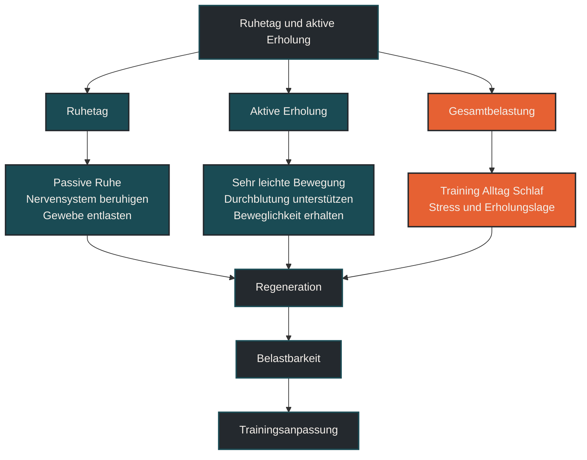

# Ruhetag und aktive Erholung

Ruhetag und aktive Erholung beschreiben zwei unterschiedliche Wege, Belastung zu verarbeiten. Ein Ruhetag bedeutet, bewusst keinen Trainingsreiz zu setzen. Aktive Erholung nutzt sehr leichte Bewegung, um Durchblutung, Beweglichkeit und subjektives Wohlbefinden zu unterstützen. Entscheidend ist, dass Erholung nicht als Trainingsausfall verstanden wird, sondern als Teil der Anpassung. [[1]](#quelle-1) [[2]](#quelle-2)

## Was Ruhetag und aktive Erholung bedeutet

Ein Ruhetag ist ein geplanter Tag ohne Training. Er gibt Körper und Kopf die Möglichkeit, Belastung zu verarbeiten, Energiereserven aufzufüllen und das Nervensystem zu beruhigen. Für Ausdauersportler ist das besonders wichtig, weil Fortschritt nicht nur durch Belastung entsteht, sondern durch das Wechselspiel aus Reiz und Erholung. [[1]](#quelle-1) [[2]](#quelle-2)

Aktive Erholung bedeutet dagegen nicht völlige Ruhe, sondern sehr leichte Bewegung. Das kann ein Spaziergang, lockeres Radfahren, entspanntes Schwimmen, Mobilität oder sehr ruhiges Bewegen ohne Leistungsziel sein. Entscheidend ist, dass aktive Erholung nicht heimlich zur zusätzlichen Trainingseinheit wird. [[1]](#quelle-1) [[2]](#quelle-2)

Der Unterschied liegt also nicht nur in der Bewegung, sondern in der Absicht. Ein Ruhetag soll entlasten. Aktive Erholung soll ebenfalls entlasten, aber mit leichter Bewegung statt vollständiger Pause. [[1]](#quelle-1) [[2]](#quelle-2)

## Warum Ruhetage wichtig sind

Training erzeugt Ermüdung. Diese Ermüdung kann muskulär, metabolisch, orthopädisch, hormonell, immunologisch oder mental sein. Wenn auf jeden Reiz sofort der nächste Reiz folgt, kann der Körper die Belastung nicht vollständig verarbeiten. [[1]](#quelle-1) [[5]](#quelle-5) [[6]](#quelle-6)

Ruhetage helfen, diese Belastung zu begrenzen. Sie geben Strukturen wie Muskeln, Sehnen, Knochen und Gelenken Zeit, sich an Training anzupassen. Gleichzeitig reduzieren sie die Gefahr, dass sich Müdigkeit über Tage und Wochen unbemerkt aufbaut. [[1]](#quelle-1) [[2]](#quelle-2) [[5]](#quelle-5) [[6]](#quelle-6)

Für viele Ausdauersportler ist der Ruhetag mental schwieriger als körperlich. Wer gerne trainiert, empfindet Pause schnell als Rückschritt. In Wirklichkeit ist ein sinnvoll gesetzter Ruhetag oft genau das, was den nächsten Trainingsreiz wieder wirksam macht. [[1]](#quelle-1) [[2]](#quelle-2)

## Wie aktive Erholung wirkt

Aktive Erholung nutzt Bewegung mit sehr geringer Intensität. Sie soll den Körper nicht zusätzlich fordern, sondern den Übergang aus Belastung in Erholung erleichtern. [[1]](#quelle-1) [[2]](#quelle-2)

Leichte Bewegung kann helfen, steife Muskulatur zu lockern, den Kreislauf sanft zu aktivieren und ein besseres Körpergefühl herzustellen. Sie kann auch mental entlastend wirken, weil man sich bewegt, ohne sich unter Trainingsdruck zu setzen. [[1]](#quelle-1) [[2]](#quelle-2)

Wichtig ist: Aktive Erholung ist nur dann Erholung, wenn sie wirklich leicht bleibt. Sobald Pace, Puls, Watt, Höhenmeter oder Trainingsumfang wieder wichtig werden, verschiebt sich die Einheit in Richtung zusätzlicher Belastung. [[1]](#quelle-1) [[2]](#quelle-2)

## Ruhetag oder aktive Erholung?

Ob ein vollständiger Ruhetag oder aktive Erholung sinnvoller ist, hängt von der Art der Ermüdung ab. [[1]](#quelle-1) [[2]](#quelle-2) [[5]](#quelle-5) [[6]](#quelle-6)

Nach sehr harten Intervallen, langen Läufen, Wettkämpfen, Schlafmangel oder hoher Alltagsbelastung kann vollständige Ruhe sinnvoll sein. Der Körper braucht dann nicht noch einen weiteren Reiz, sondern Entlastung. [[1]](#quelle-1)

Nach moderater Belastung oder an Tagen mit leichter muskulärer Steifigkeit kann aktive Erholung hilfreich sein. Dann geht es nicht um Trainingseffekt, sondern um lockere Bewegung und subjektive Erleichterung. [[1]](#quelle-1) [[2]](#quelle-2)

Ein einfaches Prinzip lautet: Wenn aktive Erholung danach frischer macht, passt sie. Wenn sie zusätzlich müde macht, war sie zu viel. [[1]](#quelle-1) [[2]](#quelle-2)

## Zentrale Einflussfaktoren

### Trainingsbelastung

Je höher Umfang und Intensität sind, desto wichtiger werden geplante Erholungsphasen. Besonders intensive Einheiten, lange Läufe und ungewohnte Belastungen erzeugen mehr Ermüdung als lockere Routineeinheiten. [[1]](#quelle-1) [[2]](#quelle-2) [[5]](#quelle-5) [[6]](#quelle-6)

Ruhetage sollten daher nicht zufällig entstehen, sondern zur Trainingswoche passen. Nach Belastungsschwerpunkten ist Erholung meist wertvoller als noch eine weitere Einheit. [[1]](#quelle-1) [[2]](#quelle-2)

### Schlaf und Alltag

Ein Trainingsplan betrachtet oft nur Sport. Der Körper zählt aber auch Beruf, Familie, Stress, Schlafmangel und mentale Belastung zur Gesamtlast. [[1]](#quelle-1)

Wenn der Alltag sehr fordernd ist, kann ein Ruhetag wichtiger sein als auf dem Papier geplant. Umgekehrt kann aktive Erholung an stressigen Tagen hilfreich sein, wenn sie wirklich entspannend bleibt. [[1]](#quelle-1) [[2]](#quelle-2)

### Muskelkater und Gewebebelastung

Muskelkater ist ein Zeichen dafür, dass Gewebe stärker oder ungewohnt belastet wurde. Leichte Bewegung kann sich angenehm anfühlen, sollte aber nicht mit hartem Training verwechselt werden. [[1]](#quelle-1) [[2]](#quelle-2)

Bei deutlichem Muskelkater, Schmerzen, veränderter Lauftechnik oder einseitigen Beschwerden ist vollständige Entlastung oft sinnvoller als aktive Erholung. [[1]](#quelle-1) [[2]](#quelle-2)

### Trainingsziel

In Aufbauphasen kann aktive Erholung helfen, Bewegung im Alltag zu erhalten, ohne die Trainingslast stark zu erhöhen. In intensiven Phasen, nach Wettkämpfen oder bei hoher Ermüdung kann der vollständige Ruhetag wichtiger sein. [[1]](#quelle-1) [[2]](#quelle-2) [[3]](#quelle-3) [[4]](#quelle-4)

Das Ziel entscheidet also mit: Geht es um Belastbarkeit, Frische, Anpassung oder mentale Entlastung? [[1]](#quelle-1) [[2]](#quelle-2)

## Bedeutung für Läufer

Für Läufer sind Ruhetage besonders wichtig, weil Laufen eine hohe mechanische Belastung erzeugt. Jeder Schritt belastet Muskeln, Sehnen, Knochen und Gelenke. Auch wenn das Herz-Kreislauf-System sich schnell erholt, können passive Strukturen mehr Zeit benötigen. [[1]](#quelle-1) [[2]](#quelle-2)

Aktive Erholung kann für Läufer sinnvoll sein, wenn sie nicht laufend stattfindet. Spaziergänge, lockeres Radfahren oder entspanntes Schwimmen können den Bewegungsdrang aufnehmen, ohne die gleiche Stoßbelastung wie Laufen zu erzeugen. [[1]](#quelle-1) [[2]](#quelle-2)

Ein häufiger Fehler ist, am Ruhetag „nur ganz locker“ laufen zu gehen und daraus doch wieder eine zusätzliche Laufeinheit zu machen. Gerade bei hoher Wochenbelastung kann das verhindern, dass der Körper wirklich zur Ruhe kommt. [[1]](#quelle-1) [[2]](#quelle-2)

## Häufige Fehler

Ein häufiger Fehler ist, Ruhetage als Zeichen mangelnder Disziplin zu sehen. Tatsächlich gehört geplante Erholung zu einer sinnvollen Trainingssteuerung. [[1]](#quelle-1) [[2]](#quelle-2)

Ein zweiter Fehler ist, aktive Erholung zu intensiv zu gestalten. Wenn eine lockere Einheit am Ende doch Puls, Tempo oder Kilometerziel bekommt, ist sie keine Erholung mehr. [[1]](#quelle-1) [[2]](#quelle-2)

Ein dritter Fehler ist, jede Müdigkeit wegzutrainieren. Manchmal fühlt man sich nach dem Aufwärmen besser, aber nicht jede Müdigkeit sollte ignoriert werden. [[1]](#quelle-1) [[5]](#quelle-5) [[6]](#quelle-6)

Ein vierter Fehler ist, Ruhetage erst dann einzubauen, wenn bereits Beschwerden auftreten. Besser ist es, Erholung regelmäßig zu planen, bevor Überlastung entsteht. [[1]](#quelle-1) [[2]](#quelle-2)

## Praktische Einordnung

Ruhetage und aktive Erholung sollten nicht als Gegensätze verstanden werden. Beide haben ihren Platz. Der vollständige Ruhetag ist sinnvoll, wenn der Körper echte Entlastung braucht. Aktive Erholung ist sinnvoll, wenn leichte Bewegung das Wohlbefinden verbessert, ohne neue Ermüdung zu erzeugen. [[1]](#quelle-1) [[2]](#quelle-2) [[5]](#quelle-5) [[6]](#quelle-6)

Für die Praxis hilft eine einfache Kontrolle: Nach einem Ruhetag oder einer aktiven Erholung sollte man sich am nächsten Tag eher frischer, ruhiger und belastbarer fühlen. Wenn das nicht der Fall ist, war entweder die vorherige Belastung zu hoch, die Erholung zu kurz oder die aktive Erholung zu intensiv. [[1]](#quelle-1) [[2]](#quelle-2)

Der wichtigste Merksatz lautet: Ein guter Ruhetag nimmt dem Training nichts weg, sondern macht den nächsten wirksamen Trainingsreiz erst möglich. [[1]](#quelle-1) [[2]](#quelle-2)

----

----

## Häufige Fragen zu Ruhetag und aktiver Erholung

### Was ist ein Ruhetag einfach erklärt?

Ein Ruhetag ist ein geplanter Tag ohne Training. Er soll Belastung verarbeiten, Energiereserven auffüllen und Körper sowie Nervensystem entlasten. [[1]](#quelle-1) [[2]](#quelle-2)

### Was ist aktive Erholung?

Aktive Erholung ist sehr leichte Bewegung ohne Leistungsziel. Dazu können Spaziergänge, lockeres Radfahren, entspanntes Schwimmen oder Mobilität gehören. [[1]](#quelle-1) [[2]](#quelle-2)

### Ist ein Ruhetag verlorene Trainingszeit?

Nein. Ein Ruhetag ist Teil der Trainingsanpassung. Er hilft, dass vorher gesetzte Reize verarbeitet werden und die nächste belastende Einheit wieder sinnvoll möglich ist. [[1]](#quelle-1) [[2]](#quelle-2)

### Wann ist aktive Erholung sinnvoll?

Aktive Erholung kann sinnvoll sein, wenn leichte Bewegung das Körpergefühl verbessert und keine zusätzliche Müdigkeit erzeugt. Sie sollte sehr locker bleiben. [[1]](#quelle-1) [[2]](#quelle-2) [[5]](#quelle-5) [[6]](#quelle-6)

### Wann ist vollständige Ruhe besser?

Vollständige Ruhe ist oft besser nach sehr harten Einheiten, Wettkämpfen, starkem Muskelkater, Schlafmangel, hoher Alltagsbelastung oder beginnenden Beschwerden. [[1]](#quelle-1)

### Was ist ein häufiger Fehler bei aktiver Erholung?

Ein häufiger Fehler ist, aktive Erholung zu intensiv zu gestalten. Wenn Pace, Kilometer, Puls oder Leistung wieder wichtig werden, wird aus Erholung schnell zusätzliche Belastung. [[1]](#quelle-1) [[2]](#quelle-2)

### Wie erkenne ich, ob Erholung funktioniert?

Ein gutes Zeichen ist, wenn man sich am nächsten Tag frischer, ruhiger und belastbarer fühlt. Wenn aktive Erholung zusätzlich müde macht, war sie wahrscheinlich zu intensiv. [[1]](#quelle-1) [[2]](#quelle-2)

----

## Quellen

### Quelle 1

Kellmann, M. et al.: [Recovery and Performance in Sport: Consensus Statement](https://journals.humankinetics.com/view/journals/ijspp/13/2/article-p240.xml), International Journal of Sports Physiology and Performance, 2018.

### Quelle 2

Dupuy, O. et al.: [An Evidence-Based Approach for Choosing Post-exercise Recovery Techniques](https://pubmed.ncbi.nlm.nih.gov/29755363/), Frontiers in Physiology, 2018.

### Quelle 3

Bourdon, P. C. et al.: [Monitoring Athlete Training Loads: Consensus Statement](https://journals.humankinetics.com/view/journals/ijspp/12/s2/article-pS2-161.xml), International Journal of Sports Physiology and Performance, 2017.

### Quelle 4

Impellizzeri, F. M.; Marcora, S. M.; Coutts, A. J.: [Internal and External Training Load: 15 Years On](https://pubmed.ncbi.nlm.nih.gov/30614348/), International Journal of Sports Physiology and Performance, 2019.

### Quelle 5

Meeusen, R. et al.: [Prevention, diagnosis, and treatment of the overtraining syndrome](https://pubmed.ncbi.nlm.nih.gov/23247672/), Medicine & Science in Sports & Exercise, 2013.

### Quelle 6

Soligard, T. et al.: [How much is too much? International Olympic Committee consensus statement on load in sport and risk of injury](https://bjsm.bmj.com/content/50/17/1030), British Journal of Sports Medicine, 2016.

----

*Hinweis: Dieser Artikel dient der allgemeinen Information und ersetzt keine medizinische oder therapeutische Beratung. Mehr dazu im [**Gesundheits- und Quellenhinweis**](/ausdauersport/disclaimer/).*
