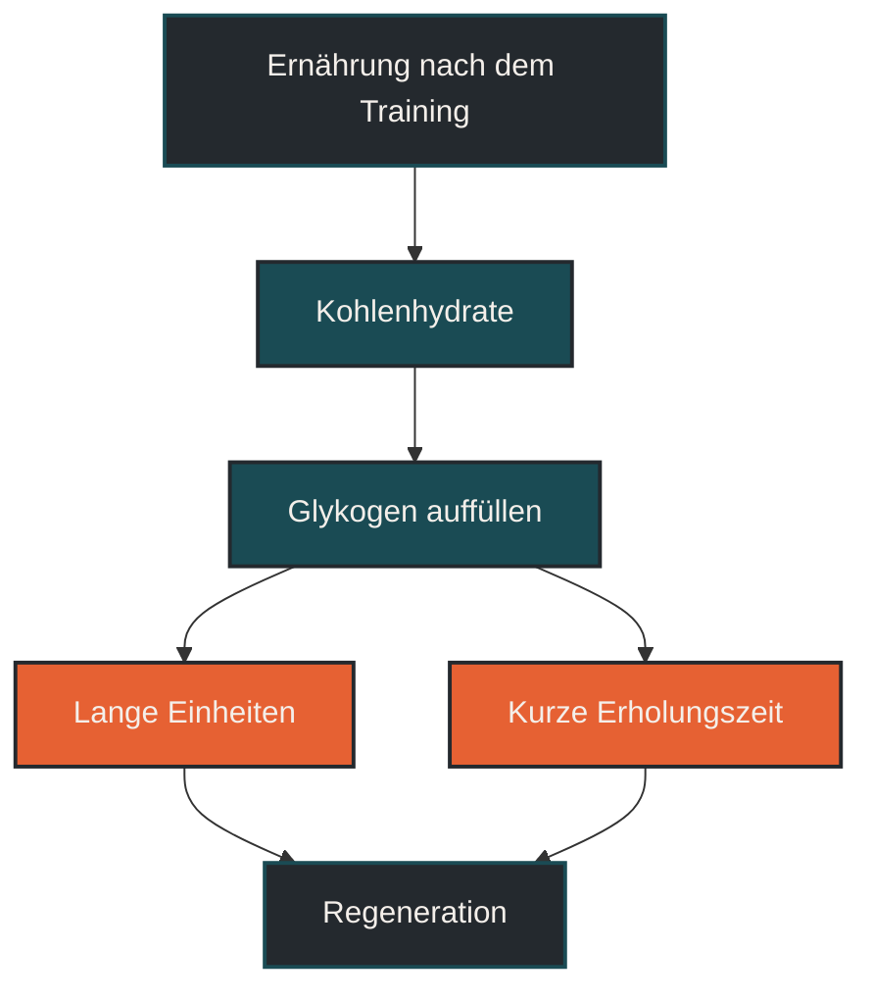
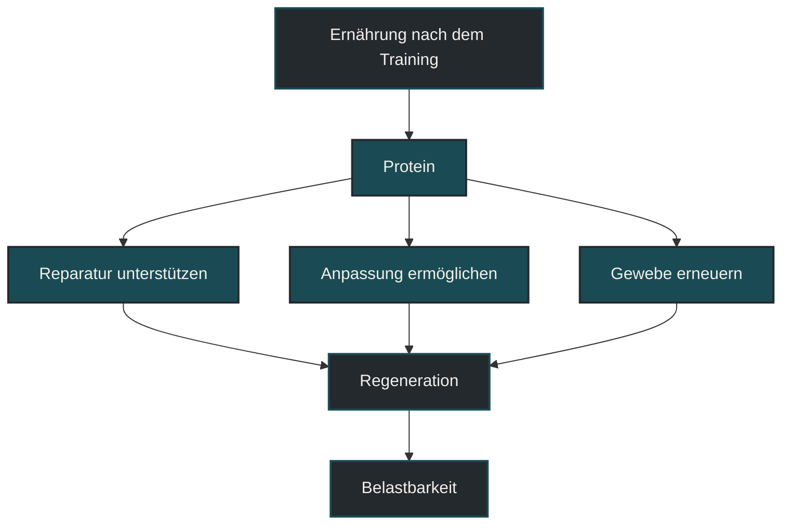
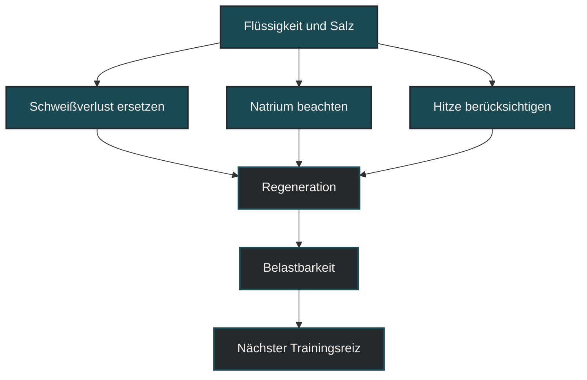
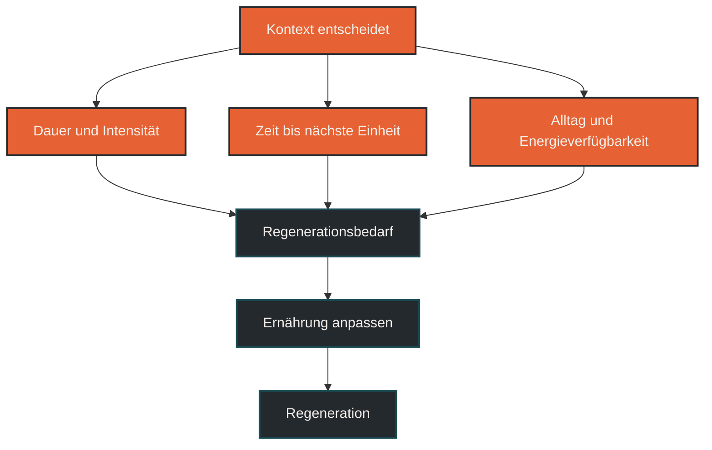

# Ernährung nach dem Training

Ernährung nach dem Training beschreibt, wie der Körper nach einer Belastung wieder mit Energie, Flüssigkeit und Baustoffen versorgt wird. Im Ausdauertraining ist das wichtig, weil Training Glykogenspeicher leert, Flüssigkeit und Elektrolyte verbraucht und Reparaturprozesse anstößt. Entscheidend ist nicht ein perfektes „Recovery-Fenster“, sondern dass Zufuhr, Trainingsbelastung und nächster Trainingsreiz zusammenpassen.

## Was Ernährung nach dem Training bedeutet

Nach dem Training befindet sich der Körper in einer Übergangsphase. Die Belastung ist beendet, aber die Verarbeitung des Trainingsreizes beginnt erst. Je nach Dauer, Intensität, Temperatur und Ernährungszustand wurden Kohlenhydrate verbraucht, Flüssigkeit verloren, Muskelproteinumsatz angeregt und das Nervensystem beansprucht.

Ernährung nach dem Training soll diese Prozesse unterstützen. Dabei geht es nicht um komplizierte Sonderregeln, sondern um drei Grundfragen: Wurden Energiereserven geleert? Braucht der Körper Protein für Reparatur und Anpassung? Muss Flüssigkeit und Salz ersetzt werden?

Die Antwort hängt stark vom Kontext ab. Ein lockerer kurzer Lauf braucht keine aufwendige Recovery-Strategie. Ein langer Lauf, ein Intervalltraining, eine Einheit bei Hitze oder zwei Trainingseinheiten am selben Tag stellen deutlich höhere Anforderungen.

## Warum Ernährung nach dem Training wichtig ist

Ausdauertraining ist nicht nur Energieverbrauch. Es setzt Anpassungsreize. Damit diese Reize verarbeitet werden können, braucht der Körper ausreichend Energie, Makronährstoffe, Mikronährstoffe und Flüssigkeit.

Wenn nach dem Training regelmäßig zu wenig gegessen wird, kann sich die Erholung verschlechtern. Die Beine fühlen sich länger schwer an, die nächste Einheit wirkt härter, die Stimmung sinkt oder der Appetit wird später unkontrolliert stark. Besonders kritisch wird es, wenn hohe Trainingsumfänge, Alltagsstress und zu geringe Energiezufuhr zusammenkommen.

Ernährung nach dem Training ist deshalb kein isolierter Trick. Sie ist Teil der gesamten Belastungssteuerung. Wer gut regenerieren will, muss nicht nur trainieren, sondern auch wieder auffüllen.

## Wie Ernährung nach dem Training wirkt

Nach dem Training stehen vor allem drei Bereiche im Vordergrund: Kohlenhydrate, Protein und Flüssigkeit.

### Kohlenhydrate

Kohlenhydrate helfen, geleerte Glykogenspeicher wieder aufzufüllen. Das ist besonders wichtig nach langen Läufen, intensiven Einheiten oder wenn am selben oder nächsten Tag erneut trainiert wird.

Je kürzer die Zeit bis zur nächsten Belastung ist, desto wichtiger wird eine zeitnahe Kohlenhydratzufuhr. Wenn bis zur nächsten Einheit viel Zeit bleibt und die Tagesernährung insgesamt passt, muss die Mahlzeit direkt nach dem Training nicht perfekt getaktet sein.

Für Läufer bedeutet das: Nach einem lockeren kurzen Lauf reicht oft die normale nächste Mahlzeit. Nach langen Läufen, Tempotraining oder Wettkämpfen ist eine bewusstere Kohlenhydratzufuhr sinnvoll.

### Protein

Protein unterstützt Reparatur- und Anpassungsprozesse. Nach Ausdauerbelastungen geht es dabei nicht nur um Muskelaufbau, sondern auch um Gewebeerneuerung, Enzymstrukturen, mitochondriale Anpassung und die allgemeine Wiederherstellung.

Protein nach dem Training ist besonders sinnvoll, wenn die Einheit lang, intensiv oder muskulär belastend war. Auch bei älteren Sportlern, hoher Trainingsfrequenz oder geringer Energiezufuhr sollte Protein nicht vernachlässigt werden.

Wichtig ist aber: Protein ersetzt keine Kohlenhydrate, wenn die Energiespeicher leer sind. Für gute Regeneration braucht es meist beides.

### Flüssigkeit und Elektrolyte

Beim Training geht Flüssigkeit über Schweiß verloren. Je nach Temperatur, Luftfeuchtigkeit, Dauer und individueller Schweißrate kann dieser Verlust klein oder erheblich sein. Mit dem Schweiß gehen auch Elektrolyte verloren, vor allem Natrium.

Nach kurzen lockeren Einheiten reicht normales Trinken meist aus. Nach langen Läufen, Hitzeeinheiten oder starkem Schwitzen ist es sinnvoll, Flüssigkeit und Salz bewusster zu ersetzen.

Dabei geht es nicht darum, zwanghaft große Mengen Wasser zu trinken. Zu viel reines Wasser ohne Elektrolyte kann ebenfalls ungünstig sein. Praktisch ist eine Kombination aus Flüssigkeit, salzhaltiger Mahlzeit und normaler Durststeuerung.

## Zentrale Einflussfaktoren

### Dauer und Intensität der Einheit

Je länger oder intensiver die Einheit war, desto wichtiger wird gezielte Ernährung danach. Ein kurzer lockerer Dauerlauf ist anders zu bewerten als ein langer Lauf, ein Intervalltraining oder ein Wettkampf.

Intensive Einheiten belasten nicht nur den Energiestoffwechsel, sondern auch das Nervensystem und die Muskulatur stärker. Dann sollte die Mahlzeit danach nicht zufällig ausfallen.

### Zeit bis zur nächsten Einheit

Wenn die nächste Einheit erst in zwei Tagen stattfindet, ist der Druck geringer. Dann reicht oft eine gute normale Tagesernährung.

Wenn am selben Tag oder am nächsten Morgen erneut trainiert wird, wird die Ernährung nach dem Training wichtiger. Je kürzer die Erholungszeit, desto weniger sollte man das Auffüllen dem Zufall überlassen.

### Energieverfügbarkeit

Energieverfügbarkeit beschreibt, ob nach Abzug der Trainingsbelastung noch genug Energie für Körperfunktionen bleibt. Wenn regelmäßig zu wenig gegessen wird, kann Regeneration leiden, auch wenn einzelne Mahlzeiten „gesund“ wirken.

Besonders bei hohen Umfängen, Gewichtsreduktion, Appetitverlust nach Belastung oder sehr kontrolliertem Essverhalten sollte dieser Punkt ernst genommen werden.

### Hitze und Schweißverlust

Hitze verändert die Anforderungen deutlich. Der Körper verliert mehr Flüssigkeit, die Herz-Kreislauf-Belastung steigt und Erholung kann länger dauern.

Nach Hitzeeinheiten reicht es oft nicht, nur an Kohlenhydrate und Protein zu denken. Flüssigkeit, Natrium und Abkühlung gehören ebenfalls zur Regeneration.

### Verträglichkeit

Nach intensiven oder langen Einheiten ist der Magen manchmal empfindlich. Dann kann es sinnvoll sein, zuerst leicht verdauliche Optionen zu wählen und später eine größere Mahlzeit zu essen.

Entscheidend ist nicht, was theoretisch ideal klingt, sondern was im Alltag regelmäßig verträglich und umsetzbar ist.

## Bedeutung für Läufer

Für Läufer ist Ernährung nach dem Training besonders wichtig, weil Lauftraining häufig sowohl energetisch als auch mechanisch belastet. Lange Läufe leeren Energiereserven, Intervalle fordern Stoffwechsel und Nervensystem, Bergläufe oder Downhill-Passagen beanspruchen die Muskulatur zusätzlich.

Nach harten oder langen Einheiten sollte die Ernährung nicht aufgeschoben werden, bis der Hunger irgendwann kommt. Manche Läufer haben direkt nach Belastung wenig Appetit, bekommen später aber Heißhunger oder fühlen sich am nächsten Tag ungewöhnlich leer. Hier kann eine kleine erste Recovery-Mahlzeit oder ein Getränk helfen, bevor später normal gegessen wird.

Bei lockeren Einheiten ist weniger Aufwand nötig. Wer nach jedem kurzen Lauf sofort Spezialprodukte nutzt, macht Ernährung unnötig kompliziert. Die Kunst liegt darin, zwischen normalen Trainingstagen und wirklich regenerationskritischen Belastungen zu unterscheiden.

## Häufige Fehler

Ein häufiger Fehler ist, nach dem Training zu lange gar nichts zu essen, obwohl die Einheit lang oder intensiv war. Dadurch kann sich die Erholung verzögern, besonders wenn bald wieder trainiert wird.

Ein zweiter Fehler ist, nur Protein zu beachten und Kohlenhydrate zu vergessen. Für Ausdauersportler sind Kohlenhydrate nach belastenden Einheiten oft zentral, weil sie die Energiespeicher wieder auffüllen.

Ein dritter Fehler ist, Flüssigkeit nur über Wasser zu ersetzen. Nach starkem Schwitzen braucht der Körper häufig auch Salz und eine normale Mahlzeit.

Ein vierter Fehler ist, Recovery-Produkte als Pflicht zu verstehen. Viele Ziele lassen sich mit normalen Lebensmitteln erreichen. Produkte können praktisch sein, sind aber nicht automatisch besser.

Ein fünfter Fehler ist, jede Einheit gleich zu behandeln. Die Ernährung nach einem lockeren 30-Minuten-Lauf muss nicht aussehen wie nach einem langen Lauf oder Wettkampf.

## Praktische Einordnung

Ernährung nach dem Training sollte zur Belastung passen. Nach kurzen lockeren Einheiten reicht meist eine normale Mahlzeit im Tagesverlauf. Nach langen, intensiven oder sehr schweißtreibenden Einheiten sind Kohlenhydrate, Protein, Flüssigkeit und Salz wichtiger.

Eine einfache Orientierung lautet: Nach kleinen Reizen normal essen. Nach großen Reizen bewusst auffüllen. Nach sehr großen Reizen frühzeitig und geplant auffüllen.

Der wichtigste Merksatz lautet: Regeneration beginnt nicht erst mit der nächsten Pause, sondern mit der Frage, ob der Körper nach dem Training wieder bekommt, was er verbraucht hat.

----

----

## Häufige Fragen zu Ernährung nach dem Training

### Was bedeutet Ernährung nach dem Training einfach erklärt?

Ernährung nach dem Training bedeutet, dem Körper nach Belastung wieder Energie, Flüssigkeit und Baustoffe zuzuführen. Ziel ist eine bessere Erholung und Vorbereitung auf die nächste Belastung.

### Muss man direkt nach dem Training essen?

Nicht nach jeder Einheit. Nach langen, intensiven oder sehr schweißtreibenden Einheiten ist eine zeitnahe Zufuhr sinnvoller als nach einem kurzen lockeren Lauf.

### Was ist nach dem Training wichtiger: Kohlenhydrate oder Protein?

Für Ausdauersportler sind meist beide wichtig. Kohlenhydrate füllen Energiespeicher auf, Protein unterstützt Reparatur und Anpassung.

### Reicht ein Proteinshake nach dem Lauf?

Ein Proteinshake kann praktisch sein, ersetzt aber nicht automatisch eine vollständige Regeneration. Nach langen oder intensiven Einheiten braucht der Körper oft auch Kohlenhydrate, Flüssigkeit und Salz.

### Was sollte man nach einem langen Lauf beachten?

Nach einem langen Lauf sind Kohlenhydrate, Protein, Flüssigkeit und Elektrolyte besonders wichtig. Je schneller die nächste Einheit folgt, desto bewusster sollte die Zufuhr geplant werden.

### Ist Essen nach einem lockeren kurzen Lauf nötig?

Oft reicht die normale nächste Mahlzeit. Eine spezielle Recovery-Strategie ist nach kurzen lockeren Einheiten meistens nicht nötig.

### Was ist ein häufiger Fehler bei Ernährung nach dem Training?

Ein häufiger Fehler ist, nach harten Einheiten nur an Protein zu denken und Kohlenhydrate, Flüssigkeit oder Salz zu vernachlässigen. 

----

*Hinweis: Dieser Artikel dient der allgemeinen Information und ersetzt keine medizinische oder therapeutische Beratung. Mehr dazu im [**Gesundheits- und Quellenhinweis**](/ausdauersport/disclaimer/).*

