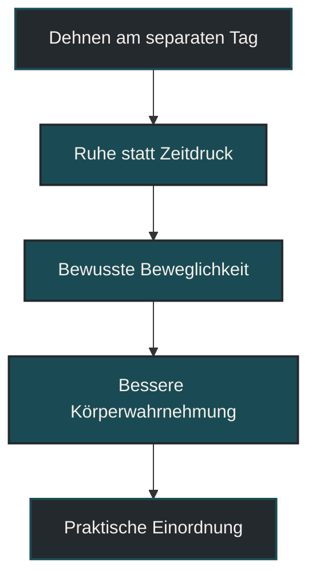

# Dehnen als Trainingseinheit

Dehnen als Trainingseinheit Tag bedeutet, Beweglichkeitsarbeit bewusst von intensiven Lauf- oder Krafteinheiten zu trennen. Im Ausdauertraining ist das sinnvoll, weil Dehnen dann nicht zwischen Ermüdung, Zeitdruck und Trainingsreiz untergeht. Entscheidend ist, Dehnen nicht als Pflichtprogramm gegen Verletzungen zu verstehen, sondern als gezielte Maßnahme für Beweglichkeit, Körperwahrnehmung und Entspannung.

## Was Dehnen als Trainingseinheit bedeutet

Dehnen als Trainingseinheit heißt nicht, dass Dehnen immer ein eigenes Training sein muss. Gemeint ist, dass längere oder ruhigere Beweglichkeitsarbeit nicht direkt an eine harte Einheit angehängt wird, sondern an einem Tag oder Zeitpunkt stattfindet, an dem der Körper weniger akut belastet ist.

Das kann ein Ruhetag sein, ein sehr lockerer Trainingstag oder ein eigener kurzer Beweglichkeitsblock am Abend. Wichtig ist, dass die Einheit nicht den Charakter einer zusätzlichen Belastung bekommt. Dehnen soll nicht noch ein weiteres Ziel erzeugen, sondern helfen, Beweglichkeit, Wahrnehmung und Entspannung zu verbessern.

Im Unterschied zum kurzen Mobilisieren vor dem Training geht es hier weniger um unmittelbare Vorbereitung auf eine Einheit. Es geht eher um langfristige Beweglichkeit, ruhige Kontrolle und das bewusste Wahrnehmen von Spannung, Einschränkung und Bewegungsqualität.

## Warum ein separater Tag sinnvoll sein kann

Viele Läufer dehnen direkt nach dem Training, weil es praktisch wirkt. Das ist nicht grundsätzlich falsch. Trotzdem kann ein separater Tag sinnvoll sein, weil der Körper nach intensiven oder langen Einheiten bereits stark belastet ist.

Nach harten Belastungen sind Muskulatur, Sehnen, Nervensystem und Stoffwechsel ermüdet. Wer dann noch lange und intensiv dehnt, setzt möglicherweise einen zusätzlichen Reiz auf bereits gereiztes Gewebe. Das muss nicht problematisch sein, kann aber unnötig sein, wenn das Ziel eigentlich Erholung ist.

Ein separater Tag schafft mehr Ruhe. Man kann langsamer arbeiten, besser wahrnehmen und muss Dehnen nicht zwischen Duschen, Essen und Alltag pressen. Dadurch wird Dehnen eher zu einer kontrollierten Beweglichkeits- und Wahrnehmungseinheit statt zu einem Pflichtanhang nach dem Lauf.

## Wie Dehnen im Ausdauertraining wirkt

Dehnen wirkt nicht wie ein einfacher Reparaturknopf. Es macht Training nicht automatisch sicherer, schneller oder besser. Seine Wirkung hängt davon ab, wie es eingesetzt wird.

### Beweglichkeit

Dehnen kann helfen, Bewegungsumfang bewusst zu erhalten oder zu verbessern. Für Läufer betrifft das häufig Hüftbeuger, Waden, hintere Oberschenkel, Gesäß, Adduktoren und Sprunggelenk.

Mehr Beweglichkeit ist aber nicht automatisch besser. Entscheidend ist, ob die Beweglichkeit zur Sportart, zur Technik und zur individuellen Anatomie passt. Zu viel passive Beweglichkeit ohne Kontrolle kann genauso wenig hilfreich sein wie zu starke Einschränkung.

### Muskeltonus und Entspannung

Ruhiges Dehnen kann helfen, Spannung wahrzunehmen und das Nervensystem herunterzufahren. Gerade an Tagen mit viel Stress oder hoher Grundanspannung kann ein kurzer, ruhiger Dehnblock angenehm sein.

Dabei geht es nicht darum, Gewebe gewaltsam länger zu ziehen. Sinnvoller ist ein kontrollierter Reiz, der nicht schmerzhaft ist und dem Körper eher Sicherheit als Bedrohung vermittelt.

### Körperwahrnehmung

Dehnen am separaten Tag kann helfen, Unterschiede zwischen rechter und linker Seite, Beweglichkeitseinschränkungen oder ungewöhnliche Spannungsgefühle zu erkennen. Diese Wahrnehmung ist für Läufer wertvoll, weil viele Probleme nicht plötzlich entstehen, sondern sich über längere Zeit aufbauen.

Wichtig ist trotzdem: Körperwahrnehmung ist kein Diagnoseinstrument. Auffällige Schmerzen, starke Einschränkungen oder wiederkehrende Beschwerden sollten nicht einfach „weg gedehnt“ werden.

## Zentrale Einflussfaktoren

### Zeitpunkt

Ein separater Dehnblock passt gut an Ruhetage, sehr lockere Tage oder abends nach einem normalen Alltag. Weniger sinnvoll ist langes intensives Dehnen direkt vor schnellen Läufen, harten Intervallen oder schweren Krafteinheiten.

Vor dem Training ist meist dynamisches Mobilisieren passender. Längeres statisches Dehnen gehört eher in ruhige Phasen, in denen keine direkte Leistungsanforderung folgt.

### Intensität

Dehnen sollte kontrolliert und gut dosiert sein. Ein Ziehen kann normal sein, Schmerz ist kein Ziel. Wer sich in eine Position zwingt, erhöht nicht automatisch den Nutzen.

Eine gute Orientierung ist: Die Dehnung soll spürbar, aber ruhig kontrollierbar sein. Atmung, Körperspannung und saubere Position sind wichtiger als maximale Reichweite.

### Art des Dehnens

Statisches Dehnen bedeutet, eine Position ruhig zu halten. Dynamisches Dehnen nutzt kontrollierte Bewegung durch einen Bewegungsbereich. Mobilität verbindet Beweglichkeit mit aktiver Kontrolle.

Für einen separaten Tag eignen sich ruhige statische Dehnungen, Mobilitätsübungen und kontrollierte aktive Bewegungen. Welche Form passt, hängt vom Ziel ab: Entspannung, Beweglichkeit, Kontrolle oder Vorbereitung auf bessere Bewegung.

### Trainingsbelastung

Je höher die Laufbelastung ist, desto vorsichtiger sollte zusätzliche Gewebebelastung dosiert werden. Nach langen Läufen, harten Intervallen, Bergabläufen oder ungewohnten Einheiten kann sehr intensives Dehnen unnötig sein.

An ruhigeren Tagen ist der Körper oft aufnahmefähiger. Dann kann Beweglichkeitsarbeit sauberer und entspannter durchgeführt werden.

## Bedeutung für Läufer

Für Läufer ist Dehnen am separaten Tag besonders interessant, weil Laufen sehr wiederholend ist. Viele Schritte in ähnlichen Bewegungswinkeln können dazu führen, dass bestimmte Bereiche dauerhaft viel Spannung oder wenig Bewegungsvielfalt erleben.

Typische Bereiche sind Waden, Hüftbeuger, hintere Oberschenkel, Gesäßmuskulatur und Sprunggelenke. Auch Brustwirbelsäule, Beckenposition und Rumpfkontrolle können eine Rolle spielen, weil Laufbewegung nicht nur aus den Beinen entsteht.

Dehnen ersetzt aber weder Krafttraining noch Technik noch Belastungssteuerung. Wenn ein Läufer Schmerzen hat, ständig steif wird oder Beweglichkeit verliert, reicht ein Dehnprogramm allein selten aus. Dann muss auch geprüft werden, ob Umfang, Intensität, Erholung, Kraft, Schlaf und Alltag zur Belastung passen.

## Häufige Fehler

Ein häufiger Fehler ist, Dehnen als automatische Verletzungsprävention zu betrachten. Dehnen kann ein sinnvoller Baustein sein, garantiert aber keine verletzungsfreie Trainingsentwicklung.

Ein zweiter Fehler ist, direkt nach harten Einheiten lange und intensiv zu dehnen. Wenn das Gewebe bereits ermüdet ist, kann ein zusätzlicher starker Dehnreiz unnötig sein.

Ein dritter Fehler ist, Schmerz als Zeichen guter Arbeit zu verstehen. Dehnen sollte nicht aggressiv sein. Wer gegen Schutzspannung arbeitet, erreicht oft eher mehr Anspannung als mehr Beweglichkeit.

Ein vierter Fehler ist, nur passiv zu dehnen und aktive Kontrolle zu vergessen. Beweglichkeit ist im Sport vor allem dann nützlich, wenn sie kontrolliert genutzt werden kann.

Ein fünfter Fehler ist, Dehnen als Ersatz für Ruhetage zu benutzen. Auch ein Beweglichkeitsblock ist ein Reiz. Wenn der Körper erschöpft ist, kann echte Ruhe sinnvoller sein.

## Praktische Einordnung

Dehnen am separaten Tag ist sinnvoll, wenn es ruhig, kontrolliert und mit klarem Ziel eingesetzt wird. Es passt gut zu Ruhetagen oder lockeren Tagen, wenn keine direkte Leistungsanforderung folgt.

Für Läufer kann ein kurzer regelmäßiger Beweglichkeitsblock hilfreicher sein als seltenes, sehr intensives Dehnen. Entscheidend ist nicht maximale Dehntiefe, sondern wiederholbare Qualität.

Eine einfache Struktur kann sein: zuerst ruhig ankommen, dann wenige relevante Bereiche bearbeiten, anschließend kurz prüfen, ob sich Bewegung freier und entspannter anfühlt. Wenn Dehnen müde, gereizt oder schmerzhaft macht, war es wahrscheinlich zu viel.

Der wichtigste Merksatz lautet: Dehnen am separaten Tag soll Beweglichkeit und Körperwahrnehmung unterstützen, nicht aus einem Ruhetag eine versteckte Trainingseinheit machen.

----

----

## Häufige Fragen zu Dehnen am separaten Tag

### Was bedeutet Dehnen am separaten Tag einfach erklärt?

Dehnen am separaten Tag bedeutet, längere Beweglichkeitsarbeit nicht direkt an harte Einheiten anzuhängen, sondern in eine ruhigere Phase zu legen.

### Warum sollte man Dehnen vom Training trennen?

Ein separater Zeitpunkt kann helfen, Dehnen kontrollierter und entspannter auszuführen. Nach harten Einheiten ist der Körper oft bereits stark ermüdet.

### Ist Dehnen nach dem Laufen falsch?

Nein. Kurzes lockeres Dehnen nach dem Laufen kann angenehm sein. Längeres oder intensives Dehnen passt aber oft besser an einen separaten, ruhigeren Zeitpunkt.

### Verhindert Dehnen Verletzungen?

Dehnen allein garantiert keine Verletzungsfreiheit. Belastungssteuerung, Kraft, Erholung, Schlaf, Technik und individuelle Voraussetzungen spielen ebenfalls eine große Rolle.

### Sollte Dehnen weh tun?

Nein. Dehnen darf spürbar sein, sollte aber nicht schmerzhaft werden. Schmerz ist kein Zeichen für bessere Wirkung.

### Was ist für Läufer besonders relevant?

Für Läufer sind häufig Waden, Hüftbeuger, hintere Oberschenkel, Gesäß, Sprunggelenke und Hüftbeweglichkeit relevant. Entscheidend ist aber immer das individuelle Bewegungsprofil.

### Wann ist Dehnen nicht sinnvoll?

Bei akuten Schmerzen, starker Ermüdung, deutlichem Muskelkater oder gereiztem Gewebe kann Ruhe sinnvoller sein. Beschwerden sollten nicht einfach überdehnt werden.

----

*Hinweis: Dieser Artikel dient der allgemeinen Information und ersetzt keine medizinische oder therapeutische Beratung. Mehr dazu im [Gesundheits- und Quellenhinweis](/ausdauersport/disclaimer/).*

