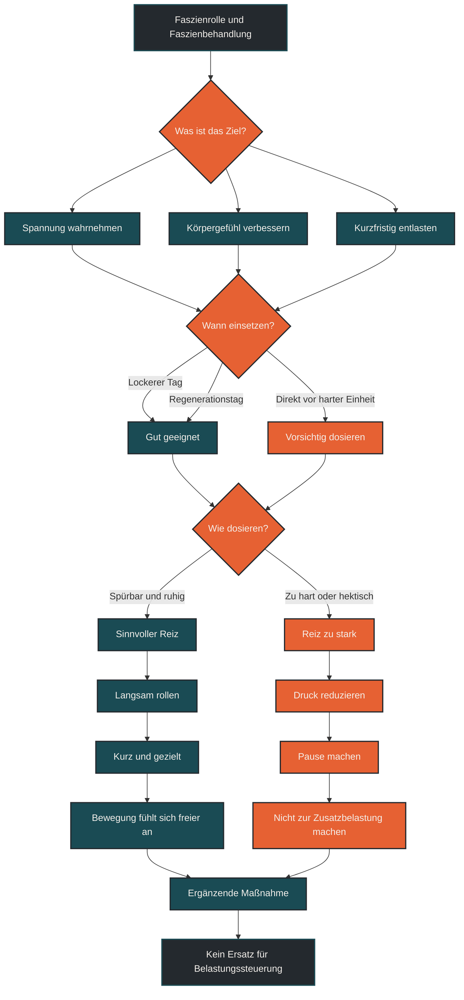
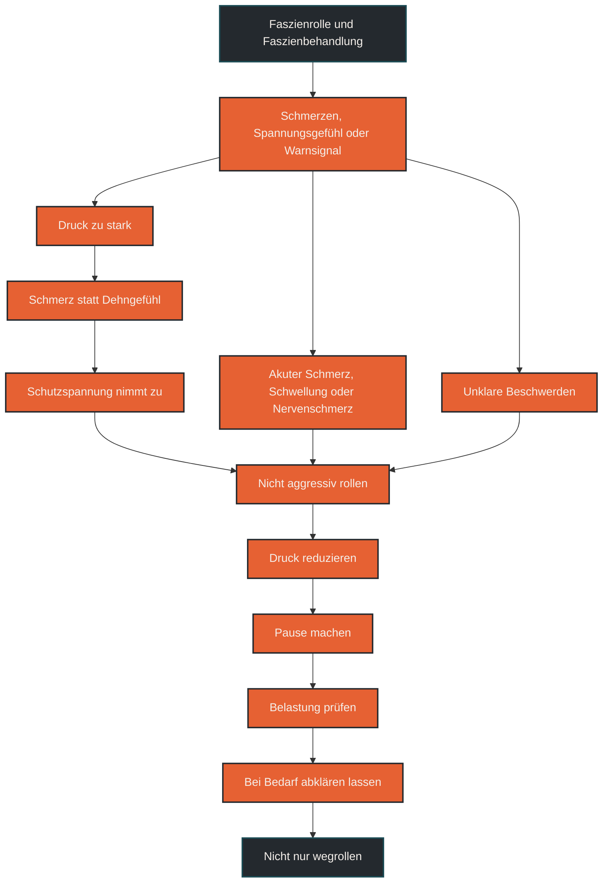

# Faszienrolle und Faszienbehandlung

Faszienrolle und Faszienbehandlung beschreiben Formen der Selbstmassage, bei denen Druck auf Muskeln, Bindegewebe und angrenzende Strukturen ausgeübt wird. Im Ausdauertraining wird das häufig zur Entspannung, zur Wahrnehmung von Gewebespannung und zur Unterstützung der Regeneration genutzt. Entscheidend ist, die Faszienrolle nicht als Reparaturwerkzeug zu überschätzen, sondern als dosierte Maßnahme für Körpergefühl, Beweglichkeit und kurzfristige Entlastung einzuordnen. [[1]](#quelle-1) [[2]](#quelle-2) [[4]](#quelle-4) [[3]](#quelle-3)

## Was Faszienrolle und Faszienbehandlung bedeutet

Eine Faszienrolle ist ein Hilfsmittel zur Selbstmassage. Sie wird meist genutzt, indem man mit dem eigenen Körpergewicht langsam über bestimmte Muskel- und Gewebebereiche rollt. Häufige Bereiche bei Läufern sind Waden, Oberschenkel, Gesäß, seitliche Hüfte und Rücken. [[1]](#quelle-1) [[2]](#quelle-2) [[4]](#quelle-4)

Der Begriff Faszienbehandlung klingt oft größer, als er im Alltag gemeint ist. Faszien sind Teil des Bindegewebes und verbinden, umhüllen und strukturieren viele Bereiche des Körpers. Mit einer Rolle wird dieses Gewebe aber nicht einfach „gelöst“ oder dauerhaft umgebaut. Realistischer ist: Die Anwendung setzt Druckreize, beeinflusst die Wahrnehmung von Spannung und kann kurzfristig Beweglichkeit oder Wohlbefinden verbessern. [[1]](#quelle-1) [[3]](#quelle-3) [[4]](#quelle-4)

Für Ausdauersportler ist die Faszienrolle deshalb eher ein ergänzendes Werkzeug. Sie ersetzt keine Belastungssteuerung, keine Kraftarbeit, keinen Schlaf und keine ausreichende Ernährung. [[1]](#quelle-1) [[2]](#quelle-2) [[4]](#quelle-4)

## Warum Faszienrollen im Ausdauertraining genutzt werden

Laufen erzeugt viele wiederholte Belastungen. Muskeln, Sehnen, Bindegewebe und Gelenke arbeiten über tausende Schritte in ähnlichen Bewegungsmustern. Nach langen Läufen, intensiven Einheiten oder ungewohnten Belastungen fühlen sich bestimmte Bereiche oft fest, empfindlich oder schwer an. [[1]](#quelle-1) [[2]](#quelle-2)

Eine Faszienrolle kann helfen, diese Bereiche bewusster wahrzunehmen. Der Druck kann ein Gefühl von Lockerung erzeugen und die Beweglichkeit kurzfristig verbessern. Für manche Läufer ist das vor allem mental hilfreich: Man nimmt sich Zeit, fährt das System herunter und prüft, wie sich der Körper anfühlt. [[1]](#quelle-1) [[2]](#quelle-2) [[4]](#quelle-4) [[3]](#quelle-3)

Wichtig ist aber: Die Rolle behandelt nicht die Ursache von Überlastung. Wenn Beschwerden immer wieder auftreten, liegt die Lösung meistens nicht in mehr Rollen, sondern in besserer Dosierung von Training, Erholung, Kraft, Technik und Alltag. [[1]](#quelle-1) [[2]](#quelle-2) [[4]](#quelle-4)

## Wie die Faszienrolle wirkt

Die Wirkung der Faszienrolle lässt sich am besten über drei Ebenen verstehen: Druckreiz, Nervensystem und Bewegungswahrnehmung. [[1]](#quelle-1) [[2]](#quelle-2) [[4]](#quelle-4) [[6]](#quelle-6)

### Druckreiz

Beim Rollen entsteht mechanischer Druck auf Haut, Muskulatur, Bindegewebe und darunterliegende Strukturen. Dieser Druck kann lokal intensiv sein und wird vom Nervensystem verarbeitet. [[1]](#quelle-1) [[2]](#quelle-2) [[4]](#quelle-4) [[6]](#quelle-6)

Mehr Druck ist dabei nicht automatisch besser. Zu harter Druck kann Schutzspannung erzeugen oder Gewebe unnötig reizen. Sinnvoller ist ein kontrollierter Reiz, der spürbar, aber gut tolerierbar bleibt. [[1]](#quelle-1) [[2]](#quelle-2)

### Nervensystem

Viele Effekte der Faszienrolle entstehen wahrscheinlich nicht dadurch, dass Gewebe mechanisch „aufgebrochen“ wird, sondern durch Reaktionen des Nervensystems. Der Körper bewertet Druck, Spannung und Bewegung neu. [[1]](#quelle-1) [[2]](#quelle-2) [[4]](#quelle-4) [[6]](#quelle-6)

Das kann dazu führen, dass sich ein Bereich danach lockerer anfühlt. Diese Veränderung muss nicht dauerhaft sein, kann aber vorübergehend hilfreich sein, zum Beispiel nach einem lockeren Lauf oder an einem Regenerationstag. [[1]](#quelle-1) [[5]](#quelle-5) [[6]](#quelle-6)

### Bewegungswahrnehmung

Die Faszienrolle kann helfen, Unterschiede zwischen Körperseiten, empfindliche Bereiche oder ungewohnte Spannung zu bemerken. Diese Wahrnehmung kann für Läufer wertvoll sein, solange sie nicht überinterpretiert wird. [[1]](#quelle-1) [[2]](#quelle-2) [[4]](#quelle-4)

Nicht jeder empfindliche Punkt ist automatisch ein Problem. Und nicht jeder feste Bereich muss aggressiv bearbeitet werden. Entscheidend ist, ob sich Beschwerden verändern, verschlechtern oder wiederkehren. [[1]](#quelle-1) [[2]](#quelle-2)

## Zentrale Einflussfaktoren

### Druck

Der Druck sollte kontrollierbar bleiben. Eine leichte bis deutliche Intensität kann sinnvoll sein, Schmerz ist aber kein Ziel. Wer beim Rollen die Luft anhält, ausweicht oder stark verkrampft, arbeitet wahrscheinlich zu intensiv. [[1]](#quelle-1) [[2]](#quelle-2) [[4]](#quelle-4) [[6]](#quelle-6)

Eine einfache Orientierung lautet: Der Druck darf spürbar sein, aber der Körper sollte dabei ruhig bleiben können. [[1]](#quelle-1) [[2]](#quelle-2)

### Dauer

Lange Roll-Einheiten sind selten nötig. Kurze Abschnitte pro Muskelgruppe reichen oft aus, wenn sie ruhig und gezielt ausgeführt werden. [[1]](#quelle-1) [[2]](#quelle-2)

Zu langes oder zu intensives Rollen kann einen Bereich unnötig reizen. Besonders nach harten Einheiten sollte die Faszienrolle nicht zu einer zusätzlichen Belastung werden. [[1]](#quelle-1) [[2]](#quelle-2) [[4]](#quelle-4)

### Zeitpunkt

Die Faszienrolle kann an lockeren Tagen, nach ruhigen Einheiten oder an separaten Regenerationstagen sinnvoll sein. Direkt vor schnellen Einheiten sollte sie nicht so intensiv eingesetzt werden, dass sich die Muskulatur müde oder gereizt anfühlt. [[1]](#quelle-1) [[2]](#quelle-2) [[4]](#quelle-4) [[5]](#quelle-5)

Nach langen Läufen oder Wettkämpfen kann sehr sanftes Rollen angenehm sein. Aggressives Rollen auf stark ermüdeter Muskulatur ist dagegen oft unnötig. [[1]](#quelle-1) [[2]](#quelle-2) [[4]](#quelle-4)

### Körperbereich

Nicht jeder Bereich eignet sich gleich gut. Große Muskelgruppen wie Waden, Oberschenkel und Gesäß lassen sich meist gut bearbeiten. Gelenke, Knochenkanten, akute Schmerzpunkte oder gereizte Bereiche sollten nicht direkt und hart gerollt werden. [[4]](#quelle-4) [[6]](#quelle-6)

Besonders vorsichtig sollte man bei akuten Verletzungen, Schwellungen, Nervenschmerzen, Entzündungszeichen oder ungeklärten Beschwerden sein. [[4]](#quelle-4) [[6]](#quelle-6)

## Bedeutung für Läufer

Für Läufer kann die Faszienrolle vor allem bei Waden, Oberschenkeln, Gesäß und seitlicher Hüfte eine praktische Rolle spielen. Diese Bereiche werden beim Laufen wiederholt belastet und fühlen sich nach Umfangssteigerungen, Tempoarbeit oder Bergläufen häufig fest an. [[1]](#quelle-1) [[2]](#quelle-2) [[4]](#quelle-4)

Sinnvoll ist die Rolle vor allem dann, wenn sie als ruhige Ergänzung genutzt wird. Sie kann helfen, den Körper nach Belastung wahrzunehmen, Spannung zu reduzieren und Beweglichkeit kurzfristig angenehmer zu machen. [[1]](#quelle-1) [[3]](#quelle-3) [[4]](#quelle-4)

Problematisch wird es, wenn Rollen zur Ersatzlösung wird. Wer wiederkehrende Schmerzen immer nur wegrollt, übersieht möglicherweise das eigentliche Thema: zu schnelle Steigerung, zu wenig Erholung, fehlende Kraft, ungeeignete Belastungsverteilung oder ein anderer medizinisch abklärungsbedürftiger Grund. [[1]](#quelle-1) [[2]](#quelle-2) [[4]](#quelle-4) [[6]](#quelle-6)

## Häufige Fehler

Ein häufiger Fehler ist, die Faszienrolle zu aggressiv einzusetzen. Starker Schmerz ist kein Qualitätsmerkmal. [[1]](#quelle-1) [[2]](#quelle-2) [[4]](#quelle-4) [[6]](#quelle-6)

Ein zweiter Fehler ist, direkt auf gereizten oder verletzten Bereichen zu rollen. Wenn ein Bereich schmerzhaft, geschwollen, heiß oder deutlich empfindlich ist, sollte nicht einfach Druck darauf gegeben werden. [[1]](#quelle-1) [[2]](#quelle-2) [[4]](#quelle-4) [[6]](#quelle-6)

Ein dritter Fehler ist, Rollen als Ersatz für Trainingsteuerung zu betrachten. Die Faszienrolle kann Erholung begleiten, aber sie korrigiert keine dauerhaft zu hohe Belastung. [[1]](#quelle-1) [[2]](#quelle-2) [[4]](#quelle-4)

Ein vierter Fehler ist, jeden festen Punkt als Verklebung zu deuten. Spannung, Müdigkeit und Empfindlichkeit können viele Ursachen haben. [[1]](#quelle-1) [[2]](#quelle-2)

Ein fünfter Fehler ist, immer gleich zu rollen. Je nach Tagesform, Trainingsphase und Gewebegefühl sollte Druck und Dauer angepasst werden. [[1]](#quelle-1) [[2]](#quelle-2) [[4]](#quelle-4)

## Praktische Einordnung

Faszienrolle und Faszienbehandlung können im Ausdauertraining sinnvoll sein, wenn sie ruhig, kontrolliert und ohne Heilsversprechen eingesetzt werden. Sie passen gut zu Regenerationstagen, lockeren Tagen oder kurzen Beweglichkeitsroutinen. [[1]](#quelle-1) [[2]](#quelle-2) [[4]](#quelle-4) [[3]](#quelle-3)

Für die Praxis reicht oft ein einfacher Ansatz: wenige relevante Bereiche auswählen, langsam arbeiten, Druck dosieren und danach prüfen, ob Bewegung angenehmer wirkt. Wenn ein Bereich stärker schmerzt, gereizter wird oder Beschwerden regelmäßig zurückkehren, sollte nicht weiter aggressiv gerollt werden. [[4]](#quelle-4) [[6]](#quelle-6)

Der wichtigste Merksatz lautet: Die Faszienrolle ist ein Werkzeug zur Selbstwahrnehmung und kurzfristigen Entlastung, aber kein Ersatz für sinnvolle Belastungssteuerung. [[1]](#quelle-1) [[2]](#quelle-2) [[4]](#quelle-4)

----

## Mermaid: Sinnvolle Anwendung der Faszienrolle

----

## Warnsignale und falsche Anwendung

----

## Häufige Fragen zu Faszienrolle und Faszienbehandlung

### Was bedeutet Faszienrolle einfach erklärt?

Eine Faszienrolle ist ein Hilfsmittel zur Selbstmassage. Sie wird genutzt, um mit kontrolliertem Druck Muskeln und umliegendes Bindegewebe zu bearbeiten. [[1]](#quelle-1) [[2]](#quelle-2) [[4]](#quelle-4)

### Was bringt eine Faszienrolle im Ausdauertraining?

Sie kann helfen, Spannung wahrzunehmen, kurzfristig Beweglichkeit angenehmer zu machen und Regenerationstage bewusst zu gestalten. Sie ersetzt aber keine Trainingssteuerung. [[1]](#quelle-1) [[3]](#quelle-3) [[4]](#quelle-4) [[5]](#quelle-5)

### Löst eine Faszienrolle verklebte Faszien?

Das ist zu einfach gedacht. Viele Effekte entstehen wahrscheinlich über Druckreize, Wahrnehmung und das Nervensystem, nicht durch ein direktes mechanisches „Aufbrechen“ von Gewebe. [[4]](#quelle-4) [[6]](#quelle-6)

### Sollte Rollen weh tun?

Nein. Rollen darf spürbar sein, sollte aber nicht stark schmerzhaft werden. Schmerz ist kein Zeichen für bessere Wirkung. [[1]](#quelle-1) [[2]](#quelle-2) [[4]](#quelle-4) [[6]](#quelle-6)

### Wann sollte man die Faszienrolle nicht nutzen?

Bei akuten Schmerzen, Schwellung, Entzündungszeichen, Nervenschmerzen, ungeklärten Beschwerden oder frischen Verletzungen sollte nicht aggressiv gerollt werden. [[4]](#quelle-4) [[6]](#quelle-6)

### Ist Rollen vor dem Laufen sinnvoll?

Leichtes, kurzes Rollen kann als Teil einer Routine angenehm sein. Es sollte aber nicht so intensiv sein, dass die Muskulatur danach müde oder gereizt ist. [[1]](#quelle-1) [[2]](#quelle-2) [[4]](#quelle-4)

### Was ist ein häufiger Fehler bei Faszienrollen?

Ein häufiger Fehler ist, zu hart und zu lange zu rollen. Dadurch wird aus einer Regenerationsmaßnahme eine zusätzliche Belastung. [[1]](#quelle-1) [[2]](#quelle-2) [[4]](#quelle-4) [[5]](#quelle-5)

----

## Quellen

### Quelle 1

Wiewelhove, T. et al.: [A Meta-Analysis of the Effects of Foam Rolling on Performance and Recovery](https://pmc.ncbi.nlm.nih.gov/articles/PMC6465761/), Frontiers in Physiology, 2019.

### Quelle 2

Hendricks, S.; Hill, H.; Hollander, S. den; Lombard, W.; Parker, R.: [Effects of foam rolling on performance and recovery: A systematic review of the literature](https://www.sciencedirect.com/science/article/pii/S1360859220300218), Physical Therapy in Sport, 2020.

### Quelle 3

Konrad, A. et al.: [Foam Rolling Training Effects on Range of Motion: A Systematic Review with Meta-Analysis](https://link.springer.com/article/10.1007/s40279-022-01699-8), Sports Medicine - Open, 2022.

### Quelle 4

Cheatham, S. W. et al.: [The effects of self-myofascial release using a foam roll or roller massager on joint range of motion, muscle recovery, and performance](https://pubmed.ncbi.nlm.nih.gov/26618062/), International Journal of Sports Physical Therapy, 2015.

### Quelle 5

MacDonald, G. Z. et al.: [Foam rolling as a recovery tool after an intense bout of physical activity](https://pubmed.ncbi.nlm.nih.gov/23113501/), Medicine & Science in Sports & Exercise, 2014.

### Quelle 6

Dupuy, O. et al.: [An Evidence-Based Approach for Choosing Post-exercise Recovery Techniques](https://pubmed.ncbi.nlm.nih.gov/29755363/), Frontiers in Physiology, 2018.

----

*Hinweis: Dieser Artikel dient der allgemeinen Information und ersetzt keine medizinische oder therapeutische Beratung. Mehr dazu im [**Gesundheits- und Quellenhinweis**](/ausdauersport/disclaimer/).*
