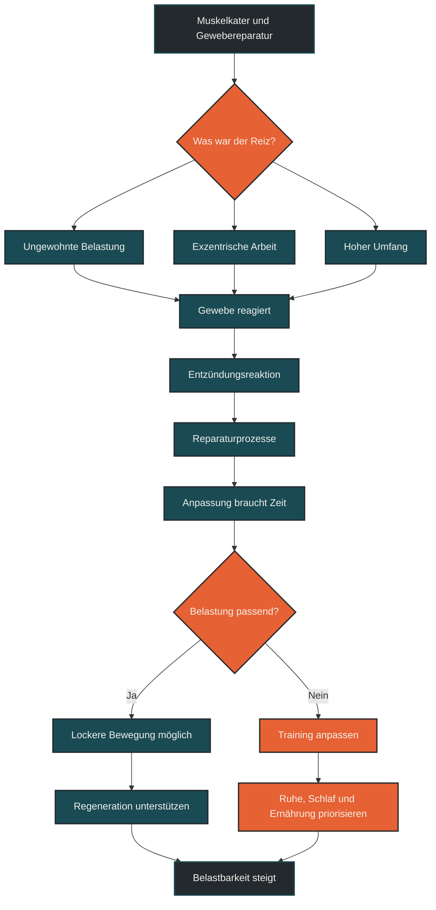
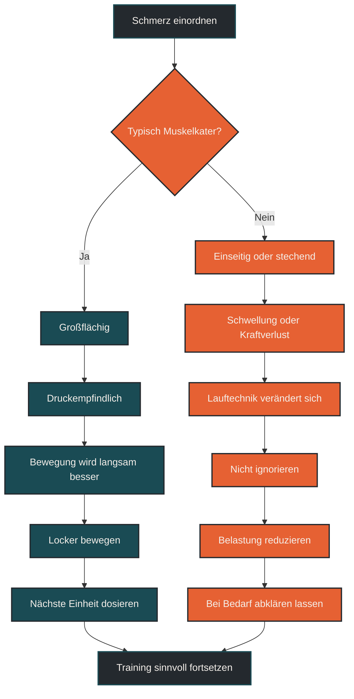

# Muskelkater und Gewebereparatur

Muskelkater und Gewebereparatur beschreiben die Reaktion des Körpers auf ungewohnte oder hohe muskuläre Belastung. Im Ausdauertraining tritt Muskelkater besonders nach Bergabläufen, langen Läufen, Tempowechseln, Krafttraining oder neuen Bewegungen auf. Entscheidend ist, Muskelkater nicht als Trainingsqualität zu verwechseln, sondern als Zeichen erhöhter Gewebebelastung einzuordnen.

## Was Muskelkater und Gewebereparatur bedeutet

Muskelkater ist eine verzögerte Muskelbeschwerde nach Belastung. Er tritt meist nicht sofort während des Trainings auf, sondern entwickelt sich häufig einige Stunden später und erreicht oft erst am nächsten oder übernächsten Tag seinen Höhepunkt.

Im Alltag wird Muskelkater oft als Zeichen eines besonders guten Trainings verstanden. Das ist zu einfach. Muskelkater zeigt vor allem, dass Gewebe stärker, ungewohnt oder anders belastet wurde als gewohnt. Er kann nach sinnvollen Trainingsreizen auftreten, ist aber kein notwendiger Beweis für Fortschritt.

Gewebereparatur beschreibt die Prozesse, mit denen der Körper belastete Strukturen wiederherstellt und anpasst. Dazu gehören unter anderem Muskelgewebe, Bindegewebe, Sehnenansätze, Faszien, Gefäße und die lokale Entzündungsregulation. Diese Prozesse brauchen Zeit, Energie, Schlaf und eine passende Belastungssteuerung.

## Warum Muskelkater im Ausdauertraining wichtig ist

Ausdauertraining wird oft vor allem über Herzfrequenz, Pace, Watt oder Dauer betrachtet. Muskelkater erinnert daran, dass Training nicht nur das Herz-Kreislauf-System belastet, sondern auch mechanisch auf Gewebe wirkt.

Gerade beim Laufen ist das wichtig. Jeder Schritt erzeugt Stoß- und Bremskräfte. Besonders exzentrische Belastungen, also bremsende Muskelarbeit, können Muskelkater begünstigen. Typisch sind Bergabläufe, ungewohnte Trails, schnelle Tempowechsel oder lange Läufe mit müder Muskulatur.

Muskelkater ist deshalb ein Hinweis auf die mechanische Seite der Belastung. Auch wenn der Puls niedrig war, kann eine Einheit muskulär und orthopädisch anspruchsvoll gewesen sein.

## Wie Muskelkater entsteht

Muskelkater entsteht nicht einfach durch „Milchsäure“ oder Laktat. Diese Erklärung ist veraltet und führt in die falsche Richtung. Wahrscheinlicher ist eine Kombination aus mikroskopischen Belastungsreaktionen im Gewebe, lokaler Entzündungsantwort, Flüssigkeitsverschiebungen und erhöhter Empfindlichkeit von Nervenenden.

### Ungewohnte Belastung

Muskelkater entsteht besonders leicht, wenn eine Bewegung neu ist oder in ungewohnter Dosierung auftritt. Das kann auch bei gut trainierten Sportlern passieren.

Ein Läufer kann lange flach laufen und trotzdem starken Muskelkater bekommen, wenn plötzlich viele Höhenmeter bergab, Sprintbelastungen oder Kraftübungen dazukommen.

### Exzentrische Muskelarbeit

Exzentrische Muskelarbeit bedeutet, dass ein Muskel Kraft erzeugt, während er gleichzeitig verlängert wird. Beim Laufen passiert das zum Beispiel beim Abfangen des Körpers nach dem Fußaufsatz.

Diese bremsende Arbeit ist für Laufökonomie, Stabilität und Belastbarkeit wichtig. Sie kann aber auch mehr Muskelkater auslösen als gleichmäßige, konzentrische Arbeit.

### Entzündungs- und Reparaturprozesse

Nach ungewohnter Belastung reagiert der Körper mit Reparatur- und Anpassungsprozessen. Eine gewisse Entzündungsreaktion ist dabei normal und nicht automatisch schlecht. Sie gehört zur Einordnung und Wiederherstellung des Gewebes.

Problematisch wird es, wenn auf starke Gewebereizung zu früh wieder hohe Belastung folgt. Dann kann aus einem normalen Anpassungsreiz eine unnötige Überlastung werden.

## Zentrale Einflussfaktoren

### Belastungsumfang

Je länger eine Einheit dauert, desto mehr Wiederholungen wirken auf das Gewebe. Besonders lange Läufe können muskulär ermüdend sein, auch wenn sie kardiovaskulär kontrolliert wirken.

Wenn Muskelkater nach langen Läufen regelmäßig stark ist, sollte nicht nur die Intensität, sondern auch Umfang, Untergrund, Höhenmeter und Erholung betrachtet werden.

### Belastungsart

Nicht jede Ausdauerbelastung erzeugt denselben Muskelkater. Laufen belastet durch Stoß- und Bremskräfte anders als Radfahren oder Schwimmen.

Bergabläufe, Trailpassagen, Tempowechsel, Sprints, Sprünge und Krafttraining erhöhen häufig die muskuläre Zusatzbelastung. Sie können sinnvoll sein, sollten aber dosiert aufgebaut werden.

### Trainingszustand

Gut trainierte Strukturen reagieren robuster auf bekannte Belastungen. Muskelkater entsteht deshalb besonders häufig nach neuen Reizen oder nach Trainingspausen.

Das bedeutet nicht, dass neue Reize vermieden werden müssen. Sie sollten nur so gesteigert werden, dass der Körper Zeit zur Anpassung hat.

### Erholung

Gewebereparatur braucht Schlaf, Energie, Protein, Flüssigkeit und Ruhe zwischen belastenden Reizen. Wenn Erholung fehlt, kann Muskelkater länger anhalten oder sich stärker bemerkbar machen.

Auch Alltagsstress spielt eine Rolle. Ein Körper, der schlecht schläft, wenig isst und mental stark belastet ist, verarbeitet Trainingsreize meist schlechter.

## Bedeutung für Läufer

Für Läufer ist Muskelkater besonders relevant, weil Lauftraining mechanisch wiederholend ist. Viele Beschwerden entstehen nicht durch eine einzelne falsche Bewegung, sondern durch die Summe vieler Schritte.

Muskelkater in Waden, Oberschenkeln oder Gesäß kann nach ungewohnten Einheiten normal sein. Besonders nach Bergabpassagen sind vordere Oberschenkel häufig betroffen, weil sie viel bremsende Arbeit leisten.

Wichtig ist die Abgrenzung zu Schmerz. Muskelkater ist meist beidseitig oder großflächig, druckempfindlich und bewegungsabhängig. Warnzeichen sind dagegen stechende Schmerzen, einseitige Beschwerden, Schwellung, deutlicher Kraftverlust, veränderte Lauftechnik oder Schmerzen, die während der Belastung zunehmen.

## Training trotz Muskelkater?

Training trotz leichtem Muskelkater ist nicht grundsätzlich verboten. Entscheidend ist, wie stark der Muskelkater ist und welche Einheit geplant ist.

Bei leichtem Muskelkater kann lockere Bewegung sinnvoll sein. Ein ruhiger Spaziergang, lockeres Radfahren oder ein sehr leichter Lauf können sich gut anfühlen, wenn die Bewegung sauber bleibt.

Bei starkem Muskelkater ist harte Belastung weniger sinnvoll. Intensive Intervalle, Bergläufe, schnelle Tempodauerläufe oder schweres Krafttraining setzen dann einen starken Reiz auf bereits belastetes Gewebe.

Ein praktisches Kriterium ist die Bewegungsqualität. Wenn man wegen Muskelkater anders läuft, ausweicht oder steif wird, sollte die geplante Einheit angepasst werden.

## Häufige Fehler

Ein häufiger Fehler ist, Muskelkater als Ziel zu betrachten. Training muss nicht weh tun, um wirksam zu sein.

Ein zweiter Fehler ist, Muskelkater mit Laktat zu erklären. Muskelkater ist kein Zeichen dafür, dass „Säure im Muskel“ geblieben ist.

Ein dritter Fehler ist, starken Muskelkater mit noch mehr Training „wegzumachen“. Leichte Bewegung kann helfen, aber harte Belastung kann die Reparatur stören.

Ein vierter Fehler ist, Muskelkater und Verletzung zu verwechseln. Nicht jeder Schmerz ist harmloser Muskelkater. Einseitige, stechende oder zunehmende Beschwerden sollten ernst genommen werden.

Ein fünfter Fehler ist, neue Reize zu schnell zu steigern. Bergabtraining, Plyometrie, Krafttraining oder Sprints sollten schrittweise eingeführt werden.

## Praktische Einordnung

Muskelkater ist ein Signal, aber kein Qualitätsmerkmal. Er zeigt, dass Gewebe ungewohnt oder stark belastet wurde. Das kann Teil eines sinnvollen Trainingsprozesses sein, sollte aber nicht regelmäßig provoziert werden.

Für die Praxis ist wichtig: Leichter Muskelkater erlaubt oft lockere Bewegung. Starker Muskelkater spricht eher für Entlastung, Schlaf, Ernährung und angepasste Trainingsplanung. Wenn Schmerzen scharf, einseitig, geschwollen oder belastungszunehmend sind, sollte man nicht einfach weitertrainieren.

Der wichtigste Merksatz lautet: Muskelkater zeigt Belastung, aber nicht automatisch Fortschritt.

----

## Belastungsreiz und Gewebereparatur

----

## Muskelkater oder Warnsignal

----

## Häufige Fragen zu Muskelkater und Gewebereparatur

### Was ist Muskelkater einfach erklärt?

Muskelkater ist eine verzögerte Muskelbeschwerde nach ungewohnter oder hoher Belastung. Er entsteht meist einige Stunden nach dem Training und kann ein bis mehrere Tage spürbar bleiben.

### Ist Muskelkater ein Zeichen für gutes Training?

Nicht automatisch. Muskelkater zeigt vor allem, dass das Gewebe ungewohnt oder stark belastet wurde. Training kann auch ohne Muskelkater sehr wirksam sein.

### Kommt Muskelkater von Laktat?

Nein. Muskelkater wird nicht dadurch erklärt, dass Laktat im Muskel bleibt. Er hängt eher mit Gewebebelastung, Entzündungsreaktion und Reparaturprozessen zusammen.

### Darf man mit Muskelkater laufen?

Bei leichtem Muskelkater kann lockere Bewegung möglich sein. Bei starkem Muskelkater, veränderter Lauftechnik oder Schmerzen sollte die Einheit angepasst oder verschoben werden.

### Was hilft bei Muskelkater?

Hilfreich sind meist Schlaf, ausreichende Energiezufuhr, Protein, Flüssigkeit, lockere Bewegung und Zeit. Aggressive Maßnahmen sind selten nötig.

### Wann ist Muskelkater ein Warnsignal?

Warnzeichen sind stechende Schmerzen, einseitige Beschwerden, Schwellung, deutlicher Kraftverlust, zunehmender Schmerz während Belastung oder veränderte Lauftechnik.

### Wie kann man starken Muskelkater vermeiden?

Neue Reize sollten schrittweise aufgebaut werden. Besonders Bergabläufe, Sprints, Krafttraining, Sprünge und ungewohnte Untergründe sollten dosiert eingeführt werden.

----

*Hinweis: Dieser Artikel dient der allgemeinen Information und ersetzt keine medizinische oder therapeutische Beratung. Mehr dazu im [Gesundheits- und Quellenhinweis](/ausdauersport/disclaimer/).*

