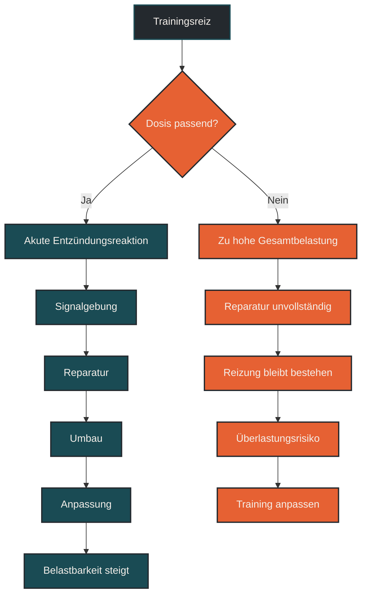
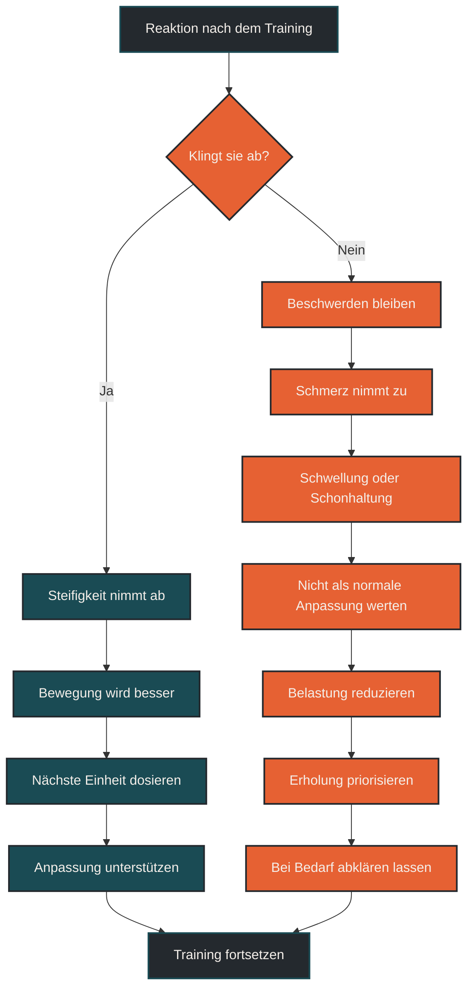

# Entzündung und Anpassung

Entzündung und Anpassung beschreiben, wie der Körper auf Trainingsbelastung reagiert. Eine kurzfristige Entzündungsreaktion nach Training ist nicht automatisch schlecht, sondern Teil von Reparatur, Signalgebung und Anpassung. Entscheidend ist die Dosis: Wird die Belastung gut verarbeitet, entsteht Anpassung. Wird sie dauerhaft zu hoch, kann aus einem sinnvollen Reiz eine Überlastung werden.

## Was Entzündung und Anpassung bedeutet

Entzündung klingt im Alltag oft negativ. Im Training ist das zu einfach. Nach einer Belastung reagiert der Körper mit lokalen Reparatur- und Regulationsprozessen. Dabei werden belastete Strukturen bewertet, beschädigte Bestandteile abgebaut, neue Proteine aufgebaut und Anpassungssignale ausgelöst.

Diese Prozesse können mit Müdigkeit, Muskelkater, Wärmegefühl, Druckempfindlichkeit oder kurzfristiger Leistungsminderung verbunden sein. Das bedeutet nicht automatisch, dass etwas falsch läuft. Der Körper arbeitet nach dem Training daran, die Belastung zu verarbeiten.

Anpassung entsteht, wenn Belastungsreiz und Erholung zusammenpassen. Dann wird der Körper nicht nur wiederhergestellt, sondern robuster gegenüber ähnlichen Reizen. Wenn Belastung, Schlaf, Energiezufuhr und Erholung nicht zusammenpassen, kann die Entzündungsreaktion länger anhalten oder in Richtung Überlastung kippen.

## Warum Entzündung im Ausdauertraining wichtig ist

Ausdauertraining wirkt nicht nur über Herzfrequenz, Sauerstoffaufnahme und Energiebereitstellung. Es wirkt auch über Gewebe, Immunsystem, Stoffwechsel und Nervensystem. Jede Einheit setzt Signale.

Lockere Dauerläufe, lange Läufe, Intervalle, Bergläufe und Krafttraining erzeugen unterschiedliche Reize. Manche Reize sind eher metabolisch, andere eher mechanisch. Besonders ungewohnte oder hohe Belastungen können eine stärkere lokale Reaktion auslösen.

Für Läufer ist das wichtig, weil nicht jede Entzündungsreaktion vermieden werden sollte. Anpassung braucht Reize. Gleichzeitig sollte Entzündung nicht dauerhaft provoziert werden. Der Körper braucht Phasen, in denen er die gesetzten Reize verarbeiten kann.

## Wie Entzündung zur Anpassung beiträgt

Nach Training laufen mehrere Prozesse parallel ab. Sie betreffen Muskeln, Bindegewebe, Sehnen, Knochen, Gefäße, Immunzellen und den Energiestoffwechsel.

### Signalgebung

Ein Trainingsreiz stört kurzfristig das Gleichgewicht. Genau diese Störung ist ein Signal. Der Körper erkennt, dass eine Struktur oder ein System beansprucht wurde, und startet Anpassungsprozesse.

Dabei geht es nicht nur um Reparatur. Der Körper versucht, zukünftige ähnliche Belastungen besser zu bewältigen. Das ist die Grundlage von Trainingsanpassung.

### Reparatur

Belastetes Gewebe muss nach dem Training wiederhergestellt werden. Das betrifft zum Beispiel Muskelproteine, Zellstrukturen, Bindegewebe und lokale Stoffwechselprozesse.

Eine gewisse Entzündungsreaktion hilft dabei, beschädigte Bestandteile zu erkennen, aufzuräumen und den Neuaufbau einzuleiten. Problematisch wird es, wenn ständig neue Belastung auf noch nicht verarbeitete Belastung trifft.

### Umbau

Anpassung bedeutet nicht nur Wiederherstellung, sondern Umbau. Muskeln, Sehnen, Knochen, Kapillaren, Mitochondrien und neuronale Steuerung passen sich langfristig an wiederholte Reize an.

Dieser Umbau braucht Zeit. Deshalb ist ein einzelner Trainingsreiz weniger entscheidend als die wiederholte, sinnvoll dosierte Abfolge aus Belastung und Erholung.

## Akute und chronische Entzündung unterscheiden

Eine kurzfristige Reaktion nach Training ist etwas anderes als eine dauerhaft erhöhte Belastungs- oder Entzündungslage.

Akute Entzündungsreaktionen sind zeitlich begrenzt. Sie treten nach einer Belastung auf, werden verarbeitet und klingen wieder ab. In diesem Rahmen können sie Teil der Anpassung sein.

Chronische oder dauerhaft wiederkehrende Reaktionen sind problematischer. Wenn Müdigkeit, Schmerzen, Reizbarkeit, Schlafprobleme, Leistungsabfall oder Infektanfälligkeit zunehmen, passt möglicherweise die Gesamtbelastung nicht mehr zur Regenerationsfähigkeit.

Für die Trainingspraxis ist deshalb nicht die Frage: „Ist Entzündung gut oder schlecht?“ Die bessere Frage lautet: „Ist die Reaktion angemessen, zeitlich begrenzt und gut verarbeitet?“

## Zentrale Einflussfaktoren

### Trainingsdosis

Die Trainingsdosis bestimmt, wie stark der Reiz ist. Umfang, Intensität, Häufigkeit, Höhenmeter, Untergrund und ungewohnte Bewegungen beeinflussen, wie stark Gewebe und Stoffwechsel reagieren.

Eine passende Dosis führt zu Anpassung. Eine dauerhaft zu hohe Dosis kann Reparaturprozesse überfordern.

### Erholung

Erholung entscheidet, ob die Entzündungsreaktion verarbeitet werden kann. Schlaf, Ruhetage, aktive Erholung, Ernährung und Stressmanagement sind deshalb keine Nebensachen.

Wenn Erholung fehlt, wird ein an sich sinnvoller Trainingsreiz schneller problematisch.

### Energieverfügbarkeit

Reparatur und Anpassung brauchen Energie. Wer viel trainiert und dauerhaft zu wenig isst, erschwert dem Körper die Verarbeitung der Belastung.

Das betrifft nicht nur Leistung, sondern auch Immunsystem, Hormonregulation, Gewebereparatur und allgemeines Wohlbefinden.

### Trainingszustand

Ein gut vorbereiteter Körper reagiert auf bekannte Belastungen meist kontrollierter. Neue Reize lösen dagegen oft stärkere Reaktionen aus.

Deshalb sollten neue Trainingsformen, längere Läufe, Bergabpassagen, Sprints, Krafttraining oder Plyometrie schrittweise eingeführt werden.

## Bedeutung für Läufer

Für Läufer ist Entzündung und Anpassung besonders relevant, weil Laufen mechanisch wiederholend ist. Jeder Schritt erzeugt Kräfte, die auf Muskeln, Sehnen, Knochen und Gelenke wirken.

Nach langen Läufen oder intensiven Einheiten ist eine kurzfristige Reaktion normal. Schwere Beine, leichte Steifigkeit oder Muskelkater können vorkommen. Entscheidend ist, ob diese Reaktion abklingt und die nächste Belastung wieder sauber möglich ist.

Warnsignale sind dagegen anhaltende oder zunehmende Schmerzen, Schwellung, deutliche einseitige Beschwerden, veränderte Lauftechnik, ungewöhnliche Erschöpfung oder wiederkehrende Probleme an derselben Stelle. Dann sollte nicht einfach weiter trainiert werden, als sei es normale Anpassung.

## Häufige Fehler

Ein häufiger Fehler ist, Entzündung grundsätzlich als schlecht zu betrachten. Ohne Reiz, Signalgebung und Reparatur entsteht keine Anpassung.

Ein zweiter Fehler ist, jede Entzündungsreaktion als Fortschritt zu deuten. Starke Beschwerden sind kein Beweis für gutes Training.

Ein dritter Fehler ist, ständig harte Reize zu setzen, ohne Verarbeitung abzuwarten. Anpassung entsteht nicht durch maximale Reizdichte, sondern durch passende Reiz-Erholungs-Abfolge.

Ein vierter Fehler ist, Warnsignale mit normaler Trainingsmüdigkeit zu verwechseln. Zunehmende Schmerzen, Schwellung oder veränderte Bewegung sollten ernst genommen werden.

Ein fünfter Fehler ist, Erholung nur als Pause zu sehen. Schlaf, Ernährung, Energieverfügbarkeit und Alltagsstress entscheiden mit, ob der Körper den Reiz nutzen kann.

## Praktische Einordnung

Entzündung und Anpassung gehören im Training zusammen. Eine kurzfristige Reaktion nach Belastung kann sinnvoll sein, wenn sie abklingt und zu besserer Belastbarkeit führt. Problematisch wird es, wenn Reaktionen dauerhaft bleiben, stärker werden oder die Bewegungsqualität verändern.

Für die Praxis hilft eine einfache Einordnung: Reiz setzen, Reaktion beobachten, Erholung ermöglichen und die nächste Belastung passend wählen. Wer immer nur Reize setzt, aber die Reaktion nicht verarbeitet, trainiert nicht automatisch besser.

Der wichtigste Merksatz lautet: Entzündung ist nicht immer schlecht, aber sie muss zur Belastung passen und wieder abklingen.

----

## Reiz, Entzündung und Anpassung

----

## Mermaid: Normale Reaktion oder Warnsignal

----

## Häufige Fragen zu Entzündung und Anpassung

### Ist Entzündung nach Training schlecht?

Nicht automatisch. Eine kurzfristige Entzündungsreaktion kann Teil von Reparatur, Signalgebung und Anpassung sein.

### Warum braucht Anpassung Entzündung?

Training setzt einen Reiz, der den Körper kurzfristig aus dem Gleichgewicht bringt. Die Reaktion darauf startet Reparatur- und Umbauprozesse.

### Wann wird Entzündung problematisch?

Problematisch wird sie, wenn Beschwerden nicht abklingen, stärker werden, Schwellung entsteht, Schmerzen zunehmen oder die Bewegungsqualität leidet.

### Sollte man Entzündung komplett vermeiden?

Nein. Ziel ist nicht, jede Reaktion zu vermeiden, sondern Belastung so zu dosieren, dass der Körper sie verarbeiten kann.

### Was hilft dem Körper bei Anpassung?

Schlaf, ausreichende Energiezufuhr, Protein, Flüssigkeit, passende Trainingssteuerung und genügend Zeit zwischen belastenden Reizen unterstützen die Verarbeitung.

### Kann man mit leichter Entzündungsreaktion trainieren?

Das hängt von der Reaktion ab. Leichte Steifigkeit oder normale Müdigkeit kann mit lockerer Bewegung vereinbar sein. Zunehmende Schmerzen oder Schwellung sprechen eher für Entlastung.

### Was ist ein häufiger Fehler bei Entzündung und Anpassung?

Ein häufiger Fehler ist, jede starke Reaktion als gutes Training zu sehen. Anpassung entsteht nicht durch maximale Reizung, sondern durch sinnvoll dosierte Belastung und ausreichende Erholung.

----

*Hinweis: Dieser Artikel dient der allgemeinen Information und ersetzt keine medizinische oder therapeutische Beratung. Mehr dazu im [Gesundheits- und Quellenhinweis](/ausdauersport/disclaimer/).*

