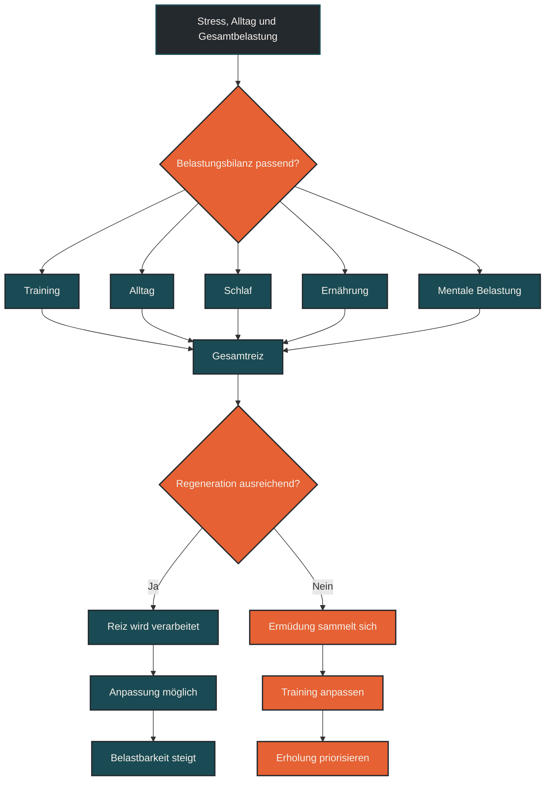

# Stress, Alltag und Gesamtbelastung

Stress, Alltag und Gesamtbelastung beschreiben, dass der Körper Training nicht isoliert verarbeitet. Beruf, Schlaf, Ernährung, Familie, mentale Belastung und Lebensumstände zählen zur gleichen Belastungsbilanz wie Laufumfang, Intensität und Wettkämpfe. Entscheidend ist nicht nur, wie hart trainiert wird, sondern ob die gesamte Belastung zur aktuellen Regenerationsfähigkeit passt.

## Was Stress, Alltag und Gesamtbelastung bedeutet

Gesamtbelastung meint die Summe aller Reize, die auf den Körper wirken. Dazu gehört das Training, aber auch alles, was außerhalb des Trainings Energie, Aufmerksamkeit und Anpassungsfähigkeit kostet.

Ein Trainingsplan kann auf dem Papier sinnvoll aussehen und trotzdem zu viel sein, wenn der Alltag gleichzeitig sehr fordernd ist. Wenig Schlaf, beruflicher Druck, familiäre Verpflichtungen, Konflikte, Reisen, Hitze, Krankheit, unregelmäßige Ernährung oder emotionale Belastung können die Regeneration deutlich beeinflussen.

Der Körper trennt dabei nicht sauber zwischen Trainingsstress und Alltagsstress. Für ihn zählt, wie stark Systeme wie Nervensystem, Stoffwechsel, Immunsystem, Hormonsystem und Gewebe insgesamt beansprucht werden.

## Warum Gesamtbelastung im Ausdauertraining wichtig ist

Ausdauertraining lebt von Wiederholung. Viele kleine und große Reize summieren sich über Tage, Wochen und Monate. Genau dadurch entsteht Anpassung. Gleichzeitig liegt darin das Risiko: Wenn zu viele Reize zusammenkommen, kann der Körper sie nicht mehr gut verarbeiten.

Dann wird nicht eine einzelne Einheit zum Problem, sondern die Gesamtlage. Der lange Lauf war vielleicht nicht zu hart. Die Intervalle waren vielleicht nicht falsch. Aber zusammen mit schlechtem Schlaf, viel Arbeit, wenig Essen und mentalem Stress kann die gleiche Einheit plötzlich deutlich belastender wirken.

Für Läufer ist das besonders wichtig, weil Lauftraining nicht nur das Herz-Kreislauf-System fordert, sondern auch mechanisch auf Muskeln, Sehnen, Knochen und Gelenke wirkt. Wenn die Gesamtbelastung zu hoch ist, steigt das Risiko, dass Müdigkeit, Beschwerden oder Leistungsabfall entstehen.

## Wie Gesamtbelastung wirkt

Gesamtbelastung wirkt über mehrere Ebenen. Sie beeinflusst, wie hart sich Training anfühlt, wie schnell der Körper repariert, wie stabil die Motivation bleibt und wie gut der nächste Trainingsreiz verarbeitet wird.

### Nervensystem

Stress aktiviert das Nervensystem. Kurzfristig ist das normal und hilfreich. Dauerhaft kann eine hohe Aktivierung jedoch dazu führen, dass der Körper schlechter herunterfährt.

Das zeigt sich manchmal in innerer Unruhe, schlechterem Schlaf, erhöhter Reizbarkeit, ungewöhnlich hoher Anstrengungswahrnehmung oder dem Gefühl, trotz Ruhetag nicht wirklich erholt zu sein.

### Stoffwechsel und Energie

Regeneration braucht Energie. Wenn Alltag und Training viel Energie kosten, aber Ernährung, Schlaf und Ruhe nicht mithalten, wird Anpassung schwieriger.

Besonders kritisch ist die Kombination aus hoher Trainingslast, hoher Alltagsbelastung und zu geringer Energiezufuhr. Dann kann der Körper zwar eine Zeit lang funktionieren, aber die Belastbarkeit sinkt oft schleichend.

### Immunsystem

Hohe Gesamtbelastung kann sich auch über Infektanfälligkeit, anhaltende Müdigkeit oder ein allgemeines Gefühl von „nicht ganz fit“ zeigen. Das bedeutet nicht automatisch, dass Training schlecht ist. Es zeigt aber, dass Belastung und Erholung nicht mehr gut zusammenpassen könnten.

### Gewebe und Bewegungsqualität

Muskeln, Sehnen, Knochen und Gelenke reagieren nicht nur auf einzelne Trainingseinheiten, sondern auf wiederholte Belastung. Wenn Müdigkeit steigt, verändert sich oft auch die Bewegung.

Die Lauftechnik wird schwerer, Schritte werden weniger elastisch, Spannung geht verloren oder Ausweichbewegungen nehmen zu. In solchen Situationen kann eine eigentlich normale Einheit plötzlich mehr Gewebestress erzeugen.

## Zentrale Einflussfaktoren

### Trainingslast

Umfang, Intensität, Häufigkeit, lange Läufe, Höhenmeter, Wettkämpfe und Krafttraining zählen zur Trainingslast. Entscheidend ist nicht nur die einzelne Einheit, sondern die Kombination über mehrere Tage.

Viele Probleme entstehen nicht durch ein hartes Training, sondern durch zu wenig Abstand zwischen mehreren belastenden Reizen.

### Schlaf

Schlaf ist einer der wichtigsten Faktoren für Regeneration. Wenn Schlafdauer oder Schlafqualität über mehrere Tage schlecht sind, sollte die geplante Trainingsbelastung vorsichtiger bewertet werden.

Eine schlechte Nacht ist nicht automatisch dramatisch. Mehrere schlechte Nächte in Verbindung mit hoher Trainingslast sind dagegen ein deutlich relevanteres Signal.

### Arbeit und mentale Belastung

Beruflicher Druck, lange Bildschirmzeiten, Verantwortung, Termine, Konflikte oder emotionale Anspannung können die Regeneration belasten, auch wenn sie nicht wie Sport aussehen.

Für die Trainingsplanung bedeutet das: Eine harte Woche im Leben kann eine harte Trainingswoche noch härter machen.

### Ernährung und Energieverfügbarkeit

Wer viel trainiert und gleichzeitig zu wenig isst, reduziert die Fähigkeit zur Reparatur und Anpassung. Das betrifft nicht nur Leistung, sondern auch Stimmung, Schlaf, Immunsystem und Gewebebelastbarkeit.

Gerade bei hoher Gesamtbelastung sollte Ernährung nicht zusätzlich restriktiv werden.

### Lebensphase

Nicht jede Trainingswoche findet unter gleichen Bedingungen statt. Urlaub, Krankheit, Stressphasen, Familienbelastung, berufliche Projekte, Reisen oder schlechte Nächte verändern die Ausgangslage.

Ein guter Trainingsplan muss deshalb flexibel genug sein, auf Lebensrealität zu reagieren.

## Bedeutung für Läufer

Für Läufer ist Gesamtbelastung besonders wichtig, weil Laufen eine hohe Wiederholungsbelastung erzeugt. Wenn das System frisch ist, kann der Körper viele Schritte gut verarbeiten. Wenn das System erschöpft ist, kann die gleiche Belastung deutlich schwerer wirken.

Typisch ist, dass zuerst nicht die Leistungswerte komplett einbrechen, sondern das Körpergefühl schlechter wird. Die Beine fühlen sich schwer an, lockeres Tempo wirkt ungewöhnlich hart, kleine Beschwerden tauchen auf, die Motivation sinkt oder die Erholung dauert länger.

In solchen Phasen ist es oft sinnvoller, die Belastung frühzeitig anzupassen, statt stur am Plan festzuhalten. Ein verschobenes Intervalltraining, ein kürzerer Dauerlauf oder ein zusätzlicher Ruhetag können verhindern, dass aus normaler Müdigkeit eine längere Überlastungsphase wird.

## Häufige Fehler

Ein häufiger Fehler ist, nur die Trainingsdaten zu betrachten. Pace, Herzfrequenz, Watt und Umfang erklären nicht alles, wenn Schlaf, Arbeit und Stress ignoriert werden.

Ein zweiter Fehler ist, Müdigkeit nur als mangelnde Disziplin zu deuten. Manchmal ist Müdigkeit kein mentales Problem, sondern ein realistisches Signal der Gesamtbelastung.

Ein dritter Fehler ist, Ruhetage nur nach dem Trainingsplan zu setzen, aber nicht nach der tatsächlichen Lebensbelastung. Wenn der Alltag außergewöhnlich fordernd ist, kann ein zusätzlicher Ruhetag sinnvoll sein.

Ein vierter Fehler ist, jede Einheit nachzuholen. Verpasste Einheiten sollten nicht automatisch in die nächsten Tage geschoben werden, weil dadurch die Belastungsdichte steigt.

Ein fünfter Fehler ist, Warnzeichen zu lange zu ignorieren. Wiederkehrende Beschwerden, anhaltende Erschöpfung, Schlafprobleme oder Leistungsabfall sollten nicht einfach mit noch mehr Disziplin beantwortet werden.

## Praktische Einordnung

Stress, Alltag und Gesamtbelastung sollten als Teil der Trainingssteuerung verstanden werden. Ein Trainingsplan ist kein starres Gesetz, sondern eine Struktur, die zur aktuellen Belastbarkeit passen muss.

Praktisch hilft eine einfache tägliche Einschätzung: Wie habe ich geschlafen? Wie hoch ist der Alltagsstress? Wie fühlen sich Beine und Kopf an? Gibt es Beschwerden? Passt die geplante Einheit noch zur heutigen Lage?

Wenn mehrere Warnzeichen gleichzeitig auftreten, sollte die Einheit angepasst werden. Das ist kein Scheitern, sondern gute Steuerung.

Der wichtigste Merksatz lautet: Der Körper verarbeitet nicht nur Training, sondern das gesamte Leben drumherum.

----

## Gesamtbelastung einordnen

----

## Warnzeichen bei zu hoher Gesamtbelastung

----

## Häufige Fragen zu Stress, Alltag und Gesamtbelastung

### Was bedeutet Gesamtbelastung einfach erklärt?

Gesamtbelastung beschreibt die Summe aus Training, Alltag, Schlaf, Ernährung, mentalem Stress und Lebensumständen. Der Körper verarbeitet diese Faktoren gemeinsam.

### Warum beeinflusst Alltagsstress das Training?

Alltagsstress beansprucht Nervensystem, Energie, Schlaf und Erholung. Dadurch kann dieselbe Trainingseinheit schwerer wirken als in einer ruhigeren Lebensphase.

### Muss man bei Stress immer weniger trainieren?

Nicht immer. Lockere Bewegung kann bei Stress hilfreich sein. Harte oder lange Einheiten sollten aber angepasst werden, wenn Schlaf, Müdigkeit oder Beschwerden dagegen sprechen.

### Woran erkennt man zu hohe Gesamtbelastung?

Hinweise können schlechter Schlaf, schwere Beine, Reizbarkeit, sinkende Motivation, Leistungsabfall, Infektanfälligkeit oder wiederkehrende Beschwerden sein.

### Ist ein zusätzlicher Ruhetag bei viel Alltagsstress sinnvoll?

Ja, wenn mehrere Belastungszeichen zusammenkommen. Ein zusätzlicher Ruhetag kann helfen, eine Überlastung zu vermeiden.

### Sollte man verpasste Einheiten nachholen?

Nicht automatisch. Verpasste Einheiten einfach in die nächsten Tage zu schieben, erhöht oft die Belastungsdichte und kann die Regeneration verschlechtern.

### Was ist der häufigste Fehler bei Gesamtbelastung?

Der häufigste Fehler ist, nur Trainingsdaten zu betrachten und den Alltag auszublenden. Training wirkt immer im Kontext des gesamten Lebens.

----

*Hinweis: Dieser Artikel dient der allgemeinen Information und ersetzt keine medizinische oder therapeutische Beratung. Mehr dazu im [Gesundheits- und Quellenhinweis](/ausdauersport/disclaimer/).*

