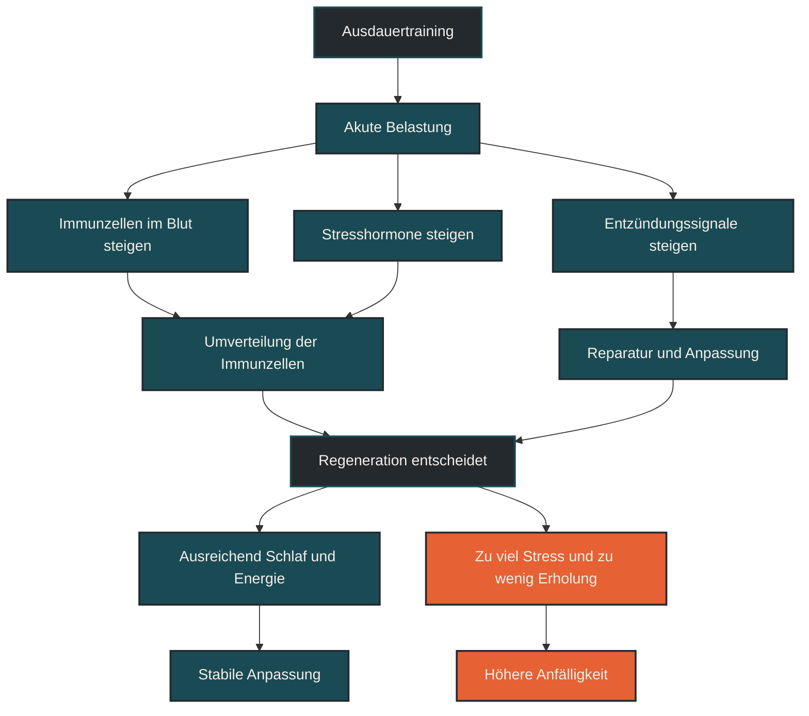

# Immunantwort auf Ausdauertraining

Die Immunantwort auf Ausdauertraining beschreibt, wie das Immunsystem auf körperliche Belastung reagiert. Im Ausdauertraining ist das wichtig, weil Training nicht nur Muskeln, Herz und Stoffwechsel fordert, sondern auch Immunzellen, Entzündungssignale und Regenerationsprozesse beeinflusst. Entscheidend ist die Dosis: Angemessenes Training kann die Immunfunktion unterstützen, während zu hohe Gesamtbelastung die Infektanfälligkeit vorübergehend erhöhen kann.

## Was die Immunantwort auf Ausdauertraining bedeutet

Das Immunsystem reagiert auf Ausdauerbelastung dynamisch. Während einer Trainingseinheit steigen Herzfrequenz, Atmung, Körpertemperatur, Stresshormone und Stoffwechselaktivität. Dadurch verändern sich auch Anzahl, Aktivität und Verteilung verschiedener Immunzellen im Blut.

Diese Reaktion ist nicht automatisch negativ. Sie gehört zur normalen Anpassung an Belastung. Training erzeugt kurzfristig Stress, der anschließend Reparatur, Anpassung und Regulation anstößt. Problematisch wird es eher dann, wenn Belastung, Alltag, Schlafmangel, Energieverfügbarkeit und Regeneration dauerhaft nicht zusammenpassen.

## Warum die Immunantwort wichtig ist

Für Ausdauersportler ist die Immunantwort wichtig, weil Training und Gesundheit eng miteinander verbunden sind. Wer regelmäßig trainiert, setzt wiederholt Reize, auf die sich der Körper anpassen muss. Dazu gehören nicht nur Herz-Kreislauf-System und Muskulatur, sondern auch Schleimhäute, Entzündungsregulation, Zellkommunikation und Energieversorgung des Immunsystems.

Eine stabile Immunfunktion hilft dabei, Trainingsreize zu verarbeiten, Infekte besser zu vermeiden und nach Belastungen wieder in einen belastbaren Zustand zurückzukehren. Gleichzeitig kann intensives oder sehr langes Training vorübergehend eine Phase erzeugen, in der der Körper empfindlicher auf zusätzliche Stressoren reagiert.

## Wie Ausdauertraining das Immunsystem aktiviert

Während der Belastung werden Immunzellen vermehrt in den Blutkreislauf mobilisiert. Dazu gehören unter anderem neutrophile Granulozyten, Monozyten, T-Zellen und natürliche Killerzellen. Diese Veränderung entsteht nicht zufällig, sondern hängt mit Durchblutung, Stresshormonen, Muskelarbeit und Signalstoffen zusammen.

Nach dem Training verschiebt sich dieses Bild wieder. Manche Zellen verlassen den Blutkreislauf und wandern in Gewebe oder Schleimhäute. Das wurde früher oft als reine Immunsuppression gedeutet. Heute wird es eher als Umverteilung verstanden: Das Immunsystem ist nicht einfach „ausgeschaltet“, sondern vorübergehend anders organisiert.

## Entzündung, Reparatur und Anpassung

Ausdauertraining kann kurzfristig entzündliche Signale erhöhen. Das klingt zunächst negativ, ist aber ein normaler Teil der Anpassung. Entzündung ist nicht automatisch schlecht. Sie hilft dem Körper, Belastung zu erkennen, beschädigte Strukturen zu reparieren und Anpassungsprozesse einzuleiten.

Wichtig ist die Balance. Eine angemessene, zeitlich begrenzte Entzündungsreaktion gehört zur Trainingsanpassung. Eine dauerhaft erhöhte Entzündungsbelastung durch zu viel Training, zu wenig Schlaf, Energiemangel oder chronischen Stress kann dagegen die Regeneration stören.

## Zentrale Einflussfaktoren

### Trainingsumfang

Längere Belastungen fordern das Immunsystem stärker als kurze, lockere Einheiten. Besonders lange Läufe, Wettkämpfe oder Trainingsblöcke mit hohem Umfang können die Immunantwort deutlich verändern. Entscheidend ist dabei nicht nur eine einzelne Einheit, sondern die Summe der Belastung über mehrere Tage und Wochen.

### Trainingsintensität

Hohe Intensitäten erzeugen eine stärkere akute Stressreaktion. Intervalle, Tempodauerläufe und Wettkämpfe können deshalb zu einer ausgeprägteren Mobilisierung von Immunzellen und Stresshormonen führen. Das ist nicht grundsätzlich problematisch, braucht aber passende Erholung.

### Energieverfügbarkeit

Das Immunsystem benötigt Energie. Wenn Training mit zu geringer Energiezufuhr, niedriger Kohlenhydratzufuhr oder dauerhaftem Kaloriendefizit kombiniert wird, kann die Immunfunktion belastet werden. Besonders kritisch wird es, wenn harte Einheiten, wenig Schlaf und geringe Energiezufuhr zusammenkommen.

### Schlaf und Alltagsstress

Schlaf ist ein zentraler Regenerationsfaktor. Zu wenig Schlaf kann die Belastbarkeit des Immunsystems verringern und die Erholung nach Trainingseinheiten verschlechtern. Auch psychischer Stress, berufliche Belastung und private Daueranspannung zählen zur Gesamtbelastung.

### Trainingszustand

Gut trainierte Sportler reagieren auf gewohnte Belastungen meist anders als Einsteiger. Der gleiche Dauerlauf kann für eine Person locker und für eine andere stark belastend sein. Deshalb sollte die Immunantwort nie nur an Pace, Kilometerzahl oder Trainingsplan gemessen werden, sondern immer am individuellen Kontext.

## Bedeutung für Läufer

Für Läufer bedeutet die Immunantwort vor allem: Training ist nicht isoliert zu betrachten. Ein langer Lauf, eine harte Intervallserie oder ein Wettkampf wirken nicht nur auf Muskeln und Herz-Kreislauf-System, sondern auch auf das Immunsystem.

Praktisch relevant ist das besonders in Phasen mit hoher Trainingsbelastung, wenig Schlaf, beruflichem Stress oder beginnenden Infektzeichen. Dann kann es sinnvoll sein, Belastung zu reduzieren, lockerer zu trainieren oder einen Ruhetag einzuplanen. Das ist kein Zeichen von Schwäche, sondern Teil einer sinnvollen Belastungssteuerung.

## Häufige Fehler

Ein häufiger Fehler ist die Annahme, dass mehr Training automatisch zu besserer Gesundheit führt. Regelmäßiges Ausdauertraining kann gesundheitsfördernd sein, aber sehr hohe oder schlecht regenerierte Belastung kann das Gegenteil bewirken.

Ein zweiter Fehler ist, jede Entzündungsreaktion als schlecht zu betrachten. Ohne Entzündung, Reparatur und Immunaktivität gäbe es keine sinnvolle Anpassung. Entscheidend ist nicht, jede Reaktion zu unterdrücken, sondern Belastung und Erholung passend zu dosieren.

Ein dritter Fehler ist, Infektzeichen zu ignorieren. Wer sich krank fühlt, Fieber hat, ungewöhnlich erschöpft ist oder deutliche Symptome entwickelt, sollte nicht versuchen, die Einheit einfach „durchzuziehen“.

## Praktische Einordnung

Die Immunantwort auf Ausdauertraining ist ein normales Anpassungssystem. Sie zeigt, dass Training den Körper ganzheitlich fordert. Für die Praxis ist weniger entscheidend, einzelne Immunwerte zu kennen, sondern die Gesamtbelastung realistisch einzuschätzen.

Sinnvoll ist eine Trainingssteuerung, die harte Einheiten, lockere Einheiten, Schlaf, Ernährung und Alltag zusammen betrachtet. Besonders in intensiven Phasen sollte Regeneration nicht als Pause vom Training verstanden werden, sondern als Teil des Trainings.

Der wichtigste Merksatz lautet: Das Immunsystem wird durch Training nicht einfach stärker oder schwächer, sondern reagiert abhängig von Dosis, Kontext und Regeneration.

----

----

## Häufige Fragen zu Immunantwort auf Ausdauertraining

### Was ist die Immunantwort auf Ausdauertraining einfach erklärt?

Die Immunantwort auf Ausdauertraining beschreibt, wie das Immunsystem auf körperliche Belastung reagiert. Während und nach dem Training verändern sich Immunzellen, Entzündungssignale, Stresshormone und Regenerationsprozesse.

### Ist Ausdauertraining gut oder schlecht für das Immunsystem?

Ausdauertraining ist nicht pauschal gut oder schlecht für das Immunsystem. Regelmäßiges, gut dosiertes Training kann die Immunfunktion unterstützen. Zu viel Belastung ohne ausreichende Erholung kann den Körper dagegen vorübergehend anfälliger machen.

### Warum bin ich nach harten Trainingsphasen manchmal anfälliger?

Nach sehr langen oder intensiven Belastungen ist der Körper mit Reparatur, Energieausgleich und Regulation beschäftigt. Wenn zusätzlich Schlafmangel, Stress oder geringe Energiezufuhr dazukommen, kann die Belastbarkeit des Immunsystems sinken.

### Bedeutet Entzündung nach Training immer etwas Schlechtes?

Nein. Entzündung ist ein normaler Teil von Reparatur und Anpassung. Problematisch wird sie eher, wenn sie dauerhaft erhöht bleibt oder wenn der Körper zwischen den Belastungen nicht ausreichend regenerieren kann.

### Welche Rolle spielt Ernährung für die Immunantwort?

Ernährung liefert Energie und Baustoffe für Training, Reparatur und Immunfunktion. Besonders bei hoher Trainingsbelastung kann zu geringe Energie- oder Kohlenhydratzufuhr die Regeneration und Immunbalance belasten.

### Wann sollte man mit Training vorsichtig sein?

Vorsicht ist sinnvoll bei Fieber, starkem Krankheitsgefühl, ungewöhnlicher Erschöpfung, deutlichen Infektzeichen oder Symptomen im Brustbereich. In solchen Situationen sollte Training nicht erzwungen werden.

----

*Hinweis: Dieser Artikel dient der allgemeinen Information und ersetzt keine medizinische oder therapeutische Beratung. Mehr dazu im [**Gesundheits- und Quellenhinweis**](/ausdauersport/disclaimer/).*

