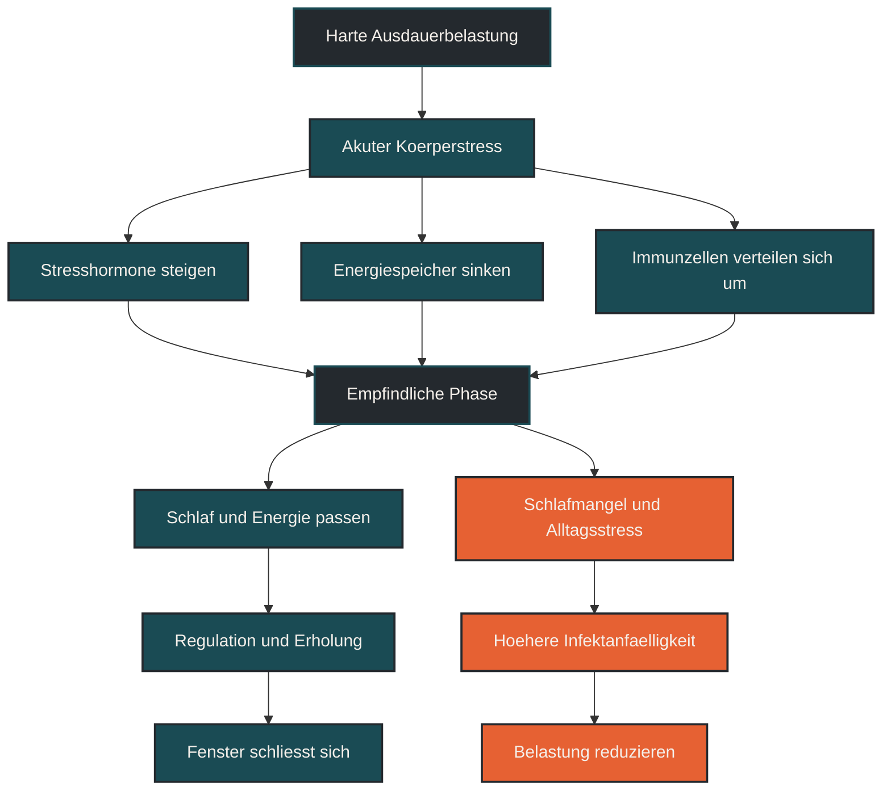

# Open-Window-Effekt

Der Open-Window-Effekt beschreibt die Annahme, dass das Immunsystem nach sehr langen oder intensiven Ausdauerbelastungen vorübergehend anfälliger für Infekte sein kann. Im Ausdauertraining ist das wichtig, weil harte Einheiten, Wettkämpfe, Schlafmangel, Energiemangel und Alltagsstress zusammen die Belastbarkeit des Körpers senken können. Entscheidend ist: Das „offene Fenster“ ist keine einfache Immunschwäche, sondern eine kurzfristige Veränderung der Immunregulation im Gesamtstress des Körpers. [[1]](#quelle-1) [[2]](#quelle-2) [[3]](#quelle-3)

## Was der Open-Window-Effekt bedeutet

Der Begriff Open-Window-Effekt wird häufig verwendet, um eine Phase nach intensiver oder langer Belastung zu beschreiben, in der der Körper empfindlicher auf Krankheitserreger reagieren könnte. Gemeint ist vor allem die Zeit nach langen Läufen, Wettkämpfen, sehr harten Intervallen oder mehrtägigen Belastungsblöcken. [[2]](#quelle-2) [[4]](#quelle-4) [[6]](#quelle-6)

Früher wurde diese Phase oft so erklärt, als sei das Immunsystem nach dem Training einfach „unterdrückt“. Diese Sicht ist zu grob. Heute wird die Reaktion differenzierter betrachtet: Immunzellen verändern ihre Verteilung, Entzündungssignale verschieben sich, Stresshormone bleiben vorübergehend erhöht und der Körper priorisiert Reparatur, Energieausgleich und Regulation. [[1]](#quelle-1) [[2]](#quelle-2) [[3]](#quelle-3)

Das Fenster ist also nicht einfach offen oder geschlossen. Es hängt davon ab, wie hoch die Trainingsbelastung war und in welchem Zustand der Körper in die Einheit hineingegangen ist. [[1]](#quelle-1) [[2]](#quelle-2) [[3]](#quelle-3)

## Warum der Open-Window-Effekt wichtig ist

Für Ausdauersportler ist der Open-Window-Effekt wichtig, weil Infekte oft nicht zufällig in Trainingsphasen auftreten. Viele Läufer werden nicht nach einer einzelnen lockeren Einheit krank, sondern eher nach Wettkämpfen, Trainingslagern, sehr langen Läufen oder Wochen mit hoher Gesamtbelastung. [[2]](#quelle-2) [[4]](#quelle-4) [[6]](#quelle-6)

Dabei spielt nicht nur das Training selbst eine Rolle. Auch Schlaf, Ernährung, psychischer Stress, Kälte, Reisen, Kontakt zu vielen Menschen und unzureichende Regeneration können die Situation verschärfen. Der Open-Window-Effekt hilft deshalb weniger als starre Regel, sondern eher als Warnmodell: Nach hoher Belastung sollte der Körper nicht zusätzlich unnötig gestresst werden. [[5]](#quelle-5) [[7]](#quelle-7) [[8]](#quelle-8)

## Wie das offene Fenster entstehen kann

Nach intensiver Ausdauerbelastung muss der Körper mehrere Aufgaben gleichzeitig lösen. Energiespeicher werden wieder aufgefüllt, Flüssigkeit und Elektrolyte müssen ausgeglichen werden, Mikroverletzungen werden repariert und Entzündungsprozesse werden reguliert. [[5]](#quelle-5) [[7]](#quelle-7) [[8]](#quelle-8)

Gleichzeitig können Stresshormone wie Adrenalin und Cortisol erhöht sein. Diese beeinflussen, wie Immunzellen im Blut zirkulieren und wohin sie anschließend wandern. Manche Immunzellen erscheinen nach der Belastung niedriger im Blut, was früher als Immunsuppression gedeutet wurde. Eine andere Erklärung ist, dass sie nicht verschwinden, sondern in Gewebe und Schleimhäute umverteilt werden. [[1]](#quelle-1) [[2]](#quelle-2) [[3]](#quelle-3)

Praktisch bedeutet das: Der Körper befindet sich nach harter Belastung in einer empfindlichen Übergangsphase. Ob daraus ein Infekt entsteht, hängt aber nicht nur vom Training ab, sondern auch von Erregerkontakt, Erholung und individueller Belastbarkeit. [[2]](#quelle-2) [[4]](#quelle-4) [[6]](#quelle-6)

## Zentrale Einflussfaktoren

### Belastungsdauer

Sehr lange Belastungen erhöhen die Gesamtbeanspruchung. Lange Läufe, Ultrabelastungen, Marathons oder lange Radeinheiten können das Immunsystem stärker fordern als kurze, lockere Einheiten. Besonders relevant wird das, wenn solche Belastungen häufig auftreten oder nicht ausreichend regeneriert werden. [[2]](#quelle-2) [[4]](#quelle-4) [[6]](#quelle-6)

### Belastungsintensität

Hohe Intensitäten verstärken die akute Stressreaktion. Intervalle, Tempoläufe und Wettkämpfe können eine stärkere hormonelle und immunologische Reaktion auslösen als ruhige Dauerläufe. Das ist normal, braucht aber eine passende Erholungsphase. [[2]](#quelle-2) [[4]](#quelle-4) [[6]](#quelle-6)

### Energie- und Kohlenhydratverfügbarkeit

Wenn harte Einheiten mit geringer Energiezufuhr kombiniert werden, steigt die Gesamtbelastung. Niedrige Kohlenhydratverfügbarkeit kann den Stress der Einheit erhöhen und die Regeneration erschweren. Besonders ungünstig ist die Kombination aus hoher Trainingslast, Kaloriendefizit, wenig Schlaf und Alltagsdruck. [[5]](#quelle-5) [[7]](#quelle-7) [[8]](#quelle-8)

### Schlaf

Schlaf ist ein zentraler Faktor für Immunregulation und Regeneration. Wer nach harten Einheiten schlecht oder zu wenig schläft, verlängert möglicherweise die empfindliche Phase nach der Belastung. Dadurch kann sich der Körper schlechter stabilisieren. [[5]](#quelle-5) [[7]](#quelle-7) [[8]](#quelle-8)

### Erregerkontakt und Umgebung

Ein Infekt entsteht nicht nur durch ein belastetes Immunsystem, sondern auch durch Kontakt mit Erregern. Menschenmengen, Reisen, öffentliche Verkehrsmittel, Wettkampfveranstaltungen und enge Innenräume können das Risiko erhöhen. Deshalb ist die Zeit nach Wettkämpfen oft besonders relevant. [[5]](#quelle-5) [[7]](#quelle-7) [[8]](#quelle-8)

## Bedeutung für Läufer

Für Läufer bedeutet der Open-Window-Effekt vor allem: Nach sehr harten oder langen Einheiten ist Regeneration nicht optional. Der Körper braucht Zeit, Energie, Flüssigkeit, Schlaf und Ruhe, um die Belastung zu verarbeiten. [[5]](#quelle-5) [[7]](#quelle-7) [[8]](#quelle-8)

Das heißt nicht, dass jede harte Einheit gefährlich ist. Training lebt von Belastung. Problematisch wird es eher, wenn harte Belastungen dauerhaft auf einen bereits gestressten Körper treffen. Wer nach Wettkämpfen, langen Läufen oder intensiven Trainingswochen ungewöhnlich erschöpft ist, sollte das ernst nehmen und nicht sofort die nächste harte Einheit erzwingen. [[2]](#quelle-2) [[4]](#quelle-4) [[6]](#quelle-6)

## Häufige Fehler

Ein häufiger Fehler ist die Vorstellung, dass jede Trainingseinheit das Immunsystem schwächt. Das stimmt so nicht. Regelmäßiges, gut dosiertes Ausdauertraining kann langfristig zur Gesundheitsförderung beitragen. [[2]](#quelle-2) [[4]](#quelle-4) [[6]](#quelle-6)

Ein zweiter Fehler ist, den Open-Window-Effekt als Ausrede für Angst vor Belastung zu verwenden. Der Körper darf belastet werden. Entscheidend ist, ob Belastung und Erholung zusammenpassen. [[2]](#quelle-2) [[4]](#quelle-4) [[6]](#quelle-6)

Ein dritter Fehler ist, Warnzeichen zu ignorieren. Wer sich nach intensiven Einheiten ungewöhnlich erschöpft fühlt, schlecht schläft, Halsschmerzen entwickelt oder wiederholt Infekte bekommt, sollte die Gesamtbelastung prüfen. [[2]](#quelle-2) [[4]](#quelle-4) [[6]](#quelle-6)

## Praktische Einordnung

Der Open-Window-Effekt ist am sinnvollsten als Modell für erhöhte Aufmerksamkeit nach hoher Belastung. Nach langen Läufen, Wettkämpfen oder intensiven Trainingsblöcken lohnt es sich, Schlaf, Ernährung, Flüssigkeit, Wärme und Hygiene bewusst ernst zu nehmen. [[5]](#quelle-5) [[7]](#quelle-7) [[8]](#quelle-8)

Für die Trainingsplanung bedeutet das: Harte Belastungen brauchen Platz. Wer intensive Einheiten sinnvoll einbettet, lockere Tage wirklich locker hält und Regeneration aktiv plant, reduziert unnötigen Zusatzstress. [[2]](#quelle-2) [[4]](#quelle-4) [[6]](#quelle-6)

Der wichtigste Merksatz lautet: Das offene Fenster entsteht nicht nur durch Training, sondern durch Training plus Gesamtstress. [[1]](#quelle-1) [[2]](#quelle-2) [[3]](#quelle-3)

----

----

## Häufige Fragen zu Open-Window-Effekt

### Was ist der Open-Window-Effekt einfach erklärt?

Der Open-Window-Effekt beschreibt eine mögliche empfindliche Phase nach sehr langer oder intensiver Belastung. In dieser Zeit kann der Körper stärker mit Regeneration, Energieausgleich und Immunregulation beschäftigt sein. [[5]](#quelle-5) [[7]](#quelle-7) [[8]](#quelle-8)

### Ist das Immunsystem nach dem Training wirklich geschwächt?

Nicht unbedingt. Die frühere Vorstellung einer einfachen Immunschwäche ist zu grob. Häufig verändern sich Immunzellverteilung, Stresshormone und Entzündungssignale vorübergehend. [[1]](#quelle-1) [[2]](#quelle-2) [[3]](#quelle-3)

### Wann ist der Open-Window-Effekt besonders relevant?

Besonders relevant ist er nach Wettkämpfen, langen Läufen, sehr intensiven Einheiten, Trainingslagern oder Phasen mit hoher Gesamtbelastung. Das gilt vor allem, wenn wenig Schlaf, Energiemangel oder Alltagsstress dazukommen. [[5]](#quelle-5) [[7]](#quelle-7) [[8]](#quelle-8)

### Wie lange dauert das offene Fenster?

Das lässt sich nicht pauschal sagen. Die Dauer hängt von Belastung, Trainingszustand, Schlaf, Ernährung und Gesamtstress ab. Nach lockeren Einheiten ist die Reaktion meist deutlich geringer als nach sehr langen oder harten Belastungen. [[5]](#quelle-5) [[7]](#quelle-7) [[8]](#quelle-8)

### Was kann ich nach harten Einheiten tun?

Sinnvoll sind ausreichend Schlaf, passende Energie- und Flüssigkeitszufuhr, lockere Erholung, Wärme und ein bewusster Umgang mit zusätzlichem Stress. Direkt nach sehr harten Belastungen sollte nicht sofort die nächste intensive Einheit folgen. [[5]](#quelle-5) [[7]](#quelle-7) [[8]](#quelle-8)

### Bedeutet der Open-Window-Effekt, dass hartes Training ungesund ist?

Nein. Hartes Training kann sinnvoll sein, wenn es richtig dosiert und gut eingebettet wird. Problematisch wird es, wenn hohe Belastung dauerhaft ohne ausreichende Regeneration stattfindet. [[2]](#quelle-2) [[4]](#quelle-4) [[6]](#quelle-6)

----

----

## Quellen

### Quelle 1

Debunking the Myth of Exercise-Induced Immune Suppression: Redefining the Impact of Exercise on Immunological Health Across the Lifespan. Campbell, J. P., & Turner, J. E. (2018). [Debunking the Myth of Exercise-Induced Immune Suppression: Redefining the Impact of Exercise on Immunological Health Across the Lifespan.](https://pmc.ncbi.nlm.nih.gov/articles/PMC5911985/), Frontiers in Immunology, 9, 648.

### Quelle 2

The compelling link between physical activity and the body's defense system. Nieman, D. C., & Wentz, L. M. (2019). [The compelling link between physical activity and the body's defense system.](https://pmc.ncbi.nlm.nih.gov/articles/PMC6523821/), Journal of Sport and Health Science, 8(3), 201–217.

### Quelle 3

Recovery of the immune system after exercise. Peake, J. M., Neubauer, O., Walsh, N. P., & Simpson, R. J. (2017). [Recovery of the immune system after exercise.](https://journals.physiology.org/doi/full/10.1152/japplphysiol.00622.2016), Journal of Applied Physiology, 122(5), 1077–1087.

### Quelle 4

Position statement. Part one: Immune function and exercise. Walsh, N. P., Gleeson, M., Shephard, R. J., et al. (2011). [Position statement. Part one: Immune function and exercise.](https://europepmc.org/article/MED/21446352), Exercise Immunology Review, 17, 6–63.

### Quelle 5

Position statement. Part two: Maintaining immune health. Walsh, N. P., Gleeson, M., Pyne, D. B., et al. (2011). [Position statement. Part two: Maintaining immune health.](https://europepmc.org/abstract/MED/21446353), Exercise Immunology Review, 17, 64–103.

### Quelle 6

Exercise, upper respiratory tract infection, and the immune system. Nieman, D. C. (1994). [Exercise, upper respiratory tract infection, and the immune system.](https://europepmc.org/abstract/MED/8164529), Medicine & Science in Sports & Exercise, 26(2), 128–139.

### Quelle 7

Nutrition for endurance sports: marathon, triathlon, and road cycling. Jeukendrup, A. E. (2011). [Nutrition for endurance sports: marathon, triathlon, and road cycling.](https://pubmed.ncbi.nlm.nih.gov/21916794/), Journal of Sports Sciences, 29 Suppl 1, S91–S99.

### Quelle 8

2023 International Olympic Committee's consensus statement on Relative Energy Deficiency in Sport (REDs). Mountjoy, M., Ackerman, K. E., Bailey, D. M., et al. (2023). [2023 International Olympic Committee's consensus statement on Relative Energy Deficiency in Sport (REDs).](https://bjsm.bmj.com/content/57/17/1073), British Journal of Sports Medicine, 57(17), 1073–1097.

----

*Hinweis: Dieser Artikel dient der allgemeinen Information und ersetzt keine medizinische oder therapeutische Beratung. Mehr dazu im [**Gesundheits- und Quellenhinweis**](/ausdauersport/disclaimer/).*
