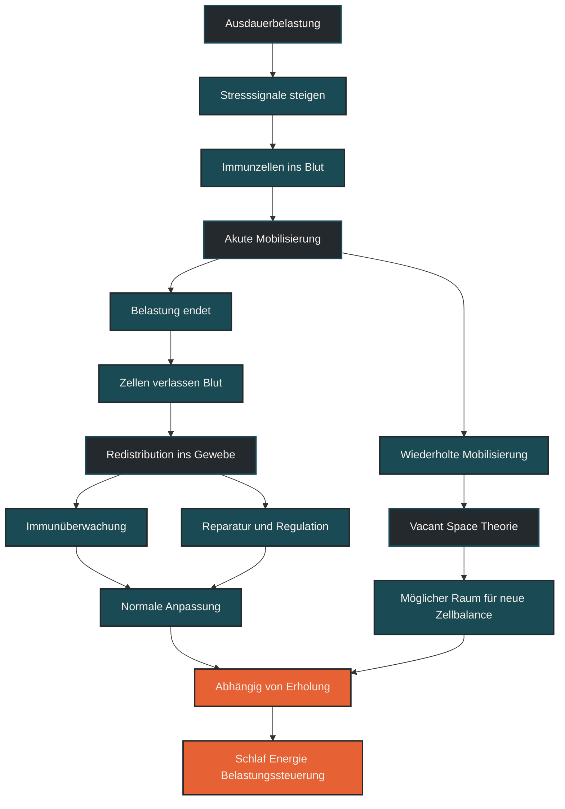

# Redistribution und Vacant-Space-Theorie

Redistribution und Vacant-Space-Theorie beschreiben, wie Immunzellen durch Ausdauerbelastung vorübergehend umverteilt werden und wie dadurch langfristig Raum für eine erneuerte Immunzellbalance entstehen könnte. Im Ausdauertraining ist das wichtig, weil die sinkende Zellzahl im Blut nach Belastung nicht automatisch Immunschwäche bedeutet. Entscheidend ist: Viele Immunzellen verschwinden nicht, sondern wechseln ihren Ort. [[5]](#quelle-5) [[6]](#quelle-6)

## Was Redistribution bedeutet

Redistribution bedeutet Umverteilung. Bei Ausdauerbelastung werden Immunzellen zunächst vermehrt in den Blutkreislauf mobilisiert. Das betrifft unter anderem natürliche Killerzellen, T-Zellen, Monozyten und andere Immunzellgruppen. [[1]](#quelle-1) [[2]](#quelle-2) [[3]](#quelle-3)

Nach der Belastung sinken manche Zellzahlen im Blut wieder deutlich ab. Früher wurde das oft als Zeichen einer unterdrückten Immunabwehr interpretiert. Die moderne Einordnung ist vorsichtiger: Viele dieser Zellen sind nicht einfach verloren, sondern wandern aus dem Blut in Gewebe, Schleimhäute oder andere immunologisch relevante Bereiche. [[1]](#quelle-1) [[2]](#quelle-2) [[3]](#quelle-3)

Das Blutbild zeigt also nur einen Ausschnitt. Wenn weniger Immunzellen im Blut messbar sind, heißt das nicht automatisch, dass der Körper insgesamt weniger Abwehrkraft besitzt. [[1]](#quelle-1) [[2]](#quelle-2) [[3]](#quelle-3)

## Was die Vacant-Space-Theorie bedeutet

Die Vacant-Space-Theorie beschreibt die Idee, dass wiederholte Belastungsreize bestimmte Immunzellen mobilisieren und dadurch langfristig eine Art „freier Raum“ im Immunsystem entstehen könnte. Dieser Raum könnte theoretisch dazu beitragen, dass neue oder weniger erschöpfte Immunzellen nachrücken. [[5]](#quelle-5) [[6]](#quelle-6)

Im Ausdauersport wird diese Theorie vor allem im Zusammenhang mit Immunalterung diskutiert. Mit zunehmendem Alter können sich stärker ausdifferenzierte oder weniger flexible Immunzellen ansammeln. Regelmäßige körperliche Aktivität könnte helfen, solche Zellpopulationen stärker zu mobilisieren und die Immunzelllandschaft dynamischer zu halten. [[5]](#quelle-5) [[6]](#quelle-6)

Wichtig ist aber: Die Vacant-Space-Theorie ist kein einfacher Beweis dafür, dass jedes Training das Immunsystem automatisch verjüngt. Sie ist ein Erklärungsmodell, das hilft, mögliche langfristige Effekte von regelmäßiger Bewegung auf Immunüberwachung und Immunbalance einzuordnen. [[5]](#quelle-5) [[6]](#quelle-6)

## Warum diese Modelle wichtig sind

Redistribution und Vacant-Space-Theorie sind wichtig, weil sie eine zu einfache Sicht auf das Immunsystem korrigieren. Nach Training sieht man im Blut manchmal weniger Lymphozyten. Daraus wurde lange abgeleitet, dass das Immunsystem nach Belastung geschwächt sei. [[5]](#quelle-5) [[6]](#quelle-6)

Diese Schlussfolgerung ist zu kurz. Immunzellen erfüllen ihre Aufgaben nicht nur im Blut. Sie zirkulieren, wandern, kontrollieren Gewebe und reagieren auf Signale aus Muskeln, Schleimhäuten und Organen. Ausdauertraining verändert diese Bewegungsmuster. [[1]](#quelle-1) [[2]](#quelle-2) [[3]](#quelle-3)

Für die Praxis bedeutet das: Eine akute Veränderung im Blutbild ist nicht automatisch ein Problem. Entscheidend ist der Kontext aus Trainingsdosis, Erholung, Schlaf, Energieverfügbarkeit, Infektzeichen und langfristiger Belastbarkeit. [[1]](#quelle-1) [[2]](#quelle-2) [[3]](#quelle-3)

## Wie Ausdauertraining die Zellverteilung beeinflusst

Während intensiver oder längerer Belastung steigen Stresshormone wie Adrenalin und Noradrenalin. Diese Signale mobilisieren Immunzellen aus Gefäßwänden, Milz, Lymphgewebe und anderen Reservoirs in den Blutkreislauf. [[1]](#quelle-1) [[2]](#quelle-2) [[3]](#quelle-3)

Nach der Belastung verändert sich die Situation. Stresshormone sinken, Entzündungs- und Reparatursignale werden reguliert, und Immunzellen wandern wieder aus dem Blut heraus. Das kann dazu führen, dass bestimmte Zellgruppen im Blut kurzfristig unter den Ausgangswert fallen. [[1]](#quelle-1) [[2]](#quelle-2) [[3]](#quelle-3)

Diese Phase ist nicht zwangsläufig eine offene Tür für Infekte. Sie kann auch eine gezielte Umverteilung zur Immunüberwachung sein. Problematisch wird es eher, wenn hohe Belastung dauerhaft mit Schlafmangel, Energiemangel, psychischem Stress oder beginnenden Infekten kombiniert wird. [[1]](#quelle-1) [[2]](#quelle-2) [[3]](#quelle-3)

## Zentrale Einflussfaktoren

### Belastungsintensität

Hohe Intensitäten führen meist zu einer stärkeren Mobilisierung von Immunzellen. Intervalle, Tempoläufe und Wettkämpfe können deshalb deutlicher auf die Zellverteilung wirken als lockere Dauerläufe. [[2]](#quelle-2) [[4]](#quelle-4) [[7]](#quelle-7)

### Belastungsdauer

Sehr lange Belastungen erzeugen eine größere Gesamtbeanspruchung. Je länger die Einheit dauert, desto stärker können Energieverfügbarkeit, Flüssigkeitshaushalt, Entzündungssignale und Immunzellbewegung beeinflusst werden. [[2]](#quelle-2) [[4]](#quelle-4) [[7]](#quelle-7)

### Trainingszustand

Gut trainierte Sportler reagieren auf gewohnte Belastungen oft kontrollierter als Einsteiger. Eine Einheit, die für eine Person moderat ist, kann für eine andere eine starke Stressreaktion auslösen. [[2]](#quelle-2) [[4]](#quelle-4) [[7]](#quelle-7)

### Regeneration

Schlaf, Ernährung, ruhige Tage und Belastungssteuerung beeinflussen, ob die Umverteilung Teil einer normalen Anpassung bleibt oder in eine ungünstige Gesamtbelastung übergeht. [[1]](#quelle-1) [[2]](#quelle-2) [[3]](#quelle-3)

### Alter und Immunstatus

Mit zunehmendem Alter verändert sich das Immunsystem. Die Vacant-Space-Theorie ist deshalb besonders interessant, wenn es um Immunoseneszenz, also altersbedingte Veränderungen der Immunfunktion, geht. Für die Praxis bleibt aber entscheidend, Training sinnvoll zu dosieren. [[5]](#quelle-5) [[6]](#quelle-6)

## Bedeutung für Läufer

Für Läufer bedeutet Redistribution vor allem: Nach einer harten Einheit ist das Immunsystem nicht einfach ausgeschaltet. Der Körper sortiert sich neu. Immunzellen werden mobilisiert, verteilt und in Regenerationsprozesse eingebunden. [[1]](#quelle-1) [[2]](#quelle-2) [[3]](#quelle-3)

Das ist besonders relevant nach Wettkämpfen, langen Läufen oder intensiven Trainingsblöcken. In solchen Phasen sollte man nicht nur auf Muskelkater achten, sondern auch auf allgemeine Erschöpfung, Schlafqualität, Appetit, Stimmung und Infektzeichen. [[3]](#quelle-3) [[7]](#quelle-7)

Die Vacant-Space-Theorie liefert zusätzlich eine langfristige Perspektive. Regelmäßiges, angemessen dosiertes Ausdauertraining könnte helfen, das Immunsystem beweglich und anpassungsfähig zu halten. Das funktioniert aber nicht über maximale Härte, sondern über wiederholte, gut verkraftete Reize. [[5]](#quelle-5) [[6]](#quelle-6)

## Häufige Fehler

Ein häufiger Fehler ist die Annahme, dass weniger Immunzellen im Blut nach dem Training automatisch eine geschwächte Abwehr bedeuten. Das Blut ist nur ein Messraum, nicht das gesamte Immunsystem. [[1]](#quelle-1) [[2]](#quelle-2) [[3]](#quelle-3)

Ein zweiter Fehler ist, aus der Vacant-Space-Theorie eine einfache Anti-Aging-Regel abzuleiten. Training kann gesundheitsfördernd sein, aber es ersetzt keine Erholung, keine ausreichende Energiezufuhr und keine medizinische Abklärung bei Beschwerden. [[5]](#quelle-5) [[6]](#quelle-6)

Ein dritter Fehler ist, die Modelle als Freifahrtschein für hohe Belastung zu verstehen. Auch wenn Umverteilung nicht automatisch Immunsuppression bedeutet, kann zu viel Gesamtstress die Infektanfälligkeit erhöhen. [[1]](#quelle-1) [[2]](#quelle-2) [[3]](#quelle-3)

## Praktische Einordnung

Redistribution und Vacant-Space-Theorie helfen, Immunreaktionen nach Ausdauertraining differenzierter zu verstehen. Sie zeigen, dass das Immunsystem nicht statisch ist, sondern ständig zwischen Blut, Gewebe, Schleimhäuten und Lymphsystem wechselt. [[5]](#quelle-5) [[6]](#quelle-6)

Für die Trainingspraxis ist entscheidend, akute Immunveränderungen nicht zu überinterpretieren, aber Warnzeichen ernst zu nehmen. Regelmäßige Bewegung kann ein sinnvoller Reiz für Immunüberwachung und Immunbalance sein. Zu hohe Belastung ohne Erholung kann diese Balance jedoch stören. [[2]](#quelle-2) [[4]](#quelle-4) [[7]](#quelle-7)

Der wichtigste Merksatz lautet: Nach dem Training sind Immunzellen nicht einfach weg, sie sind oft nur woanders. [[1]](#quelle-1) [[3]](#quelle-3)

----

----

## Häufige Fragen zu Redistribution und Vacant-Space-Theorie

### Was bedeutet Redistribution einfach erklärt?

Redistribution bedeutet, dass Immunzellen durch Training ihren Ort verändern. Sie erscheinen während der Belastung vermehrt im Blut und wandern danach wieder in Gewebe, Schleimhäute oder andere immunologisch aktive Bereiche. [[1]](#quelle-1) [[2]](#quelle-2) [[3]](#quelle-3)

### Sind weniger Immunzellen im Blut nach Training schlecht?

Nicht automatisch. Weniger Immunzellen im Blut bedeuten nicht zwingend, dass das Immunsystem geschwächt ist. Viele Zellen können aus dem Blut in andere Körperbereiche umverteilt worden sein. [[1]](#quelle-1) [[2]](#quelle-2) [[3]](#quelle-3)

### Was beschreibt die Vacant-Space-Theorie?

Die Vacant-Space-Theorie beschreibt die Idee, dass wiederholte Mobilisierung von Immunzellen langfristig Raum für eine erneuerte oder flexiblere Immunzellbalance schaffen könnte. Sie wird vor allem im Zusammenhang mit Immunalterung diskutiert. [[5]](#quelle-5) [[6]](#quelle-6)

### Hat die Vacant-Space-Theorie etwas mit Anti-Aging zu tun?

Sie kann helfen, mögliche Zusammenhänge zwischen Bewegung und Immunalterung einzuordnen. Sie ist aber kein Beweis dafür, dass Training das Immunsystem automatisch verjüngt. Entscheidend bleiben Trainingsdosis, Regeneration und Gesamtgesundheit. [[5]](#quelle-5) [[6]](#quelle-6)

### Warum ist das für Läufer relevant?

Läufer erleben nach langen oder intensiven Einheiten oft deutliche körperliche Reaktionen. Redistribution erklärt, warum Immunveränderungen nach Belastung nicht nur als Schwäche, sondern auch als normale Umorganisation verstanden werden können. [[1]](#quelle-1) [[2]](#quelle-2) [[3]](#quelle-3)

### Was ist der häufigste Denkfehler?

Der häufigste Denkfehler ist, Blutwerte nach Training isoliert zu betrachten. Das Immunsystem arbeitet nicht nur im Blut, sondern auch in Gewebe, Schleimhäuten, Lymphsystem und Organen. [[1]](#quelle-1) [[2]](#quelle-2) [[3]](#quelle-3)

----

----

## Quellen

### Quelle 1: Debunking the Myth of Exercise-Induced Immune Suppression: Redefining the Impact of Exercise on Immunological Health Across the Lifespan.

Campbell, J. P., & Turner, J. E. (2018). [Debunking the Myth of Exercise-Induced Immune Suppression: Redefining the Impact of Exercise on Immunological Health Across the Lifespan.](https://pmc.ncbi.nlm.nih.gov/articles/PMC5911985/), Frontiers in Immunology, 9, 648.

### Quelle 2: Recovery of the immune system after exercise.

Peake, J. M., Neubauer, O., Walsh, N. P., & Simpson, R. J. (2017). [Recovery of the immune system after exercise.](https://journals.physiology.org/doi/full/10.1152/japplphysiol.00622.2016), Journal of Applied Physiology, 122(5), 1077–1087.

### Quelle 3: The compelling link between physical activity and the body's defense system.

Nieman, D. C., & Wentz, L. M. (2019). [The compelling link between physical activity and the body's defense system.](https://pmc.ncbi.nlm.nih.gov/articles/PMC6523821/), Journal of Sport and Health Science, 8(3), 201–217.

### Quelle 4: Exercise and the Regulation of Immune Functions.

Simpson, R. J., Campbell, J. P., Gleeson, M., et al. (2015). [Exercise and the Regulation of Immune Functions.](https://pubmed.ncbi.nlm.nih.gov/26477922/), Progress in Molecular Biology and Translational Science, 135, 355–380.

### Quelle 5: Is immunosenescence influenced by our lifetime “dose” of exercise?

Turner, J. E. (2016). [Is immunosenescence influenced by our lifetime “dose” of exercise?](https://pmc.ncbi.nlm.nih.gov/articles/PMC4889625/), Biogerontology, 17, 581–602.

### Quelle 6: Major features of immunesenescence, including reduced thymic output, are ameliorated by high levels of physical activity in adulthood.

Duggal, N. A., Pollock, R. D., Lazarus, N. R., et al. (2018). [Major features of immunesenescence, including reduced thymic output, are ameliorated by high levels of physical activity in adulthood.](https://europepmc.org/article/pmc/5847865), Aging Cell, 17(2), e12750.

### Quelle 7: Position statement. Part one: Immune function and exercise.

Walsh, N. P., Gleeson, M., Shephard, R. J., et al. (2011). [Position statement. Part one: Immune function and exercise.](https://europepmc.org/article/MED/21446352), Exercise Immunology Review, 17, 6–63.

----

*Hinweis: Dieser Artikel dient der allgemeinen Information und ersetzt keine medizinische oder therapeutische Beratung. Mehr dazu im [**Gesundheits- und Quellenhinweis**](/ausdauersport/disclaimer/).*
