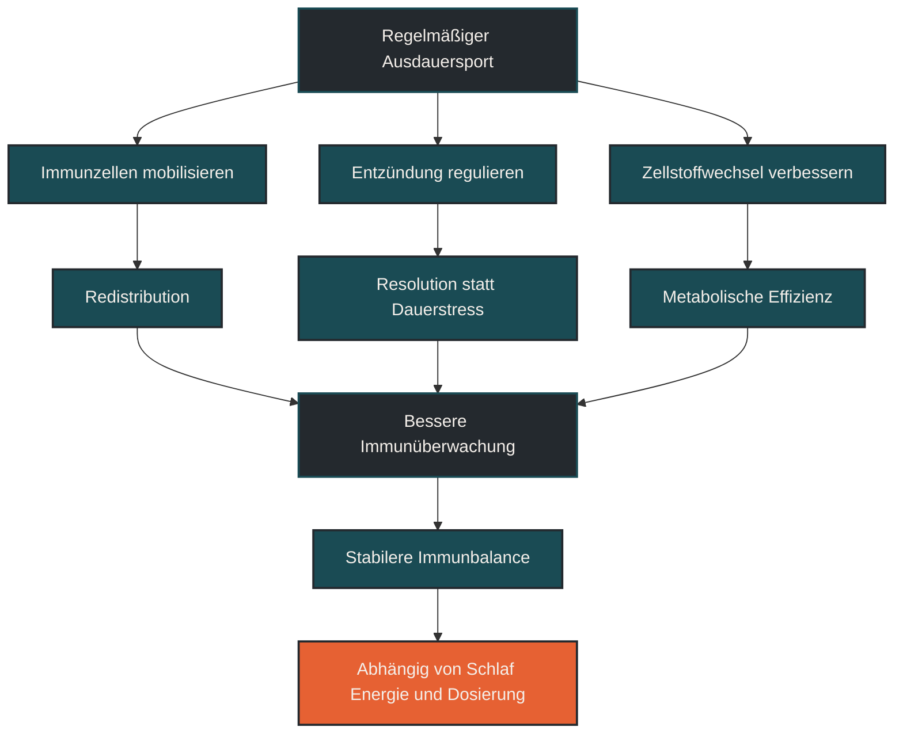
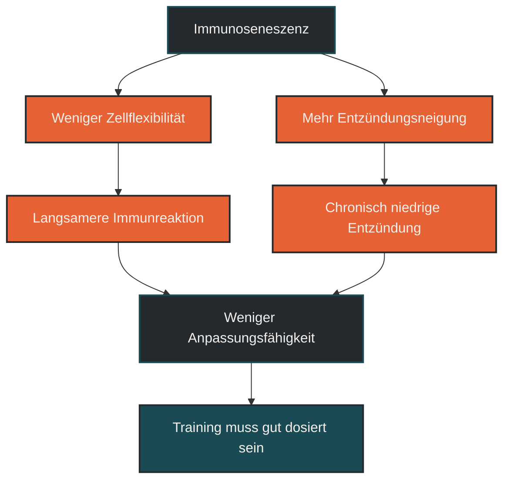

# Ausdauersport gegen Immunoseneszenz

Ausdauersport gegen Immunoseneszenz beschreibt, wie regelmäßige aerobe Belastung altersbedingte Veränderungen des Immunsystems günstig beeinflussen kann. Im Ausdauertraining ist das wichtig, weil Immunalterung nicht nur mit Infektanfälligkeit, sondern auch mit chronisch erhöhter Entzündungsaktivität, schlechterer Zellregulation und verlangsamter Erholung zusammenhängen kann. Entscheidend ist: Ausdauersport stoppt das Altern nicht, kann aber helfen, Immunzellen beweglicher, regulierter und metabolisch effizienter zu halten. [[1]](#quelle-1) [[2]](#quelle-2) [[7]](#quelle-7)

## Was Immunoseneszenz bedeutet

Immunoseneszenz beschreibt altersbedingte Veränderungen des Immunsystems. Mit zunehmendem Alter verändert sich die Zusammensetzung der Immunzellen. Manche Zellgruppen reagieren weniger flexibel, andere bleiben länger aktiv oder senden dauerhaft entzündliche Signale. [[1]](#quelle-1) [[2]](#quelle-2) [[7]](#quelle-7)

Das bedeutet nicht, dass das Immunsystem plötzlich ausfällt. Es wird eher weniger anpassungsfähig. Neue Erreger, Impfantworten, Entzündungsregulation und Reparaturprozesse können dadurch anders ablaufen als in jüngeren Jahren. [[1]](#quelle-1) [[2]](#quelle-2)

Ein wichtiger Begleitbegriff ist Inflammaging. Damit ist eine niedriggradige, chronische Entzündungsneigung gemeint, die im Alter häufiger beobachtet wird. Für Ausdauersportler ist das relevant, weil Training, Regeneration und Gesundheit immer auch von einer guten Entzündungsbalance abhängen. [[1]](#quelle-1) [[2]](#quelle-2) [[7]](#quelle-7)

## Warum Ausdauersport dabei wichtig ist

Regelmäßiger Ausdauersport wirkt nicht nur auf Herz, Muskeln und Stoffwechsel. Er beeinflusst auch die Art, wie Immunzellen mobilisiert, umverteilt und reguliert werden. Jede Belastung ist ein Reiz, auf den das Immunsystem reagieren muss. [[3]](#quelle-3) [[6]](#quelle-6)

Langfristig kann ein sinnvoll dosiertes Ausdauertraining dazu beitragen, dass Immunzellen häufiger zirkulieren, Gewebe überwachen und entzündliche Prozesse besser reguliert werden. Besonders interessant ist dabei die Verbindung aus Zellmobilisierung, Entzündungsauflösung und Immunometabolismus. [[3]](#quelle-3) [[6]](#quelle-6)

Das bedeutet aber nicht, dass möglichst viel Training automatisch besser ist. Der positive Effekt entsteht vor allem durch regelmäßige, gut verkraftete Belastung. Zu viel Training, zu wenig Schlaf, Energiemangel oder dauerhafter Stress können die gleiche Richtung wieder kippen. [[2]](#quelle-2) [[4]](#quelle-4) [[5]](#quelle-5)

## Wie Ausdauersport auf Immunalterung wirken kann

Ausdauertraining mobilisiert Immunzellen aus verschiedenen Speicherorten in den Blutkreislauf. Besonders bei intensiveren Reizen werden bestimmte T-Zellen, natürliche Killerzellen und andere Immunzellen kurzfristig stärker sichtbar. [[3]](#quelle-3) [[6]](#quelle-6)

Nach der Belastung verlassen viele dieser Zellen den Blutkreislauf wieder. Sie verschwinden nicht einfach, sondern wandern in Gewebe, Schleimhäute oder andere immunologisch aktive Bereiche. Diese Umverteilung kann als Training der Immunüberwachung verstanden werden. [[3]](#quelle-3) [[6]](#quelle-6)

Im Zusammenhang mit Immunoseneszenz wird häufig diskutiert, dass wiederholte Mobilisierung alter oder weniger funktioneller Immunzellen langfristig zu einer günstigeren Zellbalance beitragen könnte. Die Vacant-Space-Theorie beschreibt genau diese Idee: Wenn stark ausdifferenzierte oder dysfunktionale Zellen mobilisiert und abgebaut werden, kann Raum für funktionellere Zellpopulationen entstehen. [[1]](#quelle-1) [[2]](#quelle-2) [[7]](#quelle-7)

## Entzündungsregulation statt Dauerfeuer

Ein alterndes Immunsystem kann dazu neigen, entzündliche Signale länger oder stärker aufrechtzuerhalten. Ausdauertraining kann helfen, Entzündungsreaktionen nicht nur auszulösen, sondern auch wieder zu beenden. [[1]](#quelle-1) [[2]](#quelle-2) [[7]](#quelle-7)

Das ist ein wichtiger Punkt. Anpassung entsteht nicht dadurch, dass Entzündung komplett verhindert wird. Anpassung entsteht, wenn Entzündung, Reparatur und Rückkehr in einen stabilen Zustand gut zusammenarbeiten. [[1]](#quelle-1) [[2]](#quelle-2)

Gut dosiertes Ausdauertraining kann diese Regulation unterstützen. Schlecht dosiertes Training kann dagegen zusätzliche Entzündungs- und Stresssignale erzeugen, wenn die Regeneration nicht ausreicht. [[2]](#quelle-2) [[4]](#quelle-4) [[5]](#quelle-5)

## Zentrale Einflussfaktoren

### Regelmäßigkeit

Der mögliche Schutz vor Immunoseneszenz entsteht nicht durch eine einzelne harte Einheit. Entscheidend ist wiederholte, langfristige Bewegung. Regelmäßigkeit ist für das Immunsystem oft wichtiger als extreme Spitzenbelastung. [[1]](#quelle-1) [[2]](#quelle-2) [[7]](#quelle-7)

### Trainingsdosis

Moderate und gut verträgliche Ausdauerreize können die Immunregulation unterstützen. Sehr hohe Umfänge oder häufige intensive Einheiten ohne ausreichende Erholung können dagegen die Gesamtbelastung erhöhen. [[1]](#quelle-1) [[2]](#quelle-2)

### Erholung

Schlaf, Ruhetage und lockere Einheiten entscheiden mit darüber, ob Training als positiver Reiz verarbeitet wird. Ohne Erholung wird aus Anpassung leicht Dauerstress. [[2]](#quelle-2) [[4]](#quelle-4) [[5]](#quelle-5)

### Energieverfügbarkeit

Das Immunsystem braucht Energie. Wer viel trainiert und dauerhaft zu wenig isst, kann die Immunfunktion belasten. Besonders im Alter ist eine ausreichende Energie- und Proteinversorgung wichtig, weil Regeneration, Muskelerhalt und Immunfunktion eng zusammenhängen. [[1]](#quelle-1) [[2]](#quelle-2) [[7]](#quelle-7)

### Entzündungsbalance

Ausdauertraining kann helfen, Entzündungsprozesse besser zu regulieren. Der Effekt hängt aber vom Gesamtbild ab: Training, Ernährung, Schlaf, Stress, Erkrankungen und Lebensstil wirken zusammen. [[2]](#quelle-2) [[4]](#quelle-4) [[5]](#quelle-5)

## Bedeutung für Läufer

Für Läufer bedeutet das: Regelmäßiges Lauftraining kann ein sinnvoller Reiz sein, um das Immunsystem aktiv, beweglich und regulierbar zu halten. Besonders ruhige Dauerläufe, gut dosierte Tempoanteile und konsequente Erholung können langfristig wertvoll sein. [[2]](#quelle-2) [[4]](#quelle-4) [[5]](#quelle-5)

Wichtig ist aber, den Begriff „gegen Immunoseneszenz“ nicht als Kampf gegen das Altern zu verstehen. Es geht nicht darum, Alterung zu verhindern. Es geht darum, die Anpassungsfähigkeit des Körpers möglichst lange zu erhalten. [[1]](#quelle-1) [[2]](#quelle-2) [[7]](#quelle-7)

Für ältere Läufer oder Master-Athleten ist deshalb nicht maximale Härte entscheidend, sondern Belastungsverträglichkeit. Training soll regelmäßig genug sein, um Anpassung auszulösen, aber dosiert genug, um Regeneration, Schlaf und Immunbalance nicht zu überfordern. [[1]](#quelle-1) [[2]](#quelle-2) [[7]](#quelle-7)

## Häufige Fehler

Ein häufiger Fehler ist die Vorstellung, Ausdauersport mache das Immunsystem automatisch jünger. So einfach ist es nicht. Training kann günstige Reize setzen, ersetzt aber keine Erholung, keine ausreichende Energiezufuhr und keine medizinische Betreuung bei Beschwerden. [[2]](#quelle-2) [[4]](#quelle-4) [[5]](#quelle-5)

Ein zweiter Fehler ist, nur auf intensive Einheiten zu setzen. Immunologische Anpassung entsteht nicht nur durch harte Belastung. Auch lockere, regelmäßige Ausdauerreize können wichtig sein. [[2]](#quelle-2) [[4]](#quelle-4) [[5]](#quelle-5)

Ein dritter Fehler ist, Warnzeichen zu ignorieren. Häufige Infekte, ungewöhnliche Müdigkeit, schlechter Schlaf, Leistungsabfall oder anhaltende Erschöpfung können Hinweise sein, dass die Gesamtbelastung zu hoch ist. [[4]](#quelle-4) [[6]](#quelle-6)

## Praktische Einordnung

Ausdauersport kann Immunoseneszenz nicht aufheben, aber altersbedingte Immunveränderungen günstig begleiten. Der wichtigste Mechanismus ist wahrscheinlich nicht ein einzelner Effekt, sondern das Zusammenspiel aus Zellmobilisierung, besserer Entzündungsauflösung, metabolischer Effizienz und regelmäßiger Immunüberwachung. [[1]](#quelle-1) [[2]](#quelle-2) [[7]](#quelle-7)

Für die Trainingspraxis bedeutet das: Langfristig denken, regelmäßig trainieren, Erholung ernst nehmen und intensive Belastungen bewusst dosieren. Das Ziel ist nicht, das Immunsystem ständig maximal zu reizen, sondern es immer wieder sinnvoll zu fordern und anschließend gut regenerieren zu lassen. [[2]](#quelle-2) [[4]](#quelle-4) [[5]](#quelle-5)

Der wichtigste Merksatz lautet: Ausdauersport wirkt gegen Immunoseneszenz nicht durch maximale Härte, sondern durch regelmäßige, gut regenerierte Reize. [[1]](#quelle-1) [[2]](#quelle-2) [[7]](#quelle-7)

----

## Ausdauersport und Immunbalance

----

## Immunoseneszenz

----

## Häufige Fragen zu Ausdauersport gegen Immunoseneszenz

### Was ist Immunoseneszenz einfach erklärt?

Immunoseneszenz beschreibt altersbedingte Veränderungen des Immunsystems. Immunzellen können weniger flexibel reagieren, entzündliche Signale können länger bestehen bleiben und die Immunregulation verändert sich. [[1]](#quelle-1) [[2]](#quelle-2) [[7]](#quelle-7)

### Kann Ausdauersport Immunoseneszenz verhindern?

Ausdauersport kann Immunoseneszenz nicht verhindern oder rückgängig machen. Regelmäßige, gut dosierte Bewegung kann aber helfen, Immunzellen zu mobilisieren, Entzündung besser zu regulieren und die Anpassungsfähigkeit des Körpers zu unterstützen. [[1]](#quelle-1) [[2]](#quelle-2) [[7]](#quelle-7)

### Warum ist regelmäßiges Training wichtiger als einzelne harte Einheiten?

Das Immunsystem passt sich vor allem an wiederholte Reize an. Einzelne sehr harte Einheiten können stark belasten, während regelmäßige, gut verkraftete Einheiten langfristig eher eine stabile Immunbalance unterstützen. [[2]](#quelle-2) [[4]](#quelle-4) [[5]](#quelle-5)

### Welche Rolle spielt Entzündung?

Entzündung ist nicht automatisch schlecht. Sie gehört zu Reparatur und Anpassung. Problematisch wird sie eher, wenn sie dauerhaft erhöht bleibt oder durch zu viel Training, Schlafmangel und Energiemangel verstärkt wird. [[2]](#quelle-2) [[4]](#quelle-4) [[5]](#quelle-5)

### Was bedeutet das für ältere Läufer?

Für ältere Läufer ist Belastungsverträglichkeit besonders wichtig. Sinnvoll sind regelmäßige Ausdauerreize, ausreichend Erholung, gute Energieversorgung und eine Trainingssteuerung, die Warnzeichen ernst nimmt. [[1]](#quelle-1) [[2]](#quelle-2) [[7]](#quelle-7)

### Was ist ein häufiger Fehler bei diesem Thema?

Ein häufiger Fehler ist die Annahme, mehr Training sei automatisch besser für das Immunsystem. Entscheidend ist nicht maximale Belastung, sondern die Balance aus Reiz, Regeneration und langfristiger Regelmäßigkeit. [[2]](#quelle-2) [[4]](#quelle-4) [[5]](#quelle-5)

----

----

## Quellen

### Quelle 1: Major features of immunesenescence, including reduced thymic output, are ameliorated by high levels of physical activity in adulthood.

Duggal, N. A., Pollock, R. D., Lazarus, N. R., et al. (2018). [Major features of immunesenescence, including reduced thymic output, are ameliorated by high levels of physical activity in adulthood.](https://europepmc.org/article/pmc/5847865), Aging Cell, 17(2), e12750.

### Quelle 2: Can physical activity ameliorate immunosenescence and thereby reduce age-related multi-morbidity?

Duggal, N. A., Niemiro, G., Harridge, S. D. R., Simpson, R. J., & Lord, J. M. (2019). [Can physical activity ameliorate immunosenescence and thereby reduce age-related multi-morbidity?](https://www.nature.com/articles/s41577-019-0177-9), Nature Reviews Immunology, 19, 563–572.

### Quelle 3: Is immunosenescence influenced by our lifetime “dose” of exercise?

Turner, J. E. (2016). [Is immunosenescence influenced by our lifetime “dose” of exercise?](https://pmc.ncbi.nlm.nih.gov/articles/PMC4889625/), Biogerontology, 17, 581–602.

### Quelle 4: The compelling link between physical activity and the body's defense system.

Nieman, D. C., & Wentz, L. M. (2019). [The compelling link between physical activity and the body's defense system.](https://pmc.ncbi.nlm.nih.gov/articles/PMC6523821/), Journal of Sport and Health Science, 8(3), 201–217.

### Quelle 5: Exercise immunology: Future directions.

Nieman, D. C., & Pence, B. D. (2020). [Exercise immunology: Future directions.](https://www.sciencedirect.com/science/article/pii/S2095254619301528), Journal of Sport and Health Science, 9(5), 432–445.

### Quelle 6: Debunking the Myth of Exercise-Induced Immune Suppression: Redefining the Impact of Exercise on Immunological Health Across the Lifespan.

Campbell, J. P., & Turner, J. E. (2018). [Debunking the Myth of Exercise-Induced Immune Suppression: Redefining the Impact of Exercise on Immunological Health Across the Lifespan.](https://pmc.ncbi.nlm.nih.gov/articles/PMC5911985/), Frontiers in Immunology, 9, 648.

### Quelle 7: Inflammaging: a new immune–metabolic viewpoint for age-related diseases.

Franceschi, C., Garagnani, P., Parini, P., Giuliani, C., & Santoro, A. (2018). [Inflammaging: a new immune–metabolic viewpoint for age-related diseases.](https://www.nature.com/articles/s41574-018-0059-4), Nature Reviews Endocrinology, 14, 576–590.

----

*Hinweis: Dieser Artikel dient der allgemeinen Information und ersetzt keine medizinische oder therapeutische Beratung. Mehr dazu im [**Gesundheits- und Quellenhinweis**](/ausdauersport/disclaimer/).*
