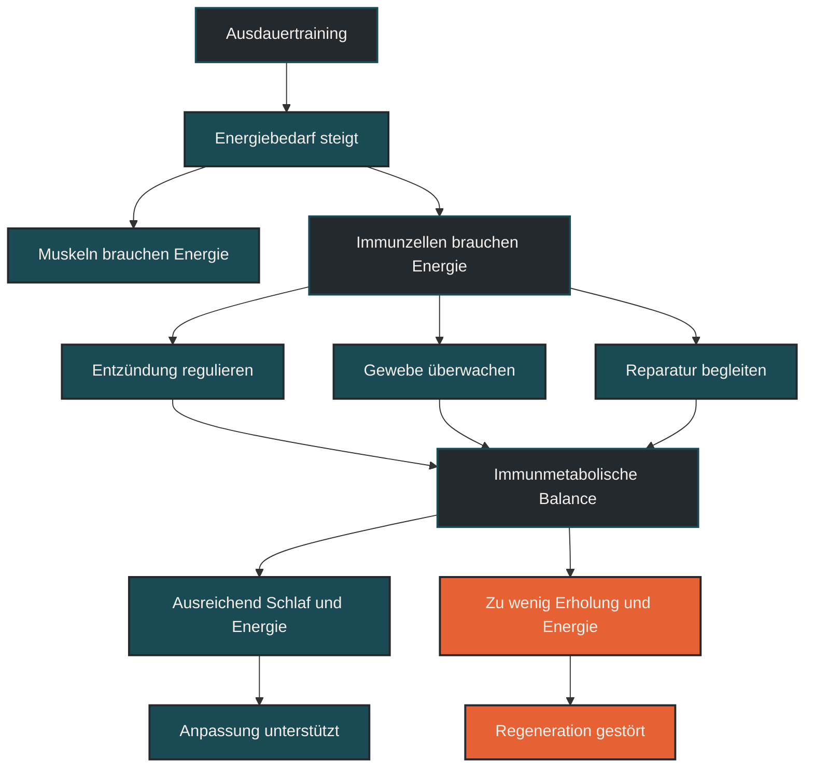

# Immunometabolismus

Immunometabolismus beschreibt, wie der Stoffwechsel von Immunzellen ihre Funktion beeinflusst. Im Ausdauertraining ist das wichtig, weil Immunzellen Energie benötigen, um zu zirkulieren, Entzündung zu regulieren, Gewebe zu überwachen und Reparaturprozesse zu begleiten. Entscheidend ist: Das Immunsystem reagiert nicht nur auf Erreger, sondern auch auf Energieverfügbarkeit, Trainingsbelastung, Schlaf, Ernährung und Regeneration. [[3]](#quelle-3) [[4]](#quelle-4)

## Was Immunometabolismus bedeutet

Immunometabolismus verbindet zwei Bereiche, die oft getrennt betrachtet werden: Immunsystem und Energiestoffwechsel. Immunzellen sind keine passiven Abwehrzellen, sondern hochaktive Zellen mit eigenem Energiebedarf. [[3]](#quelle-3) [[4]](#quelle-4)

Je nachdem, welche Aufgabe eine Immunzelle gerade erfüllt, verändert sie ihren Stoffwechsel. Eine Zelle, die schnell reagieren und entzündliche Signale senden muss, nutzt Energie anders als eine Zelle, die Gewebe überwacht, reguliert oder zur Beruhigung einer Entzündungsreaktion beiträgt. [[3]](#quelle-3) [[4]](#quelle-4)

Für den Ausdauersport bedeutet das: Training beeinflusst nicht nur Muskeln, Herz und Lunge, sondern auch die Energieumgebung, in der Immunzellen arbeiten. [[3]](#quelle-3) [[4]](#quelle-4)

## Warum Immunometabolismus wichtig ist

Ausdauertraining verändert den Energiehaushalt des Körpers. Während einer Belastung werden Kohlenhydrate und Fette genutzt, Glykogenspeicher sinken, Stresshormone steigen und Muskelzellen setzen Signalstoffe frei. Diese Veränderungen betreffen auch Immunzellen. [[3]](#quelle-3) [[4]](#quelle-4)

Wenn ausreichend Energie verfügbar ist, können Immunzellen ihre Aufgaben besser erfüllen. Bei hoher Belastung, wenig Schlaf, geringer Energiezufuhr oder dauerhaftem Stress kann die Situation schwieriger werden. Dann konkurrieren Training, Reparatur, Temperaturregulation, Gehirn, Muskulatur und Immunsystem um Ressourcen. [[3]](#quelle-3) [[4]](#quelle-4)

Immunometabolismus hilft deshalb zu verstehen, warum eine Trainingsphase nicht nur an Kilometern, Pace oder Herzfrequenz bewertet werden sollte. Auch die Energieverfügbarkeit entscheidet mit darüber, ob Belastung zu Anpassung oder zu Überforderung wird. [[3]](#quelle-3) [[4]](#quelle-4)

## Wie Immunzellen Energie nutzen

Immunzellen können verschiedene Energiewege nutzen. Manche Situationen benötigen schnelle Energie, andere eher stabile und effiziente Energieversorgung. Vereinfacht kann man sagen: Akute Aktivierung braucht oft schnelle Energie, langfristige Regulation braucht eine kontrollierte und nachhaltige Stoffwechsellage. [[3]](#quelle-3) [[4]](#quelle-4)

Bei starker Belastung entstehen viele Signale gleichzeitig. Muskeln benötigen Energie, Entzündungsprozesse werden angestoßen, Reparatur beginnt und Immunzellen werden mobilisiert. Dadurch verändert sich die Stoffwechsellage des gesamten Körpers. [[3]](#quelle-3) [[4]](#quelle-4)

Das heißt nicht, dass jede harte Einheit schlecht ist. Solche Reize gehören zum Training. Problematisch wird es eher dann, wenn der Körper dauerhaft zu wenig Energie bekommt oder zwischen den Reizen nicht ausreichend in einen stabilen Zustand zurückfindet. [[3]](#quelle-3) [[4]](#quelle-4)

## Entzündung und Stoffwechsel

Entzündung und Stoffwechsel hängen eng zusammen. Eine akute Entzündungsreaktion benötigt Energie. Immunzellen müssen wandern, Signale senden, mit anderen Zellen kommunizieren und auf Belastung reagieren. [[3]](#quelle-3) [[4]](#quelle-4)

Nach dem Training ist aber nicht nur die Aktivierung wichtig, sondern auch die Auflösung der Entzündungsreaktion. Der Körper muss von „Alarm und Reparatur“ wieder zurück in Regulation kommen. Dieser Übergang ist energieabhängig. [[3]](#quelle-3) [[4]](#quelle-4)

Wenn Training, Schlaf, Ernährung und Erholung zusammenpassen, kann diese Regulation gut funktionieren. Wenn zu viele Stressoren gleichzeitig wirken, kann Entzündung länger bestehen bleiben oder Regeneration verzögert werden. [[1]](#quelle-1) [[2]](#quelle-2) [[5]](#quelle-5)

## Rolle der Energieverfügbarkeit

Energieverfügbarkeit ist ein zentraler Faktor für den Immunometabolismus. Wer viel trainiert, braucht nicht nur Energie für die Einheit selbst, sondern auch für Reparatur, Anpassung und Immunfunktion. [[3]](#quelle-3) [[4]](#quelle-4) [[6]](#quelle-6) [[8]](#quelle-8)

Eine dauerhaft zu niedrige Energiezufuhr kann das Immunsystem belasten. Das gilt besonders in Phasen mit hohem Umfang, intensiven Einheiten, Wettkampfvorbereitung oder zusätzlichem Alltagsstress. [[3]](#quelle-3) [[4]](#quelle-4)

Auch Kohlenhydrate spielen eine praktische Rolle. Niedrige Kohlenhydratverfügbarkeit kann bestimmte Trainingsanpassungen beeinflussen, erhöht aber zugleich den Stress der Einheit. Deshalb sollte sie nicht unüberlegt mit jeder harten oder langen Belastung kombiniert werden. [[1]](#quelle-1) [[2]](#quelle-2) [[5]](#quelle-5)

## Mitochondrien und Immunfunktion

Mitochondrien sind nicht nur für Muskelzellen wichtig. Auch Immunzellen nutzen mitochondriale Prozesse, um Energie bereitzustellen und Signale zu steuern. [[3]](#quelle-3) [[4]](#quelle-4) [[7]](#quelle-7)

Ein gut funktionierender Zellstoffwechsel kann dazu beitragen, dass Immunzellen nicht nur schnell reagieren, sondern auch effizient regulieren. Das ist besonders für längerfristige Anpassung, Entzündungsauflösung und Immunbalance relevant. [[3]](#quelle-3) [[4]](#quelle-4)

Ausdauertraining kann die mitochondriale Leistungsfähigkeit im Körper fördern. Für Immunzellen bedeutet das nicht automatisch eine einfache Leistungssteigerung, aber eine günstigere Stoffwechselumgebung kann ihre Funktion unterstützen. [[3]](#quelle-3) [[4]](#quelle-4)

## Zentrale Einflussfaktoren

### Trainingsbelastung

Je höher Umfang und Intensität, desto stärker wird der Energiehaushalt gefordert. Lange Läufe, Wettkämpfe und intensive Trainingsblöcke beeinflussen den Immunometabolismus stärker als kurze, lockere Einheiten. [[3]](#quelle-3) [[4]](#quelle-4)

### Energiezufuhr

Ausreichende Energiezufuhr unterstützt Training, Reparatur und Immunfunktion. Ein dauerhaftes Defizit kann die Anpassung erschweren und die Belastbarkeit des Immunsystems verringern. [[3]](#quelle-3) [[4]](#quelle-4)

### Kohlenhydratverfügbarkeit

Kohlenhydrate sind besonders bei intensiven Belastungen wichtig. Wenn harte Einheiten mit sehr niedriger Kohlenhydratverfügbarkeit kombiniert werden, steigt der Stress für den Körper. [[1]](#quelle-1) [[2]](#quelle-2) [[5]](#quelle-5)

### Schlaf

Schlaf beeinflusst Stoffwechsel, Hormonlage und Immunregulation. Zu wenig Schlaf verschlechtert nicht nur die muskuläre Erholung, sondern kann auch die immunologische Balance stören. [[3]](#quelle-3) [[4]](#quelle-4)

### Entzündungsstatus

Akute Entzündung gehört zur Anpassung. Dauerhaft erhöhte Entzündung kann dagegen Energie binden und Regeneration verschlechtern. Entscheidend ist, ob der Körper nach Belastung wieder regulieren kann. [[3]](#quelle-3) [[4]](#quelle-4)

## Bedeutung für Läufer

Für Läufer bedeutet Immunometabolismus: Das Immunsystem läuft energetisch mit. Wer trainiert, belastet nicht nur die Beine, sondern auch Stoffwechsel, Hormonsystem und Immunregulation. [[3]](#quelle-3) [[4]](#quelle-4)

Besonders relevant wird das bei langen Läufen, intensiven Einheiten, Trainingslagern, Diäten oder Wettkampfphasen. In solchen Zeiten kann die Kombination aus hoher Belastung und niedriger Energieverfügbarkeit das Immunsystem stärker fordern. [[3]](#quelle-3) [[4]](#quelle-4)

Praktisch heißt das nicht, dass jede Einheit perfekt versorgt sein muss. Es heißt aber, dass harte und lange Belastungen nicht dauerhaft auf leeren Speichern, wenig Schlaf und hohem Alltagsstress aufgebaut werden sollten. [[1]](#quelle-1) [[2]](#quelle-2) [[5]](#quelle-5)

## Häufige Fehler

Ein häufiger Fehler ist die Annahme, Immunfunktion habe nur mit Vitaminen oder einzelnen Supplementen zu tun. Tatsächlich ist die gesamte Energie- und Belastungslage oft wichtiger. [[3]](#quelle-3) [[4]](#quelle-4)

Ein zweiter Fehler ist, niedrige Energieverfügbarkeit als besonders diszipliniert zu betrachten. Für Ausdauerleistung, Regeneration und Immunfunktion kann ein dauerhaftes Defizit problematisch sein. [[3]](#quelle-3) [[4]](#quelle-4)

Ein dritter Fehler ist, Entzündung immer verhindern zu wollen. Entzündung ist Teil der Anpassung. Entscheidend ist nicht die völlige Vermeidung, sondern eine gute Regulation und Auflösung nach der Belastung. [[1]](#quelle-1) [[2]](#quelle-2) [[5]](#quelle-5)

## Praktische Einordnung

Immunometabolismus zeigt, dass Training, Ernährung, Schlaf und Immunsystem nicht getrennt betrachtet werden sollten. Immunzellen brauchen Energie, Signale und eine stabile Umgebung, um sinnvoll zu reagieren. [[3]](#quelle-3) [[4]](#quelle-4)

Für die Trainingspraxis bedeutet das: Belastung muss zur verfügbaren Energie passen. Harte Einheiten, lange Läufe und Wettkämpfe brauchen eine andere Vorbereitung und Regeneration als lockere Dauerläufe. Wer dauerhaft müde ist, schlecht schläft, häufig Infekte bekommt oder ungewöhnlich langsam regeneriert, sollte nicht nur das Training, sondern auch Energiezufuhr und Gesamtstress prüfen. [[3]](#quelle-3) [[4]](#quelle-4)

Der wichtigste Merksatz lautet: Immunzellen trainieren nicht mit, aber sie bezahlen jede Belastung energetisch mit. [[3]](#quelle-3) [[4]](#quelle-4)

----

----

## Häufige Fragen zu Immunometabolismus

### Was ist Immunometabolismus einfach erklärt?

Immunometabolismus beschreibt, wie der Stoffwechsel von Immunzellen ihre Funktion beeinflusst. Immunzellen brauchen Energie, um zu reagieren, zu wandern, Entzündung zu regulieren und Reparaturprozesse zu begleiten. [[3]](#quelle-3) [[4]](#quelle-4)

### Warum ist Immunometabolismus im Ausdauertraining wichtig?

Ausdauertraining verändert den Energiehaushalt des Körpers. Dadurch verändert sich auch die Umgebung, in der Immunzellen arbeiten. Besonders bei hoher Belastung, wenig Schlaf oder geringer Energiezufuhr kann das wichtig werden. [[3]](#quelle-3) [[4]](#quelle-4)

### Welche Rolle spielt Energieverfügbarkeit?

Energieverfügbarkeit ist zentral, weil das Immunsystem Energie benötigt. Wenn Training und Alltag viel Energie verbrauchen, aber zu wenig zugeführt wird, kann das Regeneration und Immunfunktion belasten. [[3]](#quelle-3) [[4]](#quelle-4)

### Sind Kohlenhydrate für das Immunsystem wichtig?

Kohlenhydrate können besonders bei intensiven oder langen Belastungen wichtig sein, weil sie den Stress der Einheit beeinflussen. Sehr niedrige Kohlenhydratverfügbarkeit kann den Körper stärker belasten und sollte nicht unüberlegt eingesetzt werden. [[1]](#quelle-1) [[2]](#quelle-2) [[5]](#quelle-5)

### Ist Entzündung nach dem Training schlecht?

Nein. Entzündung gehört zu Reparatur und Anpassung. Problematisch wird sie eher, wenn sie dauerhaft erhöht bleibt oder der Körper nach Belastung nicht gut in Regulation zurückfindet. [[1]](#quelle-1) [[2]](#quelle-2) [[5]](#quelle-5)

### Was ist ein häufiger Fehler bei Immunometabolismus?

Ein häufiger Fehler ist, nur einzelne Nährstoffe oder Supplemente zu betrachten. Wichtiger ist meist das Gesamtbild aus Trainingsbelastung, Energiezufuhr, Schlaf, Regeneration und Alltagsstress. [[3]](#quelle-3) [[4]](#quelle-4)
----

----

## Quellen

### Quelle 1: The compelling link between physical activity and the body's defense system.

Nieman, D. C., & Wentz, L. M. (2019). [The compelling link between physical activity and the body's defense system.](https://pmc.ncbi.nlm.nih.gov/articles/PMC6523821/), Journal of Sport and Health Science, 8(3), 201–217.

### Quelle 2: Exercise immunology: Future directions.

Nieman, D. C., & Pence, B. D. (2020). [Exercise immunology: Future directions.](https://www.sciencedirect.com/science/article/pii/S2095254619301528), Journal of Sport and Health Science, 9(5), 432–445.

### Quelle 3: Metabolic Instruction of Immunity.

Buck, M. D., Sowell, R. T., Kaech, S. M., & Pearce, E. L. (2017). [Metabolic Instruction of Immunity.](https://pubmed.ncbi.nlm.nih.gov/28475890/), Cell, 169(4), 570–586.

### Quelle 4: A guide to immunometabolism for immunologists.

O'Neill, L. A. J., Kishton, R. J., & Rathmell, J. (2016). [A guide to immunometabolism for immunologists.](https://www.nature.com/articles/nri.2016.70), Nature Reviews Immunology, 16, 553–565.

### Quelle 5: Recovery of the immune system after exercise.

Peake, J. M., Neubauer, O., Walsh, N. P., & Simpson, R. J. (2017). [Recovery of the immune system after exercise.](https://journals.physiology.org/doi/full/10.1152/japplphysiol.00622.2016), Journal of Applied Physiology, 122(5), 1077–1087.

### Quelle 6: Low energy availability increases immune cell formation of reactive oxygen species and systemic inflammation in female endurance athletes.

Jeppesen, J. S., Caldwell, H. G., Lossius, L. O., et al. (2024). [Low energy availability increases immune cell formation of reactive oxygen species and impairs exercise performance in female endurance athletes.](https://www.ncbi.nlm.nih.gov/pmc/articles/PMC11260862/), Redox Biology, 75, 103250.

### Quelle 7: Acute exercise rewires the proteomic landscape of human immune cells.

Walzik, D., Joisten, N., Metcalfe, A. J., et al. (2026). [Acute exercise rewires the proteomic landscape of human immune cells.](https://www.nature.com/articles/s41467-025-68101-9), Nature Communications, 17, 130.

### Quelle 8: 2023 International Olympic Committee's consensus statement on Relative Energy Deficiency in Sport (REDs).

Mountjoy, M., Ackerman, K. E., Bailey, D. M., et al. (2023). [2023 International Olympic Committee's consensus statement on Relative Energy Deficiency in Sport (REDs).](https://bjsm.bmj.com/content/57/17/1073), British Journal of Sports Medicine, 57(17), 1073–1097.

----

*Hinweis: Dieser Artikel dient der allgemeinen Information und ersetzt keine medizinische oder therapeutische Beratung. Mehr dazu im [**Gesundheits- und Quellenhinweis**](/ausdauersport/disclaimer/).*
