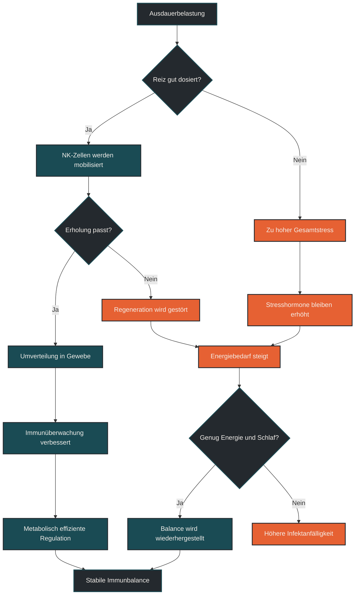

# NK-Zellen und metabolische Effizienz

NK-Zellen und metabolische Effizienz beschreiben, wie natürliche Killerzellen Energie nutzen, um ihre Immunaufgaben zu erfüllen. Im Ausdauertraining ist das wichtig, weil NK-Zellen auf Belastung, Stresshormone, Entzündungssignale und Energieverfügbarkeit reagieren. Entscheidend ist: Regelmäßiges Ausdauertraining kann die Immunzellen nicht einfach „stärker“ machen, aber es kann ihre Regulation, Belastbarkeit und Stoffwechseleffizienz günstig beeinflussen.

## Was NK-Zellen sind

NK-Zellen sind natürliche Killerzellen. Sie gehören zum angeborenen Immunsystem und reagieren schnell auf auffällige Zellen, zum Beispiel virusinfizierte oder stark veränderte körpereigene Zellen.

Sie sind keine unspezifischen „Angriffszellen“, sondern Teil einer regulierten Immunüberwachung. NK-Zellen müssen erkennen, reagieren, kommunizieren und ihre Aktivität wieder begrenzen können. Genau dafür brauchen sie Energie und eine passende Stoffwechsellage.

Für Ausdauersportler sind NK-Zellen interessant, weil sie besonders deutlich auf akute Belastung reagieren. Während intensiver oder längerer Belastung können sie vermehrt im Blut erscheinen und danach wieder in andere Gewebe umverteilt werden.

## Was metabolische Effizienz bei NK-Zellen bedeutet

Metabolische Effizienz bedeutet, dass eine Zelle ihre Energie sinnvoll nutzt. Eine NK-Zelle muss schnell reagieren können, darf aber nicht dauerhaft überaktiv bleiben. Sie braucht also nicht nur viel Energie, sondern eine gut gesteuerte Energienutzung.

Wenn NK-Zellen metabolisch effizient arbeiten, können sie besser zwischen Aktivierung und Regulation wechseln. Das ist wichtig, weil eine zu schwache Reaktion problematisch sein kann, eine dauerhaft überzogene Entzündungsreaktion aber ebenfalls.

Im Sportkontext bedeutet das: Die Qualität der Immunantwort hängt nicht nur davon ab, wie viele Immunzellen vorhanden sind. Entscheidend ist auch, wie gut diese Zellen ihren Stoffwechsel an Belastung, Entzündung und Erholung anpassen können.

## Warum Ausdauertraining hier eine Rolle spielt

Ausdauertraining verändert den Energiehaushalt des gesamten Körpers. Muskeln, Leber, Hormonsystem, Blutgefäße und Immunzellen reagieren auf die Belastung. Dadurch verändert sich auch die Umgebung, in der NK-Zellen arbeiten.

Regelmäßiges, gut dosiertes Ausdauertraining kann dazu beitragen, dass Immunzellen wiederholt mobilisiert, umverteilt und reguliert werden. Diese wiederholten Reize können die Anpassungsfähigkeit des Immunsystems fördern.

Das bedeutet aber nicht, dass möglichst hartes Training automatisch besser ist. NK-Zellen reagieren stark auf Stress. Wenn hohe Trainingsbelastung mit Schlafmangel, Energiemangel oder chronischem Alltagsstress kombiniert wird, kann aus einem sinnvollen Reiz eine ungünstige Gesamtbelastung werden.

## NK-Zellen während und nach Belastung

Während intensiver Belastung steigen Stresshormone wie Adrenalin. Dadurch werden NK-Zellen vermehrt aus Reservoirs in den Blutkreislauf mobilisiert. Das ist ein normaler Teil der akuten Immunantwort auf Training.

Nach der Belastung sinkt die Zahl bestimmter Immunzellen im Blut oft wieder. Das bedeutet nicht automatisch, dass sie verschwunden oder geschwächt sind. Viele Zellen verlassen den Blutkreislauf und wandern in Gewebe, Schleimhäute oder andere immunologisch aktive Bereiche.

Diese Umverteilung passt zur Idee, dass Training nicht einfach eine Immunsuppression erzeugt, sondern Immunzellen in Bewegung bringt. Entscheidend ist, ob der Körper danach ausreichend Energie, Schlaf und Regeneration bekommt.

## Verbindung zu Immunometabolismus

NK-Zellen sind ein gutes Beispiel für Immunometabolismus. Ihre Funktion hängt eng mit ihrer Energieverarbeitung zusammen. Wenn sie aktiviert werden, verändern sie ihren Stoffwechsel. Wenn sie regulieren oder in Überwachung bleiben, benötigen sie eine andere Stoffwechsellage.

Ausdauertraining kann diese Stoffwechselumgebung beeinflussen. Es verbessert nicht nur die Energieverarbeitung der Muskulatur, sondern verändert auch Signale, die für Immunzellen relevant sind: Entzündungsbotenstoffe, Stresshormone, Substratverfügbarkeit und mitochondriale Regulation.

Für die Praxis heißt das: Wer über NK-Zellen spricht, sollte nicht nur an Abwehr denken, sondern auch an Energie. Immunfunktion ist immer auch eine Stoffwechselfrage.

## Zentrale Einflussfaktoren

### Trainingsdosis

NK-Zellen reagieren deutlich auf intensive und längere Belastungen. Einzelne harte Einheiten können eine starke akute Mobilisierung auslösen. Langfristig entscheidend ist aber, ob diese Reize gut verkraftet und sinnvoll in den Trainingsplan eingebettet werden.

### Energieverfügbarkeit

NK-Zellen brauchen Energie für Aktivierung, Zellkommunikation und Regulation. Wenn die Energieverfügbarkeit dauerhaft niedrig ist, kann die Immunfunktion belastet werden. Besonders kritisch ist die Kombination aus hoher Trainingslast, Kaloriendefizit, wenig Schlaf und hohem Stress.

### Kohlenhydratverfügbarkeit

Bei langen oder intensiven Einheiten kann eine sehr niedrige Kohlenhydratverfügbarkeit den Körper zusätzlich stressen. Das kann Stresshormone und Entzündungssignale beeinflussen. Deshalb sollte nüchternes oder kohlenhydratarmes Training nicht unüberlegt mit jeder harten Einheit kombiniert werden.

### Schlaf

Schlaf unterstützt Immunregulation, Hormonbalance und Erholung. Wer nach intensiven Einheiten schlecht schläft oder dauerhaft zu wenig Schlaf bekommt, verschlechtert die Bedingungen, unter denen NK-Zellen regulieren und regenerieren können.

### Alter und Trainingszustand

Mit zunehmendem Alter verändert sich auch das Immunsystem. Regelmäßiges Ausdauertraining kann helfen, Immunzellen aktiv und regulierbar zu halten. Der Effekt hängt aber vom Trainingszustand, der Belastungssteuerung und der Gesamtgesundheit ab.

## Bedeutung für Läufer

Für Läufer bedeutet das: NK-Zellen reagieren auf Training sehr sensibel. Harte Intervalle, lange Läufe und Wettkämpfe können sie mobilisieren und kurzfristig stark in Bewegung bringen.

Das ist nicht automatisch schlecht. Es kann Teil einer sinnvollen Immunüberwachung sein. Problematisch wird es eher dann, wenn die Belastung dauerhaft zu hoch ist und der Körper nicht genug Ressourcen hat, um wieder in Regulation zu kommen.

Für die Trainingspraxis sind deshalb nicht einzelne NK-Zell-Werte entscheidend, sondern das Gesamtbild: Schlaf, Ernährung, Infektanfälligkeit, Erschöpfung, Trainingsumfang, Intensität und Alltagsstress.

## Häufige Fehler

Ein häufiger Fehler ist die Vorstellung, NK-Zellen müssten einfach möglichst stark aktiviert werden. Eine gute Immunfunktion bedeutet aber nicht Daueraktivierung, sondern passende Reaktion und rechtzeitige Regulation.

Ein zweiter Fehler ist, die Zahl der NK-Zellen im Blut isoliert zu bewerten. Blutwerte zeigen nur einen Ausschnitt. NK-Zellen können nach Belastung in andere Gewebe umverteilt werden.

Ein dritter Fehler ist, metabolische Effizienz nur auf Muskeln zu beziehen. Auch Immunzellen haben einen Stoffwechsel. Wenn Energieverfügbarkeit, Schlaf und Regeneration nicht passen, betrifft das nicht nur die Beine, sondern auch die Immunfunktion.

## Praktische Einordnung

NK-Zellen zeigen gut, warum Ausdauertraining und Immunsystem nicht getrennt betrachtet werden sollten. Training bewegt Immunzellen, verändert ihre Stoffwechselumgebung und fordert ihre Regulation.

Sinnvoll dosiertes Ausdauertraining kann helfen, NK-Zellen regelmäßig zu mobilisieren und in eine stabile Immunbalance einzubetten. Zu viel Belastung ohne Erholung kann dagegen die gleiche Achse überfordern.

Der wichtigste Merksatz lautet: NK-Zellen brauchen nicht maximale Aktivierung, sondern eine effiziente Balance aus Energie, Reaktion und Regulation.

----

----

## Häufige Fragen zu NK-Zellen und metabolische Effizienz

### Was sind NK-Zellen einfach erklärt?

NK-Zellen sind natürliche Killerzellen des angeborenen Immunsystems. Sie helfen dabei, auffällige Zellen zu erkennen und gehören zur schnellen Immunüberwachung des Körpers.

### Warum sind NK-Zellen für Ausdauersportler interessant?

NK-Zellen reagieren deutlich auf körperliche Belastung. Während intensiver oder längerer Einheiten können sie vermehrt im Blut erscheinen und nach der Belastung wieder in Gewebe oder Schleimhäute umverteilt werden.

### Was bedeutet metabolische Effizienz bei NK-Zellen?

Metabolische Effizienz bedeutet, dass NK-Zellen ihre Energie sinnvoll nutzen. Sie sollen schnell reagieren können, aber nicht dauerhaft überaktiv bleiben.

### Macht Ausdauertraining NK-Zellen stärker?

Nicht im einfachen Sinn. Ausdauertraining kann NK-Zellen mobilisieren und ihre Regulation beeinflussen. Entscheidend ist aber nicht maximale Aktivierung, sondern eine gute Balance aus Reaktion, Energieversorgung und Erholung.

### Welche Rolle spielt Ernährung?

Ernährung beeinflusst die Energieverfügbarkeit. Bei hoher Trainingsbelastung kann zu wenig Energie oder eine sehr niedrige Kohlenhydratverfügbarkeit zusätzlichen Stress erzeugen und die Immunregulation belasten.

### Was ist ein häufiger Fehler bei diesem Thema?

Ein häufiger Fehler ist, NK-Zellen nur als Abwehrzellen zu sehen. Sie sind auch metabolisch aktive Zellen, deren Funktion von Energie, Schlaf, Belastung und Regeneration abhängt.

----

*Hinweis: Dieser Artikel dient der allgemeinen Information und ersetzt keine medizinische oder therapeutische Beratung. Mehr dazu im [**Gesundheits- und Quellenhinweis**](/ausdauersport/disclaimer/).*

