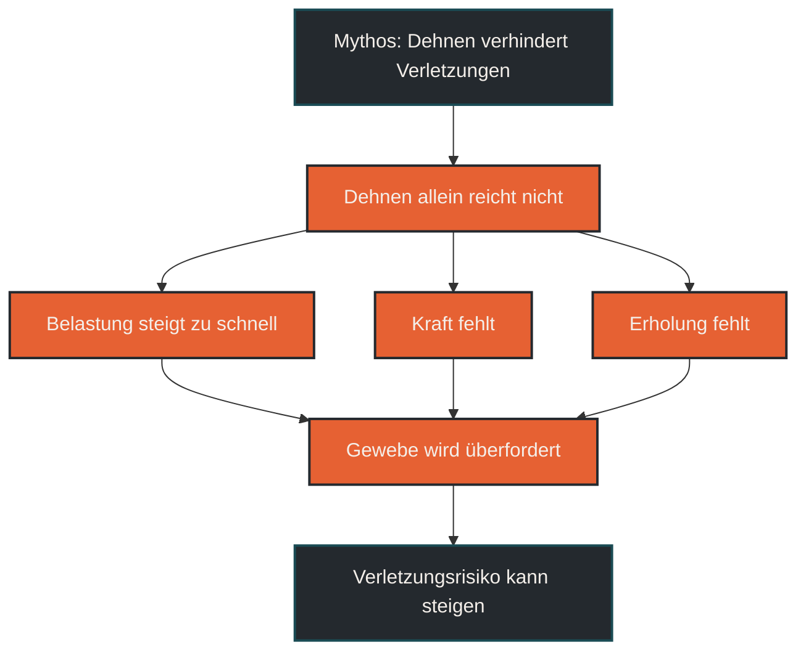
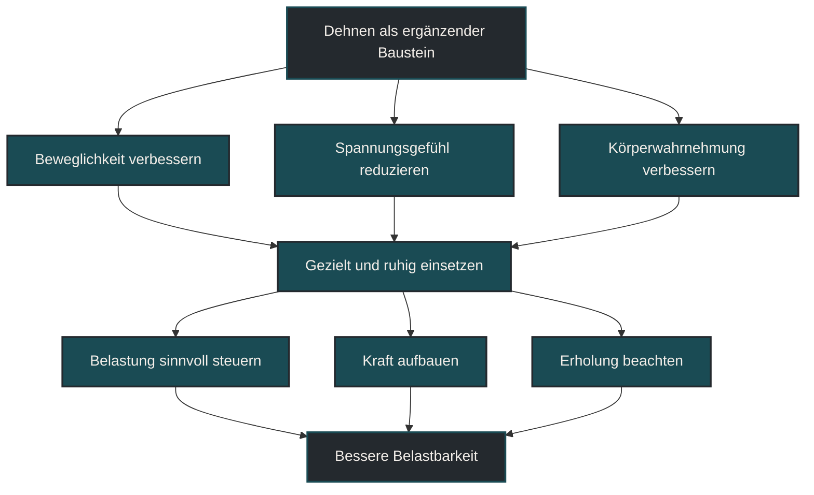

# Dehnen verhindert Verletzungen

Dehnen verhindert Verletzungen nicht automatisch. Im Ausdauersport kann Beweglichkeit hilfreich sein, wenn sie zu den eigenen Anforderungen passt. Entscheidend ist aber nicht, ob jemand viel dehnt, sondern ob Belastung, Kraft, Technik, Regeneration und Beweglichkeit sinnvoll zusammenpassen.

## Was mit Dehnen gemeint ist

Dehnen beschreibt Maßnahmen, bei denen Muskeln, Sehnen und Gelenke in eine verlängerte Position gebracht werden. Häufig wird zwischen statischem und dynamischem Dehnen unterschieden.

Statisches Dehnen bedeutet, eine Position für einige Sekunden oder Minuten zu halten. Dynamisches Dehnen nutzt kontrollierte Bewegungen, zum Beispiel Beinpendel, Ausfallschritte oder Mobilisationsübungen. Im Ausdauersport wird Dehnen oft eingesetzt, um sich beweglicher zu fühlen, die Vorbereitung auf Training zu unterstützen oder Spannungsgefühl zu reduzieren.

Das Problem entsteht, wenn Dehnen als allgemeiner Schutzmechanismus verstanden wird. Verletzungen entstehen meist nicht durch einen einzelnen fehlenden Dehnreiz, sondern durch ein Zusammenspiel aus Belastungsaufbau, Gewebetoleranz, Ermüdung, Technik, Kraft, Schlaf, Ernährung und individueller Vorgeschichte.

## Warum der Mythos so verbreitet ist

Dehnen fühlt sich oft sinnvoll an. Wer nach dem Training zieht, spannt oder steif ist, hat schnell das Gefühl, dass verkürzte Muskeln das eigentliche Problem sind. Daraus entsteht die einfache Erklärung: Wenn ich mehr dehne, werde ich beweglicher und verletze mich weniger.

Diese Erklärung ist aber zu kurz. Beweglichkeit ist nur ein Teil der Belastbarkeit. Ein Muskel kann beweglich sein und trotzdem unter Belastung überfordert werden. Umgekehrt kann ein Sportler relativ wenig Beweglichkeit haben, aber gut belastbar sein, wenn Kraft, Koordination und Trainingssteuerung passen.

Im Laufsport sind viele Beschwerden eher eine Frage der wiederholten mechanischen Belastung. Sehnen, Knochen, Muskeln und Faszien reagieren auf Trainingsumfang, Intensität, Untergrund, Schuhwechsel, Ermüdung und Erholungszeit. Dehnen allein verändert diese Belastungsbilanz nicht ausreichend.

## Wie Dehnen auf den Körper wirkt

Dehnen kann kurzfristig das Spannungsgefühl verändern. Viele Menschen empfinden danach mehr Bewegungsfreiheit oder weniger Steifigkeit. Das bedeutet aber nicht automatisch, dass Gewebe strukturell länger geworden ist oder dass das Verletzungsrisiko deutlich gesunken ist.

Ein Teil des Effekts entsteht über das Nervensystem. Der Körper toleriert eine Dehnposition besser, die Muskelspannung verändert sich, und Bewegungen fühlen sich freier an. Das kann angenehm und praktisch nützlich sein.

Für den Verletzungsschutz ist jedoch entscheidend, ob das Gewebe die tatsächlichen Trainingskräfte bewältigen kann. Beim Laufen wirken wiederholt Bodenreaktionskräfte, exzentrische Bremskräfte und elastische Speicherprozesse in Sehnen und Muskeln. Diese Belastungen werden vor allem durch dosiertes Training, Kraft, Technik, Gewöhnung und Erholung beeinflusst.

## Zentrale Einflussfaktoren

### Belastungssteuerung

Viele Laufverletzungen entstehen nicht, weil zu wenig gedehnt wurde, sondern weil Belastung schneller steigt als die Belastbarkeit. Zu schnelle Umfangssteigerung, zu viele intensive Einheiten, zu wenig Erholung oder abrupte Änderungen von Schuhen, Untergrund oder Lauftechnik können das Gewebe überfordern.

Dehnen kann diese Fehler nicht ausgleichen. Wer müde, überlastet oder mit zu hoher Intensität trainiert, wird durch zusätzliches Dehnen nicht automatisch robuster.

### Kraft und Gewebetoleranz

Muskeln, Sehnen und Knochen brauchen dosierte Belastung, um belastbarer zu werden. Krafttraining, Sprungvorbereitung, Lauf-ABC, Hüft- und Wadenkraft oder stabile Rumpfkontrolle können je nach Ziel sinnvoller sein als reines passives Dehnen.

Das bedeutet nicht, dass Dehnen wertlos ist. Es bedeutet nur, dass Verletzungsprävention eher über aktive Belastbarkeit entsteht als über passive Beweglichkeit allein.

### Beweglichkeit im passenden Maß

Zu wenig Beweglichkeit kann bestimmte Bewegungen einschränken. Zu viel Beweglichkeit ist aber ebenfalls nicht automatisch besser. Für Läufer ist nicht maximale Gelenkreichweite entscheidend, sondern eine Beweglichkeit, die den Laufstil, die Schrittmechanik und die Belastung gut unterstützt.

Eine sinnvolle Frage lautet deshalb nicht: „Bin ich beweglich genug?“ Sondern: „Kann ich meine sportliche Bewegung kontrolliert, stabil und ohne Ausweichbewegungen ausführen?“

### Zeitpunkt des Dehnens

Direkt vor intensiven Einheiten ist langes statisches Dehnen nicht immer ideal, weil es sich kurzfristig auf Spannung, Kraftgefühl und Reaktivität auswirken kann. Vor dem Laufen sind dynamische Mobilisation, lockeres Einlaufen und sportartspezifische Aktivierung oft passender.

Statisches Dehnen kann eher an separaten Tagen, nach lockeren Einheiten oder als ruhige Beweglichkeitseinheit eingesetzt werden, wenn es gut vertragen wird.

## Bedeutung für Läufer

Für Läufer ist Dehnen vor allem ein Werkzeug, aber kein Schutzschild. Es kann helfen, Bewegungen bewusster wahrzunehmen, Spannungsgefühl zu reduzieren oder bestimmte Beweglichkeitsdefizite zu bearbeiten. Es ersetzt aber keine saubere Trainingsplanung.

Wer Verletzungen vorbeugen möchte, sollte zuerst auf die großen Stellschrauben schauen: langsamer Belastungsaufbau, ausreichend lockere Einheiten, Erholung, Schlaf, Krafttraining, passende Schuhe, Technikbewusstsein und rechtzeitige Reaktion auf Warnsignale.

Dehnen kann dann ergänzen. Besonders sinnvoll ist es, wenn ein klarer Bedarf besteht, zum Beispiel bei eingeschränkter Beweglichkeit, einseitigem Spannungsgefühl oder als ruhiger Bestandteil der Regeneration. Es sollte aber nicht aggressiv, schmerzhaft oder zwanghaft eingesetzt werden.

## Häufige Fehler

Ein häufiger Fehler ist, Dehnen als Pflichtprogramm gegen jede Verletzung zu sehen. Dadurch werden wichtigere Ursachen übersehen, etwa zu schnelle Trainingssteigerung, fehlende Kraft oder unzureichende Regeneration.

Ein zweiter Fehler ist zu starkes Dehnen bei gereiztem Gewebe. Wenn eine Sehne, ein Muskel oder ein Gelenk bereits empfindlich ist, kann aggressives Ziehen zusätzliche Irritation erzeugen. Schmerz ist kein Zeichen dafür, dass die Dehnung besonders wirksam ist.

Ein dritter Fehler ist, statisches Dehnen direkt mit Aufwärmen gleichzusetzen. Aufwärmen soll den Körper auf Belastung vorbereiten. Dafür sind lockere Bewegung, Aktivierung und sportartspezifische Dynamik meist sinnvoller als langes Halten passiver Positionen.

## Praktische Einordnung

Dehnen kann im Ausdauersport sinnvoll sein, wenn es gezielt, ruhig und passend eingesetzt wird. Es sollte aber nicht als alleinige Maßnahme zur Verletzungsprävention verstanden werden.

Für die Praxis ist eine einfache Reihenfolge hilfreich: Erst Belastung vernünftig steuern, dann Kraft und Stabilität aufbauen, dann Beweglichkeit dort verbessern, wo sie tatsächlich begrenzt. Dehnen ist dabei ein ergänzender Baustein, nicht die Grundlage der Verletzungsprophylaxe.

Der wichtigste Merksatz lautet: Dehnen kann Beweglichkeit unterstützen, aber Verletzungen verhindert vor allem ein Körper, der passend belastet, kräftig genug und ausreichend erholt ist.

----

## Was Dehnen nicht leisten kann

----

## Wann Dehnen sinnvoll sein kann

----

## Häufige Fragen zu Dehnen verhindert Verletzungen

### Verhindert Dehnen Verletzungen beim Laufen?

Nicht automatisch. Dehnen kann Beweglichkeit und Körperwahrnehmung unterstützen, aber Verletzungen hängen meist stärker mit Belastungssteuerung, Kraft, Ermüdung, Technik und Erholung zusammen.

### Ist Dehnen deshalb nutzlos?

Nein. Dehnen kann sinnvoll sein, wenn es gezielt eingesetzt wird. Es kann helfen, Beweglichkeit zu erhalten, Spannungsgefühl zu reduzieren oder bestimmte Bewegungen besser wahrzunehmen.

### Sollte man vor dem Laufen dehnen?

Vor dem Laufen sind lockeres Einlaufen, Mobilisation und dynamische Aktivierung oft passender als langes statisches Dehnen. Statisches Dehnen eignet sich eher separat oder nach lockeren Einheiten, wenn es gut vertragen wird.

### Kann zu viel Dehnen schaden?

Zu aggressives oder schmerzhaftes Dehnen kann gereiztes Gewebe zusätzlich belasten. Dehnen sollte kontrolliert, ruhig und ohne starken Schmerz durchgeführt werden.

### Was schützt besser vor Verletzungen als Dehnen?

Wichtiger sind ein sinnvoller Belastungsaufbau, ausreichend Erholung, Krafttraining, stabile Lauftechnik, Schlaf, passende Schuhe und rechtzeitiges Reagieren auf Warnsignale.

### Für wen ist Dehnen besonders relevant?

Dehnen kann besonders relevant sein, wenn Beweglichkeit tatsächlich eingeschränkt ist oder bestimmte Bewegungen nicht sauber ausgeführt werden können. Es sollte dann gezielt eingesetzt und nicht pauschal als Pflichtprogramm verstanden werden.

----

*Hinweis: Dieser Artikel dient der allgemeinen Information und ersetzt keine medizinische oder therapeutische Beratung. Mehr dazu im [**Gesundheits- und Quellenhinweis**](/ausdauersport/disclaimer/).*

