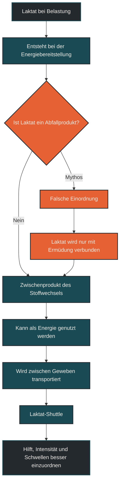

# Laktat ist kein Abfallprodukt

Laktat ist kein nutzloses Abfallprodukt. Es entsteht bei der Energiebereitstellung, kann weiterverwendet werden und dient dem Körper als Energieträger, Transportform und Signalstoff. Im Ausdauersport ist Laktat deshalb nicht der Feind, sondern ein Hinweis darauf, wie stark der Stoffwechsel gerade arbeitet. [[1]](#quelle-1) [[2]](#quelle-2)

## Was Laktat bedeutet

Laktat entsteht, wenn Kohlenhydrate über die Glykolyse zur schnellen Energiebereitstellung genutzt werden. Dabei wird Glukose schrittweise abgebaut, um ATP bereitzustellen. Ein Zwischenprodukt dieses Prozesses ist Pyruvat. Wenn die Belastung steigt, wird ein Teil dieses Pyruvats zu Laktat umgewandelt. [[1]](#quelle-1) [[2]](#quelle-2) [[4]](#quelle-4)

Früher wurde Laktat oft als Abfallstoff verstanden, der sich im Muskel ansammelt und Leistung begrenzt. Diese Sicht ist zu einfach. Laktat kann aus der arbeitenden Muskulatur ins Blut abgegeben, zu anderen Geweben transportiert und dort wieder als Energiequelle genutzt werden.

Besonders wichtig ist: Laktat ist nicht einfach ein Zeichen dafür, dass der Körper „versagt“. Es zeigt vielmehr, dass der Kohlenhydratstoffwechsel aktiv ist und dass die Belastung eine bestimmte metabolische Dynamik erreicht.

## Warum der Mythos entstanden ist

Der Mythos kommt daher, dass hohe Laktatwerte oft zusammen mit intensiver Belastung, Brennen in der Muskulatur und schneller Ermüdung auftreten. Daraus wurde lange abgeleitet, Laktat selbst sei der schädliche Stoff.

Tatsächlich ist die Situation komplexer. Bei hoher Intensität verändern sich viele Dinge gleichzeitig: Die Energienachfrage steigt stark, Wasserstoffionen nehmen zu, die Pufferkapazität wird gefordert, die Muskelkontraktion wird schwieriger, und das Nervensystem muss mehr motorische Einheiten aktivieren. [[1]](#quelle-1) [[2]](#quelle-2)

Laktat ist dabei eher ein Begleiter und Zwischenprodukt intensiver Energiebereitstellung. Es ist nicht einfach die Ursache aller Ermüdung.

## Wie Laktat im Körper genutzt wird

Laktat kann innerhalb des Körpers transportiert und wiederverwertet werden. Dieses Prinzip wird häufig als Laktat-Shuttle beschrieben. Dabei kann Laktat von Zellen, die viel davon produzieren, zu Zellen gelangen, die es gut oxidieren können. [[1]](#quelle-1) [[2]](#quelle-2)

Gut trainierte Ausdauersportler können Laktat oft effizienter nutzen. Ihre Muskulatur ist besser darin, Laktat aufzunehmen, in den Mitochondrien zu verarbeiten und als Energiequelle einzusetzen. Dadurch kann bei gleicher Belastung weniger Laktat im Blut sichtbar werden oder ein höheres Tempo länger kontrollierbar bleiben.

Auch die Leber kann Laktat nutzen, um daraus wieder Glukose aufzubauen. Laktat ist also Teil eines Kreislaufs und nicht einfach ein Endprodukt, das entsorgt werden muss.

## Bedeutung für Trainingszonen und Schwellen

Laktat ist in der Leistungsdiagnostik wichtig, weil es Hinweise auf die Stoffwechsellage gibt. Bei niedriger Intensität bleibt die Laktatkonzentration meist relativ stabil. Produktion und Abbau halten sich gut die Waage. [[3]](#quelle-3)

Mit steigender Intensität nimmt die Laktatbildung zu. Irgendwann wird ein Bereich erreicht, in dem Laktat stärker ansteigt. Diese Übergänge werden häufig mit Begriffen wie aerobe Schwelle, anaerobe Schwelle, LT1, LT2 oder MLSS beschrieben.

Für das Training ist entscheidend: Ein Laktatwert ist kein Urteil über gut oder schlecht. Er hilft nur, Belastung einzuordnen. Lockere Einheiten, Tempodauerläufe und Intervalle erzeugen unterschiedliche Laktatdynamiken, weil sie unterschiedliche Stoffwechselanforderungen haben.

## Zentrale Einflussfaktoren

### Trainingszustand

Gut trainierte Sportler können Laktat oft besser verarbeiten. Das liegt unter anderem an mehr mitochondrialer Kapazität, besserer Durchblutung, angepassten Transportmechanismen und einer höheren aeroben Leistungsfähigkeit. [[1]](#quelle-1) [[4]](#quelle-4) [[5]](#quelle-5)

### Intensität

Je höher die Intensität, desto stärker wird die schnelle Kohlenhydratverwertung beansprucht. Dadurch steigt meist auch die Laktatbildung. Das ist normal und nicht automatisch problematisch.

### Muskelfasern

Schnell zuckende Muskelfasern produzieren bei hoher Belastung häufig mehr Laktat. Langsam zuckende und gut aerob trainierte Fasern können Laktat eher wieder aufnehmen und oxidativ nutzen.

### Erholung und Ernährung

Ermüdung, niedrige Kohlenhydratspeicher, Hitze, Schlafmangel oder hohe Gesamtbelastung können verändern, wie sich Laktatwerte im Training zeigen. Deshalb sollten einzelne Messwerte nie isoliert interpretiert werden.

## Bedeutung für Läufer

Für Läufer ist Laktat besonders wichtig, weil es hilft, unterschiedliche Belastungsbereiche zu verstehen. Ein lockerer Dauerlauf soll nicht ständig in einen Bereich rutschen, in dem Laktat deutlich ansteigt. Tempoeinheiten dürfen dagegen bewusst höhere Laktatdynamiken erzeugen.

Das Ziel ist nicht, Laktat immer zu vermeiden. Ziel ist, den Körper so zu trainieren, dass er Laktat bei höheren Geschwindigkeiten besser nutzen und kontrollieren kann. Dadurch verschiebt sich die Grenze, an der ein Tempo schwer stabil zu halten ist.

Laktat erklärt also nicht nur Ermüdung, sondern auch Anpassung. Wer sinnvoll trainiert, verbessert nicht nur die maximale Sauerstoffaufnahme, sondern auch die Fähigkeit, Stoffwechselprodukte zu transportieren, zu puffern und weiterzuverwenden.

## Häufige Fehler

Ein häufiger Fehler ist die Aussage, Laktat sei „Schlackenstoff“ oder „Gift“. Das ist falsch. Laktat ist ein normaler und nützlicher Bestandteil des Energiestoffwechsels.

Ein zweiter Fehler ist, jeden hohen Laktatwert als schlechtes Training zu bewerten. Hohe Werte können bei intensiven Intervallen gewollt sein. Entscheidend ist, ob die Einheit zum Trainingsziel passt.

Ein dritter Fehler ist, Laktatwerte ohne Kontext zu interpretieren. Pace, Herzfrequenz, Temperatur, Vorermüdung, Ernährung, Testprotokoll und Tagesform beeinflussen die Aussagekraft.

## Praktische Einordnung

Laktat ist kein Abfallprodukt, sondern ein Zwischenprodukt und Energieträger. Es zeigt, wie stark der Körper Kohlenhydrate nutzt und wie gut Produktion, Transport und Verwertung zusammenarbeiten.

Für die Trainingspraxis bedeutet das: Laktatwerte können helfen, Intensitäten besser einzuordnen. Sie ersetzen aber nicht das Gesamtbild aus Gefühl, Herzfrequenz, Pace, Leistung, Erholung und langfristiger Entwicklung. [[3]](#quelle-3)

Der wichtigste Merksatz lautet: Laktat ist nicht der Gegner, sondern ein Signal dafür, wie dein Stoffwechsel unter Belastung arbeitet.

----

----

## Häufige Fragen zu Laktat ist kein Abfallprodukt

### Ist Laktat ein Abfallprodukt?

Nein. Laktat ist kein nutzloser Abfallstoff, sondern ein normales Zwischenprodukt des Energiestoffwechsels. Es kann transportiert, weiterverarbeitet und als Energiequelle genutzt werden.

### Warum steigt Laktat bei intensiver Belastung?

Bei höherer Intensität steigt die schnelle Kohlenhydratverwertung. Dadurch entsteht mehr Laktat. Wenn die Bildung stärker zunimmt als die Verwertung, steigt die Laktatkonzentration im Blut.

### Macht Laktat die Beine sauer?

Laktat ist nicht allein verantwortlich für das Brennen oder die Ermüdung. Bei hoher Intensität verändern sich viele Stoffwechselprozesse gleichzeitig. Dazu gehören auch Säure-Basen-Balance, Pufferung, Ionenverschiebungen und neuromuskuläre Ermüdung.

### Ist ein niedriger Laktatwert immer besser?

Nicht automatisch. Ein niedriger Laktatwert kann bei lockeren Einheiten sinnvoll sein. Bei intensiven Intervallen kann ein höherer Wert aber zur Belastungsform passen. Entscheidend ist das Trainingsziel.

### Was bedeutet Laktat für die Schwelle?

Laktat hilft, Belastungsbereiche und Schwellen besser einzuordnen. Besonders interessant ist, ab welcher Intensität Laktat stärker ansteigt und wie lange ein Tempo stabil gehalten werden kann.

### Können trainierte Läufer Laktat besser nutzen?

Ja, gut trainierte Ausdauersportler können Laktat oft effizienter transportieren und verwerten. Das hängt unter anderem mit mitochondrialer Kapazität, Durchblutung und Stoffwechselanpassungen zusammen.
----

## Quellen

### Quelle 1

Brooks, G. A. (2018). The science and translation of lactate shuttle theory. *Cell Metabolism*, 27(4), 757–785.
Quelle: https://www.sciencedirect.com/science/article/pii/S1550413118301864

### Quelle 2

Gladden, L. B. (2004). Lactate metabolism: a new paradigm for the third millennium. *The Journal of Physiology*, 558(Pt 1), 5–30.
Quelle: https://pubmed.ncbi.nlm.nih.gov/15131240/

### Quelle 3

Faude, O., Kindermann, W., & Meyer, T. (2009). Lactate threshold concepts: how valid are they? *Sports Medicine*, 39(6), 469–490.
Quelle: https://link.springer.com/article/10.2165/00007256-200939060-00003

### Quelle 4

Hargreaves, M., & Spriet, L. L. (2020). Skeletal muscle energy metabolism during exercise. *Nature Metabolism*, 2, 817–828.
Quelle: https://pubmed.ncbi.nlm.nih.gov/32747792/

### Quelle 5

Bishop, D. J., Botella, J., Genders, A. J., et al. (2019). High-intensity exercise and mitochondrial biogenesis: current controversies and future research directions. *Physiology*, 34(1), 56–70.
Quelle: https://pubmed.ncbi.nlm.nih.gov/30540233/

----

*Hinweis: Dieser Artikel dient der allgemeinen Information und ersetzt keine medizinische oder therapeutische Beratung. Mehr dazu im [**Gesundheits- und Quellenhinweis**](/ausdauersport/disclaimer/).*
