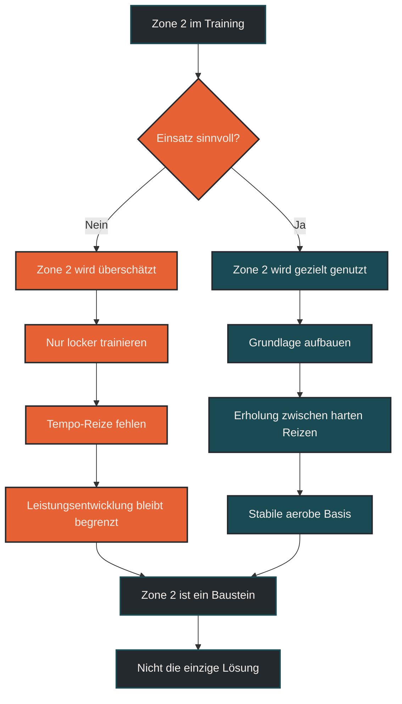

# Zone 2 ist nicht immer besser

Zone 2 ist ein wichtiger Trainingsbereich, aber nicht automatisch die beste Lösung für jedes Ziel. Lockere aerobe Belastung kann Grundlagenausdauer, Fettstoffwechsel und Belastungsverträglichkeit unterstützen. Für Leistungsentwicklung, Tempohärte, VO2max, Wettkampfspezifik und neuromuskuläre Reize braucht es aber auch andere Intensitäten.

## Was Zone 2 bedeutet

Zone 2 beschreibt meist einen niedrigen bis moderaten Ausdauerbereich, der noch relativ kontrolliert, ruhig und länger durchhaltbar ist. Je nach Modell liegt Zone 2 ungefähr unterhalb oder im Bereich der ersten Schwelle. Praktisch fühlt sich das Training meist locker bis mäßig an: Man kann noch sprechen, die Atmung ist kontrolliert, und die Belastung wirkt nicht hart.

Das Problem ist, dass Zone 2 nicht überall gleich definiert wird. In einem Drei-Zonen-Modell bedeutet Zone 2 etwas anderes als in einem Fünf-Zonen-Modell. Auch Herzfrequenzzonen, Leistungszonen, Pace-Zonen und Laktatbereiche sind nicht automatisch deckungsgleich.

Deshalb ist die Aussage „trainiere einfach Zone 2“ oft zu ungenau. Entscheidend ist, welches Zonenmodell verwendet wird, wie die Schwellen bestimmt wurden und welches Trainingsziel verfolgt wird.

## Warum Zone 2 so beliebt ist

Zone 2 ist beliebt, weil sie viele Vorteile hat. Sie ist relativ gut verträglich, lässt sich häufig wiederholen und erzeugt weniger akute Ermüdung als harte Intervalle. Für viele Ausdauersportler bildet lockeres Training die Grundlage, um Umfang aufzubauen, ohne den Körper ständig maximal zu belasten.

Außerdem passt Zone 2 gut zu langfristiger Entwicklung. Wer nur hart trainiert, sammelt schnell Ermüdung. Wer dagegen viele lockere Einheiten sinnvoll dosiert, kann über Wochen und Monate eine stabile aerobe Basis entwickeln.

Der Fehler entsteht, wenn daraus eine absolute Regel gemacht wird. Zone 2 ist wichtig, aber sie ist kein magischer Bereich, der alle anderen Trainingsformen ersetzt.

## Warum Zone 2 nicht immer besser ist

Zone 2 ist nicht immer besser, weil Training immer vom Ziel abhängt. Wer schneller werden möchte, muss irgendwann auch schneller laufen. Wer die VO2max verbessern will, braucht meist Phasen mit höherer Intensität. Wer Wettkämpfe oberhalb des lockeren Dauerlauftempos läuft, muss auch diese Belastungsbereiche vorbereiten.

Nur Zone 2 kann außerdem zu einseitig werden. Der Körper passt sich genau an das an, was regelmäßig trainiert wird. Wenn fast ausschließlich locker gelaufen wird, verbessert sich vor allem die Fähigkeit, locker zu laufen. Das ist wertvoll, aber nicht vollständig.

Auch technisch und neuromuskulär fehlt bei ausschließlich lockerem Training oft ein wichtiger Reiz. Schnellere Schritte, höhere Spannung, Abdruck, Laufökonomie bei Tempo und Belastbarkeit bei intensiveren Abschnitten werden durch Zone 2 allein nur begrenzt trainiert.

----

----

## Zentrale Einflussfaktoren

### Trainingsziel

Für Grundlagenausdauer und Umfangsaufbau ist Zone 2 sehr wertvoll. Für 5-km-Tempo, VO2max, Schwellenleistung oder Endbeschleunigung reicht sie allein nicht aus. Je spezifischer ein Ziel wird, desto wichtiger wird die passende Mischung aus locker, moderat und intensiv.

### Trainingsstand

Einsteiger profitieren oft stark von lockeren Einheiten, weil zunächst Belastungsverträglichkeit und Regelmäßigkeit wichtiger sind als harte Reize. Fortgeschrittene Läufer brauchen dagegen meist mehr Differenzierung, damit neue Anpassungen entstehen.

### Gesamtbelastung

Zone 2 ist nur dann wirklich locker, wenn sie zur aktuellen Erholung passt. Schlafmangel, Hitze, Stress, Vorermüdung oder niedrige Energiezufuhr können eine eigentlich lockere Einheit deutlich belastender machen. Dann ist auch Zone 2 nicht mehr automatisch regenerativ.

### Zonenbestimmung

Viele Sportler orientieren sich an Standardformeln oder Uhrenschätzungen. Das kann grob helfen, ist aber nicht immer präzise. Herzfrequenz, Pace, Leistung, Atmung und subjektives Belastungsempfinden sollten gemeinsam betrachtet werden.

## Bedeutung für Läufer

Für Läufer ist Zone 2 besonders wichtig, weil sie hilft, Trainingsumfang aufzubauen. Lange Läufe, ruhige Dauerläufe und viele Grundlageneinheiten sollten meistens nicht zu hart werden. Dadurch bleibt genug Energie für Qualitätseinheiten und Regeneration.

Gleichzeitig darf Zone 2 nicht zur Ausrede werden, nie schneller zu laufen. Wer sich verbessern möchte, braucht je nach Ziel auch Tempodauerläufe, Schwellenabschnitte, kurze Steigerungen, Intervalle, Berganläufe oder Krafttraining.

Die Kunst liegt nicht darin, eine Zone als beste Zone zu suchen. Die Kunst liegt darin, die richtige Intensität zum richtigen Zweck einzusetzen. Lockeres Training baut die Basis. Moderates Training entwickelt Tempokontrolle. Intensives Training setzt starke Reize. Erholung macht Anpassung möglich.

## Häufige Fehler

Ein häufiger Fehler ist, jede Einheit in Zone 2 erzwingen zu wollen. Dadurch können wichtige Trainingsreize fehlen, vor allem für Tempo, Laufökonomie und Wettkampfspezifik.

Ein zweiter Fehler ist, Zone 2 zu hart zu laufen. Viele Läufer nennen eine Einheit Zone 2, laufen aber eigentlich im grauen Bereich zwischen locker und hart. Das kann langfristig viel Ermüdung erzeugen, ohne einen klaren Qualitätsreiz zu setzen.

Ein dritter Fehler ist, Zone 2 mit Fettverbrennung gleichzusetzen und daraus falsche Schlüsse zu ziehen. Auch wenn bei niedriger Intensität anteilig mehr Fett genutzt wird, entscheidet die Trainingswirkung nicht nur über den Fettanteil der Energiebereitstellung.

## Praktische Einordnung

Zone 2 ist ein sehr nützlicher Trainingsbereich, aber kein Allheilmittel. Sie eignet sich besonders für Grundlagenausdauer, Umfang, lange Läufe und kontrollierte aerobe Entwicklung. Sie ersetzt aber nicht alle anderen Reize.

Sinnvoll ist eine klare Aufgabenverteilung: Viele Einheiten locker genug halten, einzelne Einheiten gezielt intensiver gestalten und Erholung ernst nehmen. So wird Zone 2 nicht überschätzt, sondern richtig eingeordnet.

Der wichtigste Merksatz lautet: Zone 2 ist oft wichtig, aber nicht immer besser.

----

´´´mermaid
flowchart TD
    A[Zone 2 im Training] --> B{Einsatz sinnvoll?}

    B -->|Nein| C[Zone 2 wird überschätzt]
    C --> D[Nur locker trainieren]
    D --> E[Tempo-Reize fehlen]
    E --> F[Leistungsentwicklung bleibt begrenzt]
    B -->|Ja| G[Zone 2 wird gezielt genutzt]
    G --> H[Grundlage aufbauen]
    H --> I[Erholung zwischen harten Reizen]
    I --> J[Stabile aerobe Basis]
    F --> K[Zone 2 ist ein Baustein]
    J --> K
    K --> L[Nicht die einzige Lösung]
    classDef default fill:#F4EFEA,stroke:#1A4B54,stroke-width:2px,color:#24292E;
    classDef primary fill:#1A4B54,stroke:#24292E,stroke-width:2px,color:#F4EFEA;
    classDef highlight fill:#E66133,stroke:#24292E,stroke-width:2px,color:#F4EFEA;
    classDef dark fill:#24292E,stroke:#1A4B54,stroke-width:2px,color:#F4EFEA;
    class A dark;
    class B highlight;
    class C,D,E,F highlight;
    class G,H,I,J primary;
    class K,L dark;

´´´

----

## Häufige Fragen zu Zone 2 ist nicht immer besser

### Ist Zone 2 gutes Training?

Ja. Zone 2 kann sehr gutes Training sein, vor allem für Grundlagenausdauer, lange Läufe und kontrollierten Umfangsaufbau. Sie ist aber nicht automatisch für jedes Ziel die beste Intensität.

### Sollte man nur in Zone 2 trainieren?

Nein. Wer langfristig schneller, belastbarer und wettkampfspezifischer werden möchte, braucht meist auch andere Reize wie Schwellentraining, Intervalle, Steigerungen, Krafttraining und ausreichende Erholung.

### Warum ist Zone 2 nicht immer locker?

Zone 2 kann je nach Zonenmodell unterschiedlich definiert sein. Außerdem können Hitze, Stress, Schlafmangel, Vorermüdung oder schlechte Energiezufuhr dafür sorgen, dass sich eine eigentlich lockere Einheit deutlich schwerer anfühlt.

### Was ist der häufigste Fehler bei Zone 2?

Viele Läufer laufen Zone 2 zu hart. Dann wird aus einem lockeren Grundlagentraining ein grauer Bereich, der viel Ermüdung erzeugt, aber keinen klaren intensiven Trainingsreiz setzt.

### Für wen ist Zone 2 besonders wichtig?

Zone 2 ist besonders wichtig für Läufer, die Umfang aufbauen, lange Läufe besser vertragen und eine stabile aerobe Basis entwickeln möchten. Auch für Einsteiger ist kontrolliertes lockeres Training oft ein guter Ausgangspunkt.

### Wann braucht man Training außerhalb von Zone 2?

Training außerhalb von Zone 2 wird wichtig, wenn Ziele wie höhere VO2max, bessere Schwellenleistung, Wettkampftempo, Endbeschleunigung oder Laufökonomie bei höherem Tempo entwickelt werden sollen.

----

*Hinweis: Dieser Artikel dient der allgemeinen Information und ersetzt keine medizinische oder therapeutische Beratung. Mehr dazu im [**Gesundheits- und Quellenhinweis**](/ausdauersport/disclaimer/).*

