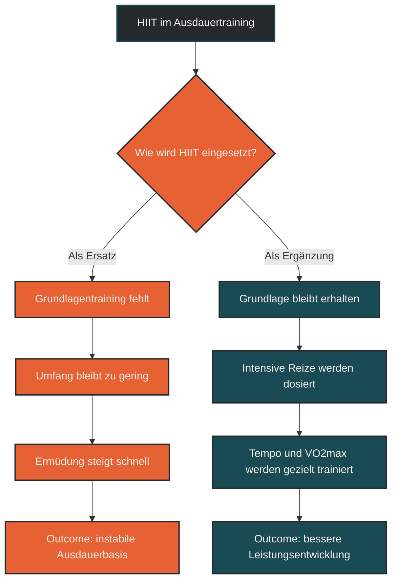

# HIIT ersetzt kein Grundlagentraining

HIIT kann ein wirksamer Trainingsreiz sein, ersetzt aber kein Grundlagentraining. Hochintensive Intervalle verbessern bestimmte Leistungsbereiche, setzen aber viel Ermüdung frei und bauen keine stabile aerobe Basis allein auf. Für Ausdauerleistung braucht es beides: viele gut verträgliche Grundlagenreize und gezielte intensive Einheiten. [[1]](#quelle-1) [[2]](#quelle-2) [[4]](#quelle-4)

## Was HIIT bedeutet

HIIT steht für High-Intensity Interval Training. Gemeint sind kurze bis längere Belastungsabschnitte mit hoher Intensität, die durch Pausen oder lockere Abschnitte unterbrochen werden. Typische Beispiele sind kurze Berganläufe, schnelle Intervalle, VO2max-Intervalle oder sehr intensive Belastungen oberhalb des Wohlfühltempos. [[1]](#quelle-1) [[2]](#quelle-2) [[3]](#quelle-3)

Der Vorteil von HIIT liegt darin, dass in relativ kurzer Zeit ein starker Reiz gesetzt werden kann. Herz-Kreislauf-System, Sauerstoffaufnahme, neuromuskuläre Aktivierung und Stoffwechsel werden deutlich gefordert.

Genau deshalb ist HIIT aber auch belastend. Es ist nicht einfach „effizientes Ausdauertraining in weniger Zeit“, sondern ein intensiver Reiz, der Erholung, Dosierung und eine gewisse Grundlage braucht.

## Was Grundlagentraining bedeutet

Grundlagentraining beschreibt überwiegend lockere bis kontrollierte Ausdauerbelastungen. Dazu gehören ruhige Dauerläufe, lange Läufe, lockere Radeinheiten oder andere niedrig bis moderat intensive Belastungen. [[5]](#quelle-5)

Diese Einheiten wirken weniger spektakulär als harte Intervalle, sind aber entscheidend für langfristige Ausdauerentwicklung. Sie verbessern die Belastungsverträglichkeit, unterstützen die aerobe Energieversorgung und ermöglichen Trainingsumfang, ohne ständig hohe Ermüdung zu erzeugen.

Grundlagentraining ist also nicht „langsam und unwichtig“, sondern die Basis, auf der intensivere Reize überhaupt sinnvoll verarbeitet werden können.

## Warum HIIT das Grundlagentraining nicht ersetzt

HIIT setzt starke Reize, aber nicht alle notwendigen Reize. Ausdauerleistung entsteht nicht nur durch maximale Intensität, sondern durch die Fähigkeit, über lange Zeit effizient Energie bereitzustellen, Ermüdung zu kontrollieren und Belastung regelmäßig zu wiederholen. [[1]](#quelle-1) [[5]](#quelle-5)

Wer nur intensiv trainiert, sammelt schnell Ermüdung. Dadurch werden lockere Tage zu hart, Qualitätseinheiten schlechter, Technik unsauberer und das Verletzungsrisiko kann steigen. Besonders im Laufsport kommt hinzu, dass hochintensive Einheiten auch mechanisch anspruchsvoll sind. [[5]](#quelle-5) [[6]](#quelle-6)

Grundlagentraining baut dagegen die robuste Basis: Sehnen, Muskeln, Herz-Kreislauf-System, Stoffwechsel und Nervensystem gewöhnen sich an regelmäßige Belastung. HIIT kann diese Basis ergänzen, aber nicht vollständig ersetzen.

## Zentrale Einflussfaktoren

### Trainingsstand

Einsteiger brauchen zuerst Regelmäßigkeit, Belastungsverträglichkeit und saubere Bewegungsabläufe. Zu frühes oder zu häufiges HIIT kann mehr Ermüdung erzeugen als Anpassung.

Fortgeschrittene Läufer können HIIT gezielter einsetzen, weil sie bereits eine größere Grundlage, bessere Technik und mehr Erfahrung mit Belastungssteuerung haben.

### Trainingsziel

Für VO2max, Tempohärte und intensive Wettkampfphasen kann HIIT sinnvoll sein. Für lange Läufe, aerobe Stabilität, Marathonvorbereitung oder langfristige Belastbarkeit reicht HIIT allein nicht aus.

Das Trainingsziel entscheidet also, wie viel Intensität sinnvoll ist.

### Erholung

HIIT braucht Erholung. Wer intensive Einheiten zu dicht setzt, trainiert nicht automatisch besser, sondern oft nur müder. Schlaf, Ernährung, lockere Tage und reduzierte Gesamtbelastung bestimmen mit, ob aus dem Reiz eine Anpassung wird. [[2]](#quelle-2) [[6]](#quelle-6)

### Umfang

Grundlagentraining ermöglicht Trainingsumfang. Dieser Umfang ist für viele Ausdaueranpassungen wichtig, weil der Körper wiederholt und langfristig lernen muss, Belastung ökonomisch zu bewältigen.

HIIT kann Umfang nicht beliebig ersetzen, weil der Körper hochintensive Belastungen nur begrenzt oft sinnvoll toleriert.

## Bedeutung für Läufer

Für Läufer ist HIIT ein Werkzeug, kein Fundament. Es kann helfen, Geschwindigkeit, Sauerstoffaufnahme, Schrittfrequenz, Abdruck und mentale Belastungstoleranz zu verbessern. Dafür muss es aber in eine stabile Trainingsstruktur eingebettet sein.

Die meisten Läufer profitieren davon, den Großteil des Trainings locker zu halten und einzelne intensive Reize gezielt zu setzen. So bleibt genug Energie für Qualität, Anpassung und Kontinuität.

Wer dagegen versucht, mit wenigen harten Einheiten das gesamte Grundlagentraining zu ersetzen, trainiert oft zu einseitig. Die kurzfristige Anstrengung ist hoch, aber die langfristige Basis bleibt schwach.

## Häufige Fehler

Ein häufiger Fehler ist die Annahme, dass hartes Training automatisch besseres Training ist. Intensität ist nur dann sinnvoll, wenn sie zum Ziel, zur Erholung und zum aktuellen Trainingsstand passt.

Ein zweiter Fehler ist zu häufiges HIIT. Wenn jede Woche mehrere harte Einheiten stattfinden, bleibt oft zu wenig Raum für Anpassung.

Ein dritter Fehler ist, lockere Einheiten als wertlos zu sehen. Gerade ruhige Läufe schaffen die Grundlage, damit intensive Einheiten später überhaupt wirksam werden.

## Praktische Einordnung

HIIT ist sinnvoll, wenn es gezielt eingesetzt wird. Es kann starke Leistungsreize setzen und bestimmte Anpassungen anstoßen. Es sollte aber nicht als Ersatz für Grundlagenarbeit verstanden werden.

Eine robuste Ausdauer entsteht durch Wiederholung, Geduld und passende Belastungsverteilung. Grundlagentraining liefert die Breite. HIIT setzt gezielte Spitzen. [[5]](#quelle-5)

Der wichtigste Merksatz lautet: HIIT macht Training intensiver, aber Grundlagentraining macht Ausdauer belastbar.

----

----

## Häufige Fragen zu HIIT ersetzt kein Grundlagentraining

### Kann HIIT Ausdauer verbessern?

Ja. HIIT kann die Ausdauerleistung verbessern, besonders in Bereichen wie VO2max, Tempoverträglichkeit und intensiver Belastungstoleranz. Es ersetzt aber nicht die langfristige aerobe Basis.

### Warum reicht HIIT allein nicht aus?

HIIT ist sehr belastend und kann nicht beliebig oft wiederholt werden. Grundlagentraining ermöglicht Umfang, verbessert Belastungsverträglichkeit und schafft die Basis für langfristige Anpassung.

### Wie oft sollte man HIIT machen?

Das hängt von Trainingsstand, Ziel und Gesamtbelastung ab. Für viele Läufer reicht eine gezielte intensive Einheit pro Woche oder pro Trainingsblock bereits aus. Entscheidend ist, dass genug Erholung bleibt.

### Ist Grundlagentraining nur langsames Training?

Nein. Grundlagentraining wirkt weniger spektakulär, ist aber zentral für aerobe Entwicklung, Ermüdungsresistenz und langfristige Belastbarkeit.

### Für wen ist HIIT besonders riskant?

HIIT kann problematisch sein, wenn die Grundlage fehlt, Beschwerden bestehen, zu wenig Erholung vorhanden ist oder bereits sehr viel Alltagsstress und Trainingsbelastung zusammenkommen.

### Was ist die beste Kombination?

Meist ist eine Mischung sinnvoll: viele kontrollierte lockere Einheiten, einzelne gezielte intensive Reize und ausreichend Erholung. Die genaue Verteilung hängt vom Ziel und Trainingsstand ab.

----

## Quellen

### Quelle 1: Laursen, P. B., & Jenkins, D. G. (2002). The scientific basis for high-intensity interval training. *Sports Medicine*, 32, 53–73.
Quelle: https://link.springer.com/article/10.2165/00007256-200232010-00003

### Quelle 2: Buchheit, M., & Laursen, P. B. (2013). High-intensity interval training, solutions to the programming puzzle. Part I: cardiopulmonary emphasis. *Sports Medicine*, 43, 313–338.
Quelle: https://link.springer.com/article/10.1007/s40279-013-0029-x

### Quelle 3: Buchheit, M., & Laursen, P. B. (2013). High-intensity interval training, solutions to the programming puzzle. Part II: anaerobic energy, neuromuscular load and practical applications. *Sports Medicine*, 43, 927–954.
Quelle: https://link.springer.com/article/10.1007/s40279-013-0066-5

### Quelle 4: Milanović, Z., Sporiš, G., & Weston, M. (2015). Effectiveness of high-intensity interval training for improving VO2max: a systematic review and meta-analysis. *Sports Medicine*, 45, 1469–1481.
Quelle: https://pubmed.ncbi.nlm.nih.gov/26243014/

### Quelle 5: Seiler, S. (2010). What is best practice for training intensity and duration distribution in endurance athletes? *International Journal of Sports Physiology and Performance*, 5(3), 276–291.
Quelle: https://journals.humankinetics.com/abstract/journals/ijspp/5/3/article-p276.xml

### Quelle 6: Bourdon, P. C., Cardinale, M., Murray, A., et al. (2017). Monitoring athlete training loads: consensus statement. *International Journal of Sports Physiology and Performance*, 12(Suppl 2), S2-161–S2-170.
Quelle: https://journals.humankinetics.com/view/journals/ijspp/12/s2/article-pS2-161.xml

----

*Hinweis: Dieser Artikel dient der allgemeinen Information und ersetzt keine medizinische oder therapeutische Beratung. Mehr dazu im [**Gesundheits- und Quellenhinweis**](/ausdauersport/disclaimer/).*
