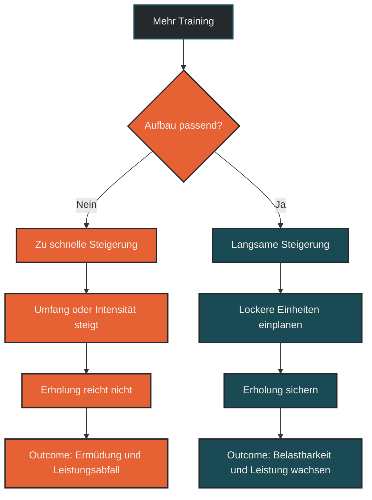

# Mehr Training ist nicht immer besser

Mehr Training führt nicht automatisch zu mehr Leistung. Ausdauer verbessert sich, wenn Belastung und Erholung zusammenpassen. Wer Umfang oder Intensität zu schnell erhöht, kann Anpassung blockieren, Ermüdung aufbauen und das Risiko für Beschwerden, Leistungsabfall oder Überlastung steigern.

## Was mehr Training bedeutet

Mehr Training kann verschiedene Dinge bedeuten. Es kann mehr Kilometer, mehr Stunden, mehr Einheiten pro Woche, mehr Höhenmeter oder mehr intensive Belastung bedeuten. Für den Körper zählt aber nicht nur die einzelne Zahl, sondern die gesamte Belastung.

Zwei Läufer können gleich viele Kilometer laufen und trotzdem völlig unterschiedlich belastet sein. Tempo, Untergrund, Schlaf, Stress, Ernährung, Trainingsalter, Kraft, Verletzungsvorgeschichte und Regeneration verändern, wie ein Trainingsreiz wirkt.

Deshalb ist mehr Training nur dann sinnvoll, wenn der Körper diesen zusätzlichen Reiz auch verarbeiten kann.

## Warum der Mythos so verbreitet ist

Im Ausdauersport ist Umfang wichtig. Viele gute Ausdauerleistungen entstehen über Jahre durch regelmäßiges Training, lange Läufe und wiederholte aerobe Reize. Daraus entsteht schnell die einfache Regel: Wenn Training gut ist, muss mehr Training besser sein.

Diese Regel stimmt aber nur bis zu einem bestimmten Punkt. Training ist kein linearer Prozess. Der Körper wird nicht während der Belastung besser, sondern in der Anpassung danach. Wenn die nächste Belastung kommt, bevor ausreichend Erholung stattgefunden hat, kann sich Ermüdung aufbauen.

Dann wird mehr Training nicht zum Fortschritt, sondern zum Störfaktor.

## Warum mehr Training nicht immer besser ist

Training setzt einen Reiz. Dieser Reiz muss stark genug sein, um Anpassung auszulösen, aber nicht so groß, dass der Körper dauerhaft überfordert wird. Wird die Belastung zu schnell gesteigert, entsteht ein Missverhältnis zwischen Trainingsreiz und Belastbarkeit.

Das kann sich unterschiedlich zeigen: schwere Beine, schlechter Schlaf, ungewöhnlich hohe Herzfrequenz, Motivationsverlust, sinkende Leistung, anhaltende Müdigkeit oder wiederkehrende Beschwerden. Solche Zeichen bedeuten nicht automatisch ein ernstes Problem, sie sollten aber ernst genommen werden.

Besonders kritisch wird es, wenn Umfang und Intensität gleichzeitig steigen. Mehr Kilometer plus mehr harte Einheiten plus weniger Erholung ist selten eine gute Kombination.

## Zentrale Einflussfaktoren

### Belastungssteigerung

Eine moderate Steigerung kann sinnvoll sein. Eine abrupte Steigerung ist riskanter. Sehnen, Knochen, Muskeln und Stoffwechsel passen sich nicht alle gleich schnell an. Gerade passive Strukturen brauchen oft länger als das Herz-Kreislauf-System.

### Intensität

Mehr Training ist vor allem dann problematisch, wenn zusätzlich viele harte Einheiten enthalten sind. Intensität erzeugt viel Ermüdung. Wenn lockere Läufe zu hart werden und harte Einheiten zu häufig kommen, fehlt dem Körper die Grundlage für Anpassung.

### Erholung

Erholung ist kein Trainingsgegner, sondern Teil des Trainings. Schlaf, Ernährung, Ruhetage, lockere Wochen und Stressmanagement entscheiden mit, ob ein Reiz verarbeitet werden kann.

### Alltag und Gesamtstress

Training wirkt nicht isoliert. Beruf, Familie, Schlafmangel, Hitze, Krankheit, mentale Belastung oder zu wenig Energiezufuhr erhöhen die Gesamtbelastung. In solchen Phasen kann ein eigentlich normaler Trainingsplan plötzlich zu viel sein.

## Bedeutung für Läufer

Für Läufer ist die Versuchung groß, Fortschritt über mehr Kilometer zu erzwingen. Das kann kurzfristig funktionieren, aber langfristig braucht Leistung eine belastbare Struktur. Umfang muss zur aktuellen Grundlage passen.

Sinnvoll ist nicht der maximal mögliche Umfang, sondern der höchste Umfang, den man regelmäßig gut verträgt. Dazu gehören lockere Läufe, gezielte Qualitätseinheiten, Ruhetage, Krafttraining und Phasen mit reduzierter Belastung.

Wer immer nur steigert, nimmt dem Körper die Möglichkeit, Anpassung zu stabilisieren. Fortschritt entsteht oft nicht durch die härteste Woche, sondern durch viele gut verträgliche Wochen hintereinander.

## Häufige Fehler

Ein häufiger Fehler ist, gute Form sofort mit noch mehr Training zu beantworten. Gerade wenn es gut läuft, steigt die Gefahr, zu schnell zu viel zu wollen.

Ein zweiter Fehler ist, Umfang und Intensität gleichzeitig zu erhöhen. Das macht es schwer zu erkennen, welcher Reiz wirkt und welcher Reiz zu viel ist.

Ein dritter Fehler ist, Müdigkeit zu ignorieren. Nicht jede schwere Einheit ist ein Warnsignal. Aber wenn Müdigkeit, schlechte Stimmung, Leistungsabfall und Beschwerden zusammenkommen, sollte die Belastung überprüft werden.

## Praktische Einordnung

Mehr Training kann sinnvoll sein, wenn es langsam aufgebaut, gut vertragen und mit ausreichend Erholung kombiniert wird. Es ist aber kein Selbstzweck. Der Körper braucht nicht möglichst viel Belastung, sondern die passende Dosis.

Für die Praxis ist eine einfache Frage hilfreich: Werde ich durch dieses zusätzliche Training belastbarer oder nur müder? Wenn die Antwort unklar ist, ist weniger manchmal die bessere Entscheidung.

Der wichtigste Merksatz lautet: Mehr Training bringt nur dann mehr Leistung, wenn der Körper den Reiz auch verarbeiten kann.

----

----

## Häufige Fragen zu Mehr Training ist nicht immer besser

### Führt mehr Training immer zu mehr Leistung?

Nein. Mehr Training verbessert die Leistung nur, wenn der Körper den zusätzlichen Reiz verarbeiten kann. Ohne ausreichende Erholung kann mehr Training auch zu Müdigkeit, Leistungsabfall oder Überlastung beitragen.

### Wann ist mehr Umfang sinnvoll?

Mehr Umfang ist sinnvoll, wenn er langsam aufgebaut wird, gut vertragen wird und die Qualität der restlichen Einheiten nicht verschlechtert. Entscheidend ist die langfristige Kontinuität.

### Was ist der häufigste Fehler?

Viele Läufer erhöhen Umfang und Intensität gleichzeitig. Dadurch steigt die Gesamtbelastung stark, während die Erholung oft gleich bleibt oder sogar schlechter wird.

### Ist Müdigkeit nach Training normal?

Ja, kurzfristige Müdigkeit nach Training ist normal. Problematisch wird es, wenn Müdigkeit dauerhaft bleibt, die Leistung sinkt, Schlaf und Stimmung schlechter werden oder Beschwerden wiederkehren.

### Sind Ruhetage verlorene Trainingstage?

Nein. Ruhetage helfen dem Körper, Trainingsreize zu verarbeiten. Anpassung entsteht nicht nur durch Belastung, sondern durch das Zusammenspiel aus Reiz und Erholung.

### Was ist besser als immer mehr Training?

Besser ist eine passende Belastungsverteilung: viele gut verträgliche Einheiten, gezielte intensive Reize, ausreichend Erholung und regelmäßige Phasen mit reduzierter Belastung.

----

*Hinweis: Dieser Artikel dient der allgemeinen Information und ersetzt keine medizinische oder therapeutische Beratung. Mehr dazu im [**Gesundheits- und Quellenhinweis**](/ausdauersport/disclaimer/).*

