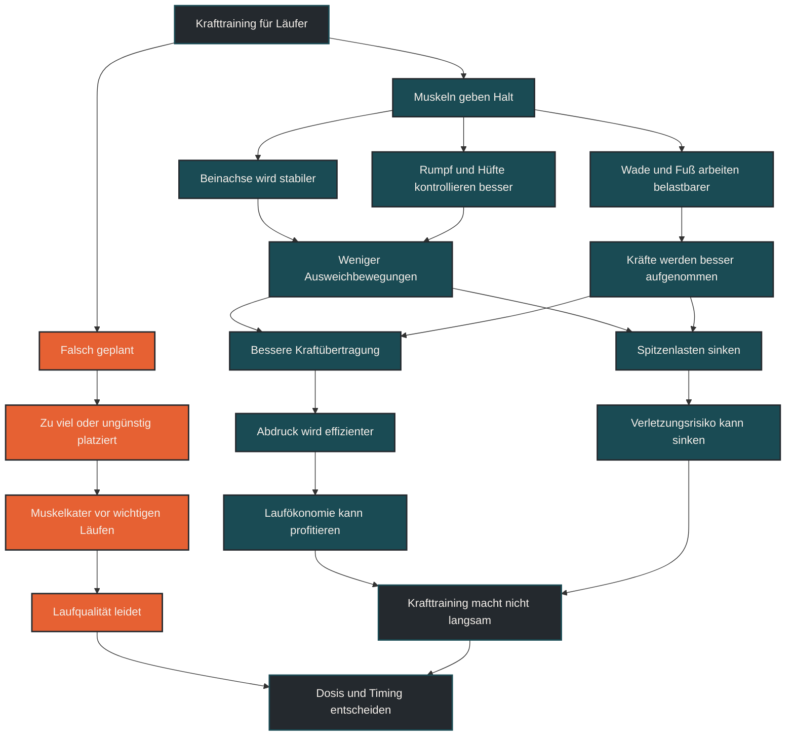

# Krafttraining macht Läufer nicht langsam

Krafttraining macht Läufer nicht automatisch langsam. Richtig dosiert kann es Laufökonomie, Stabilität, Kraftübertragung und Belastbarkeit unterstützen. Entscheidend ist nicht, ob Krafttraining gemacht wird, sondern ob es passend zum Lauftraining geplant, platziert und gesteigert wird.

## Was Krafttraining für Läufer bedeutet

Krafttraining umfasst Übungen, bei denen Muskeln, Sehnen, Gelenke und das Nervensystem gegen Widerstand arbeiten. Das kann mit dem eigenen Körpergewicht, freien Gewichten, Maschinen, Widerstandsbändern oder Sprungformen geschehen.

Für Läufer geht es dabei nicht darum, möglichst viel Muskelmasse aufzubauen. Wichtiger sind Kraftentwicklung, Rumpfstabilität, Hüftkontrolle, Wadenkraft, Beinachsenkontrolle und die Fähigkeit, wiederholte Laufbelastungen besser zu tolerieren.

Krafttraining soll das Laufen unterstützen. Es ersetzt keine Ausdauerreize, kann aber helfen, die mechanische Grundlage für dauerhaftes Lauftraining robuster zu machen.

## Warum der Mythos entstanden ist

Der Mythos entsteht aus der Vorstellung, dass zusätzliche Muskulatur automatisch mehr Gewicht bedeutet und mehr Gewicht Läufer langsamer macht. Diese Rechnung ist zu einfach.

Krafttraining für Läufer ist nicht dasselbe wie Bodybuilding. Ein sinnvoll geplantes Krafttraining zielt nicht primär auf maximale Muskelmasse, sondern auf bessere Kraftübertragung, stabile Gelenkpositionen und kontrollierte Bewegungen.

Außerdem entsteht Laufleistung nicht nur durch geringes Körpergewicht. Sie entsteht aus dem Zusammenspiel von Ausdauer, Laufökonomie, Technik, Kraft, Sehnenfunktion, Ermüdungsresistenz und Belastungsverträglichkeit.

## Warum Krafttraining Läufer nicht automatisch langsam macht

Beim Laufen muss der Körper bei jedem Schritt Kräfte aufnehmen, stabilisieren und wieder in Vortrieb umsetzen. Dafür braucht es nicht nur Ausdauer, sondern auch aktive Kontrolle.

Stärkere Waden, Hüften, Oberschenkel und ein stabiler Rumpf können helfen, die Laufbewegung auch bei Ermüdung sauberer zu halten. Das kann die Laufökonomie unterstützen, weil weniger Energie in Ausweichbewegungen verloren geht.

Langsam macht Krafttraining vor allem dann, wenn es falsch dosiert wird. Zu viele neue Übungen, zu schwere Einheiten, starker Muskelkater oder Krafttraining direkt vor wichtigen Laufeinheiten können die Laufqualität kurzfristig verschlechtern.

## Zentrale Einflussfaktoren

### Dosierung

Krafttraining muss zur gesamten Trainingsbelastung passen. Eine kurze, regelmäßig durchgeführte Einheit kann wertvoller sein als ein zu umfangreiches Kraftprogramm, das ständig Muskelkater erzeugt.

Entscheidend ist, dass Krafttraining die Laufleistung langfristig unterstützt und nicht jede Woche die Qualität der Laufeinheiten stört.

### Übungsauswahl

Für Läufer sind Übungen sinnvoll, die Hüfte, Knie, Sprunggelenk, Fuß und Rumpf kontrolliert belasten. Dazu gehören zum Beispiel Kniebeugenvarianten, Ausfallschritte, Hüftstreckung, Wadenheben, einbeinige Stabilitätsübungen und Rumpfübungen.

Die Übung muss nicht spektakulär sein. Wichtiger sind saubere Ausführung, passende Belastung und ein klarer Bezug zur Laufbewegung.

### Platzierung in der Woche

Krafttraining ist ein Trainingsreiz und braucht Erholung. Schwere Kraftreize direkt vor Intervallen, Tempoläufen oder langen Läufen können ungünstig sein.

Häufig passt Krafttraining besser nach lockeren Läufen, an separaten Tagen oder in Phasen, in denen keine sehr hohe Laufintensität geplant ist.

### Trainingsziel

Ein 5-km-Läufer, ein Marathonläufer und ein Trailrunner brauchen nicht exakt dasselbe Krafttraining. Je nach Ziel können Maximalkraft, Kraftausdauer, Sprungkraft, Rumpfstabilität oder Belastbarkeit unterschiedlich wichtig sein.

## Bedeutung für Läufer

Für Läufer ist Krafttraining ein ergänzender Baustein. Es kann helfen, die wiederholten Kräfte des Laufens besser zu verarbeiten und den Körper auf höhere Umfänge oder intensivere Belastungen vorzubereiten.

Besonders relevant wird das, wenn Laufumfang, Tempoarbeit oder Wettkampfbelastung steigen. Dann reicht es oft nicht, nur mehr zu laufen. Der Körper muss die mechanische Belastung auch stabil tragen können.

Krafttraining macht Läufer also nicht automatisch langsamer. Es kann sogar helfen, länger stabil, kontrolliert und ökonomisch zu laufen, wenn es sinnvoll in den Trainingsplan eingebettet wird.

## Häufige Fehler

Ein häufiger Fehler ist die Angst, durch Krafttraining sofort zu schwer zu werden. Bei sinnvoller Dosierung und ausdauerorientierter Einbettung passiert das nicht automatisch.

Ein zweiter Fehler ist zu viel Krafttraining auf einmal. Wer plötzlich viele neue Übungen, hohe Lasten und mehrere Einheiten pro Woche einbaut, riskiert unnötige Ermüdung.

Ein dritter Fehler ist, Krafttraining nicht als Teil der Gesamtbelastung zu zählen. Auch wenn es nicht gelaufen wird, belastet es Muskeln, Sehnen und Nervensystem.

## Praktische Einordnung

Krafttraining macht Läufer nicht langsam, wenn es passend geplant wird. Es kann Stabilität, Kraftübertragung und Belastbarkeit verbessern, sollte aber nicht gegen das Lauftraining arbeiten.

Für die Praxis ist ein ruhiger Aufbau sinnvoll: wenige Übungen, saubere Technik, moderate Steigerung und gute Platzierung in der Woche. Krafttraining soll nicht möglichst viel Muskelkater erzeugen, sondern langfristig die Laufbewegung unterstützen.

Der wichtigste Merksatz lautet: Krafttraining macht Läufer nicht langsam, wenn es das Lauftraining ergänzt und nicht verdrängt.

----

----

## Häufige Fragen zu Krafttraining macht Läufer nicht langsam

### Macht Krafttraining Läufer langsamer?

Nein, nicht automatisch. Richtig dosiertes Krafttraining kann Läufer stabiler, belastbarer und ökonomischer machen. Problematisch wird es eher, wenn Krafttraining zu viel Ermüdung erzeugt oder schlecht in den Laufplan eingebaut wird.

### Bauen Läufer durch Krafttraining zu viel Muskelmasse auf?

Bei sinnvoller Dosierung passiert das nicht automatisch. Krafttraining für Läufer zielt meist nicht auf maximale Muskelmasse, sondern auf Kraft, Stabilität, Kontrolle und Belastbarkeit.

### Welche Vorteile hat Krafttraining für Läufer?

Krafttraining kann Rumpfstabilität, Hüftkontrolle, Beinachse, Wadenkraft, Sehnenbelastbarkeit und Laufökonomie unterstützen. Es kann außerdem helfen, Belastungen besser zu tolerieren.

### Wie oft sollten Läufer Krafttraining machen?

Das hängt von Trainingsstand, Ziel und Gesamtbelastung ab. Für viele Läufer sind ein bis zwei gut geplante Einheiten pro Woche ein sinnvoller Einstieg. Entscheidend ist, dass die Laufeinheiten nicht dauerhaft darunter leiden.

### Wann sollte Krafttraining in die Woche passen?

Krafttraining sollte so platziert werden, dass wichtige Laufeinheiten nicht unnötig beeinträchtigt werden. Häufig passt es nach lockeren Läufen, an separaten Tagen oder in Phasen mit weniger Laufintensität.

### Was ist der häufigste Fehler beim Krafttraining für Läufer?

Viele machen zu viel auf einmal. Neue Übungen, hohe Lasten und starker Muskelkater können die Laufqualität kurzfristig verschlechtern. Besser ist ein ruhiger Aufbau mit sauberer Technik.

----

*Hinweis: Dieser Artikel dient der allgemeinen Information und ersetzt keine medizinische oder therapeutische Beratung. Mehr dazu im [**Gesundheits- und Quellenhinweis**](/ausdauersport/disclaimer/).*

