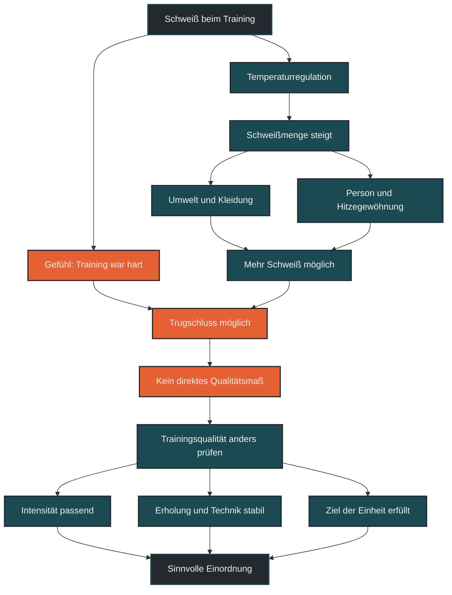

# Schweiß zeigt nicht die Trainingsqualität

Schweiß zeigt nicht automatisch, wie gut ein Training war. Schwitzen ist vor allem ein Mechanismus zur Temperaturregulation. Wie viel jemand schwitzt, hängt unter anderem von Hitze, Luftfeuchtigkeit, Kleidung, Trainingszustand, Genetik, Körpergröße und Gewöhnung an Wärme ab. Die Trainingsqualität erkennt man besser an Ziel, Intensität, Belastungssteuerung, Technik, Erholung und langfristiger Entwicklung.

## Was Schwitzen bedeutet

Schwitzen ist eine wichtige Funktion des Körpers, um Wärme abzugeben. Wenn die Körpertemperatur steigt, produziert der Körper Schweiß. Verdunstet dieser Schweiß auf der Haut, kann Wärme abgeführt werden.

Beim Ausdauertraining entsteht Wärme, weil arbeitende Muskeln Energie umsetzen. Ein Teil dieser Energie wird nicht in Bewegung, sondern in Wärme umgewandelt. Deshalb schwitzt man beim Laufen, Radfahren oder intensiven Training oft mehr als in Ruhe.

Das bedeutet aber nicht, dass viel Schweiß automatisch ein besonders wirksames Training anzeigt. Es bedeutet zunächst nur, dass der Körper versucht, Temperatur zu regulieren.

## Warum der Mythos so verbreitet ist

Schweiß ist sichtbar. Eine nasse Kleidung, tropfender Schweiß oder ein starkes Hitzegefühl wirken nach harter Arbeit. Dadurch entsteht schnell der Eindruck, dass ein Training besonders gut war, wenn man stark geschwitzt hat.

Der Mythos wird zusätzlich durch Aussagen wie „richtig ausgeschwitzt“ oder „viel geschwitzt, also viel verbrannt“ verstärkt. Das klingt plausibel, ist aber zu einfach.

Ein Training kann sehr sinnvoll sein, ohne besonders viel Schweiß zu erzeugen. Umgekehrt kann ein Training sehr schweißtreibend sein, obwohl der eigentliche Trainingsreiz schlecht dosiert oder unspezifisch war.

## Warum Schweiß kein Qualitätsmaß ist

Schweißmenge zeigt vor allem die thermische Belastung. Eine lockere Einheit bei hoher Luftfeuchtigkeit kann mehr Schweiß erzeugen als eine intensive Einheit bei kühlem Wetter. Das sagt wenig darüber aus, ob die Einheit zum Trainingsziel gepasst hat.

Auch Kleidung verändert das Bild. Wer warm angezogen läuft oder in schlecht belüfteter Umgebung trainiert, schwitzt mehr. Dadurch wird das Training aber nicht automatisch besser.

Hinzu kommt: Gut trainierte oder hitzegewöhnte Sportler können früher und effizienter schwitzen. Das kann ein Zeichen guter Wärmeregulation sein, aber nicht direkt ein Maß für die Qualität einer einzelnen Einheit.

## Zentrale Einflussfaktoren

### Temperatur und Luftfeuchtigkeit

Bei Hitze und hoher Luftfeuchtigkeit steigt die thermische Belastung. Der Körper schwitzt stärker, aber die Verdunstung funktioniert oft schlechter. Dadurch fühlt sich Training härter an, obwohl Pace oder Leistung niedriger sein können.

### Kleidung und Umgebung

Dichte Kleidung, wenig Luftzirkulation, direkte Sonne oder Training in Innenräumen können Schwitzen stark erhöhen. Das verändert die äußere Belastung, aber nicht automatisch den gewünschten Trainingsreiz.

### Trainingszustand und Hitzegewöhnung

Mit besserer Ausdauer und regelmäßiger Hitzeexposition kann der Körper seine Kühlung anpassen. Manche Sportler schwitzen früher oder mehr, weil die Thermoregulation effizienter arbeitet.

### Individuelle Unterschiede

Körpergröße, Körpermasse, Genetik, Geschlecht, Ernährung, Koffein, Stress und Tagesform können beeinflussen, wie stark jemand schwitzt. Deshalb sind Vergleiche zwischen Personen wenig sinnvoll.

## Bedeutung für Läufer

Für Läufer ist wichtig, Schweiß richtig einzuordnen. Ein stark verschwitzter Lauf war nicht automatisch ein guter Lauf. Entscheidend ist, ob die Einheit das geplante Ziel erfüllt hat.

Ein lockerer Dauerlauf soll locker bleiben, auch wenn man bei Hitze stark schwitzt. Ein Intervalltraining soll gezielt fordern, aber nicht nur deshalb als gut gelten, weil die Kleidung danach nass ist.

Schweiß kann trotzdem praktisch wichtig sein. Wer viel schwitzt, verliert Flüssigkeit und Elektrolyte. Besonders bei langen Läufen, Hitze oder Wettkämpfen sollte man deshalb auf Durst, Körpergefühl, Salzverlust, Krämpfe, Leistungseinbruch und Erholung achten.

## Häufige Fehler

Ein häufiger Fehler ist, Schweiß mit Kalorienverbrauch gleichzusetzen. Schwitzen bedeutet Wasserverlust, nicht automatisch Fettverlust.

Ein zweiter Fehler ist, Training künstlich heißer zu machen, zum Beispiel durch zu warme Kleidung. Das erhöht vor allem den Hitzestress und kann die Trainingsqualität sogar verschlechtern.

Ein dritter Fehler ist, wenig Schweiß als schlechtes Training zu bewerten. Bei kühlem Wetter, guter Belüftung oder niedriger Intensität kann ein sinnvolles Training relativ trocken bleiben.

## Praktische Einordnung

Schweiß ist ein Signal für Wärmeregulation, nicht für Trainingsqualität. Er kann helfen, Hitze, Flüssigkeitsverlust und Belastung besser wahrzunehmen. Er sagt aber nicht allein, ob eine Einheit sinnvoll war.

Für die Trainingspraxis sind andere Fragen wichtiger: Hat die Einheit zum Ziel gepasst? War die Intensität richtig? Wurde die Erholung berücksichtigt? War die Technik stabil? Passt die Einheit in die Woche?

Der wichtigste Merksatz lautet: Schweiß zeigt, dass der Körper kühlt, nicht automatisch, dass das Training besser war.

----

----

## Häufige Fragen zu Schweiß zeigt nicht die Trainingsqualität

### Bedeutet viel Schweiß ein gutes Training?

Nein. Viel Schweiß zeigt vor allem, dass der Körper Wärme reguliert. Ob das Training gut war, hängt stärker von Ziel, Intensität, Belastungssteuerung und Erholung ab.

### Verbrennt man mehr Fett, wenn man mehr schwitzt?

Nicht automatisch. Schweiß ist vor allem Wasserverlust. Fettverbrennung hängt von Energiestoffwechsel, Intensität, Dauer, Ernährung und Gesamtbilanz ab.

### Warum schwitze ich bei lockeren Läufen stark?

Hitze, Luftfeuchtigkeit, Kleidung, Körpergröße, Genetik, Stress oder Hitzegewöhnung können die Schweißmenge erhöhen. Ein lockerer Lauf kann dadurch sehr schweißtreibend wirken.

### Ist wenig Schweiß ein Zeichen für schlechtes Training?

Nein. Bei kühlem Wetter, niedriger Intensität oder guter Belüftung kann ein sinnvolles Training wenig Schweiß erzeugen.

### Kann Schwitzen trotzdem wichtig für Läufer sein?

Ja. Viel Schwitzen kann Flüssigkeits- und Elektrolytverluste erhöhen. Besonders bei langen Läufen, Hitze und Wettkämpfen sollte das berücksichtigt werden.

### Woran erkenne ich Trainingsqualität besser?

Besser sind Zielerreichung, passende Intensität, stabile Technik, subjektives Belastungsempfinden, Herzfrequenz oder Pace im Kontext, Erholung und langfristige Entwicklung.
----

*Hinweis: Dieser Artikel dient der allgemeinen Information und ersetzt keine medizinische oder therapeutische Beratung. Mehr dazu im [**Gesundheits- und Quellenhinweis**](/ausdauersport/disclaimer/).*

