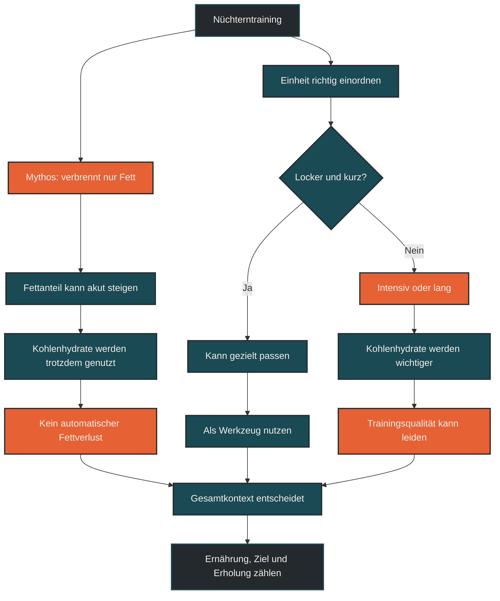

# Nüchterntraining verbrennt nicht nur Fett

Nüchterntraining verbrennt nicht nur Fett. Auch ohne Frühstück nutzt der Körper weiterhin verschiedene Energiequellen, darunter Fettsäuren, gespeicherte Kohlenhydrate und je nach Belastung auch Aminosäuren. Nüchterntraining kann für bestimmte lockere Einheiten sinnvoll sein, ist aber keine automatische Abkürzung zu Fettverlust oder besserer Ausdauerleistung.

## Was Nüchterntraining bedeutet

Nüchterntraining bedeutet meistens, morgens vor dem Frühstück zu trainieren. Der Körper hat über Nacht keine neue Energie aufgenommen, und besonders die Leberglykogenspeicher können niedriger sein. Das bedeutet aber nicht, dass alle Kohlenhydratspeicher leer sind.

Die Muskulatur verfügt weiterhin über gespeichertes Glykogen. Wie viel davon verfügbar ist, hängt vom Vortag, der letzten Mahlzeit, dem Trainingszustand und der vorherigen Belastung ab.

Nüchterntraining ist deshalb kein Zustand, in dem der Körper ausschließlich Fett nutzt. Es verändert nur die Ausgangslage der Energiebereitstellung.

## Warum der Mythos entstanden ist

Der Mythos entsteht, weil bei nüchternen lockeren Einheiten der Anteil der Fettverbrennung höher sein kann. Daraus wird oft geschlossen, dass dadurch automatisch mehr Körperfett verloren geht.

Diese Schlussfolgerung ist zu einfach. Der Körper nutzt während einer Einheit zwar unterschiedliche Brennstoffe, aber Körperfettverlust hängt nicht nur davon ab, welcher Brennstoff während genau dieser Einheit anteilig genutzt wurde.

Entscheidend sind die gesamte Energiebilanz, die Ernährung über den Tag, die Trainingsqualität, die Regeneration und die langfristige Belastungssteuerung.

## Warum Nüchterntraining nicht nur Fett verbrennt

Der Körper arbeitet nicht mit einem einzigen Energietank. Bei niedriger Intensität kann der Fettstoffwechsel stärker beteiligt sein. Mit steigender Intensität steigt aber der Bedarf an schneller Energie, und dafür werden Kohlenhydrate wichtiger.

Auch nüchtern nutzt der Körper Kohlenhydrate, besonders wenn das Tempo höher wird, Anstiege dazukommen oder die Einheit länger dauert. Je härter die Belastung, desto weniger passt die Vorstellung von „nur Fettverbrennung“.

Wenn Energieverfügbarkeit dauerhaft zu niedrig ist, kann das außerdem Regeneration, Trainingsqualität und Anpassung stören. Nüchterntraining sollte deshalb nicht als Methode verstanden werden, den Körper möglichst oft in ein Defizit zu drücken.

## Zentrale Einflussfaktoren

### Intensität

Lockere Einheiten eignen sich eher für nüchternes Training als intensive Einheiten. Bei Intervallen, Tempodauerläufen oder langen belastenden Läufen braucht der Körper meist mehr verfügbare Kohlenhydrate, um die Qualität der Einheit zu sichern.

### Dauer

Kurze, lockere Einheiten sind meist leichter nüchtern umzusetzen. Je länger die Einheit dauert, desto wichtiger werden Flüssigkeit, Kohlenhydrate und die Frage, ob die Belastung noch sinnvoll verarbeitet werden kann.

### Trainingsziel

Wenn das Ziel eine lockere aerobe Einheit ist, kann Nüchterntraining gelegentlich passen. Wenn das Ziel Tempo, VO2max, Schwelle, Wettkampfspezifik oder hohe Laufqualität ist, ist eine gute Energieverfügbarkeit oft wichtiger.

### Gesamtbelastung

Nüchterntraining wirkt nicht isoliert. Schlaf, Stress, Trainingsumfang, Kalorienzufuhr, Zyklus, Alltag und Erholung beeinflussen, ob eine nüchterne Einheit gut vertragen wird.

## Bedeutung für Läufer

Für Läufer kann Nüchterntraining ein Werkzeug sein, aber kein Pflichtprogramm. Ein kurzer lockerer Lauf vor dem Frühstück kann funktionieren, wenn er wirklich locker bleibt und gut vertragen wird.

Problematisch wird es, wenn nüchternes Training mit „mehr bringt mehr“ verwechselt wird. Wer harte Einheiten nüchtern erzwingt, riskiert schlechtere Qualität, höhere Ermüdung und weniger saubere Technik.

Für viele Läufer ist es sinnvoller, nüchterne Einheiten sparsam und gezielt einzusetzen. Wichtig ist, danach ausreichend zu essen und die Einheit nicht als Freibrief für schlechte Energieversorgung zu verstehen.

## Häufige Fehler

Ein häufiger Fehler ist die Annahme, nüchternes Training verbrenne ausschließlich Fett. Der Körper nutzt auch nüchtern mehrere Energiequellen.

Ein zweiter Fehler ist, akute Fettverbrennung mit langfristigem Körperfettverlust gleichzusetzen. Entscheidend ist nicht nur eine einzelne Einheit, sondern der gesamte Energie- und Trainingskontext.

Ein dritter Fehler ist, intensive Einheiten nüchtern durchzuziehen, obwohl Pace, Technik, Stimmung oder Erholung deutlich schlechter werden. Dann schadet die Methode eher der Trainingsqualität.

## Praktische Einordnung

Nüchterntraining kann gelegentlich sinnvoll sein, wenn es zu einer lockeren Einheit, zum Alltag und zur aktuellen Erholung passt. Es ist aber keine magische Fettverbrennungsmethode.

Für die Praxis gilt: Je lockerer und kürzer die Einheit, desto eher kann nüchternes Training passen. Je intensiver, länger oder wichtiger die Einheit ist, desto eher sollte Energieverfügbarkeit priorisiert werden.

Der wichtigste Merksatz lautet: Nüchterntraining verändert die Brennstoffnutzung, ersetzt aber keine sinnvolle Ernährung, Trainingssteuerung und Regeneration.

----

----

## Häufige Fragen zu Nüchterntraining verbrennt nicht nur Fett

### Verbrennt Nüchterntraining nur Fett?

Nein. Auch nüchtern nutzt der Körper verschiedene Energiequellen. Der Anteil der Fettverbrennung kann bei lockerer Belastung höher sein, aber Kohlenhydrate spielen weiterhin eine Rolle.

### Hilft Nüchterntraining automatisch beim Abnehmen?

Nicht automatisch. Körperfettverlust hängt vor allem vom langfristigen Energiehaushalt, der Ernährung, dem Training und der Regeneration ab. Eine einzelne nüchterne Einheit entscheidet das nicht.

### Für welche Einheiten passt Nüchterntraining eher?

Es passt eher zu kurzen, lockeren Einheiten mit niedriger Intensität. Für intensive Intervalle, Tempoläufe oder lange belastende Einheiten ist eine gute Energieverfügbarkeit oft sinnvoller.

### Kann Nüchterntraining die Trainingsqualität verschlechtern?

Ja, besonders bei hoher Intensität oder langer Dauer. Wenn Pace, Technik, Konzentration oder Erholung leiden, passt nüchternes Training wahrscheinlich nicht zur Einheit.

### Muss jeder Läufer nüchtern trainieren?

Nein. Nüchterntraining ist kein Pflichtprogramm. Es ist ein mögliches Werkzeug, das zum Ziel, zur Verträglichkeit und zur Gesamtbelastung passen muss.

### Was ist nach nüchternem Training wichtig?

Nach der Einheit sollte die Energiezufuhr nicht unnötig verzögert werden. Kohlenhydrate, Protein, Flüssigkeit und eine normale Mahlzeitenstruktur helfen, die Belastung zu verarbeiten.

----

*Hinweis: Dieser Artikel dient der allgemeinen Information und ersetzt keine medizinische oder therapeutische Beratung. Mehr dazu im [**Gesundheits- und Quellenhinweis**](/ausdauersport/disclaimer/).*

