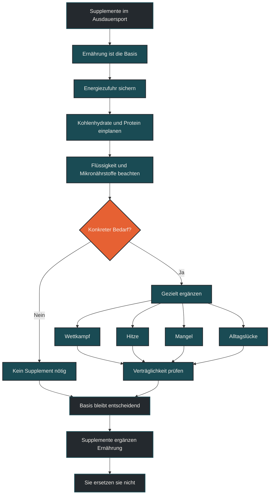

# Supplemente ersetzen keine Ernährung

Supplemente können im Ausdauersport sinnvoll sein, ersetzen aber keine gute Ernährung. Entscheidend bleiben ausreichende Energiezufuhr, Kohlenhydrate, Protein, Fette, Mikronährstoffe, Flüssigkeit und regelmäßige Mahlzeiten. Supplemente sind Ergänzungen für konkrete Situationen, nicht die Grundlage der Leistungsentwicklung. [[1]](#quelle-1) [[2]](#quelle-2) [[3]](#quelle-3)

## Was Supplemente bedeuten

Supplemente sind ergänzende Produkte, die bestimmte Nährstoffe oder Wirkstoffe liefern. Dazu gehören zum Beispiel Kohlenhydratgetränke, Elektrolyte, Proteinpulver, Koffein, Vitaminpräparate, Mineralstoffe oder einzelne sportbezogene Produkte.

Der Begriff klingt oft nach Leistungsoptimierung. In der Praxis sind Supplemente aber sehr unterschiedlich. Manche können in bestimmten Situationen sinnvoll sein, andere sind unnötig, schlecht belegt oder nur bei einem tatsächlichen Mangel relevant.

Wichtig ist deshalb die Reihenfolge: Erst muss die normale Ernährung passen. Danach kann geprüft werden, ob ein Supplement für ein konkretes Ziel überhaupt sinnvoll ist.

## Warum der Mythos so verbreitet ist

Supplemente sind einfach zu kaufen, klar zu dosieren und wirken professionell. Ein Pulver, eine Kapsel oder ein Gel vermittelt schnell das Gefühl, gezielt etwas für Leistung, Regeneration oder Gesundheit zu tun.

Ernährung ist dagegen weniger spektakulär. Sie besteht aus Gewohnheiten, Einkauf, Mahlzeiten, Timing, Alltag und Regelmäßigkeit. Genau dort entsteht aber die Grundlage.

Der Mythos entsteht, wenn einzelne Produkte wichtiger genommen werden als die Basis. Ein Supplement kann eine Lücke schließen, aber keine dauerhaft zu geringe Energiezufuhr, schlechte Mahlzeitenstruktur oder unpassende Trainingsbelastung ausgleichen.

## Warum Supplemente Ernährung nicht ersetzen

Der Körper braucht nicht nur einzelne isolierte Stoffe. Er braucht Energie, Flüssigkeit, Makronährstoffe, Mikronährstoffe, Ballaststoffe, sekundäre Pflanzenstoffe und eine insgesamt passende Ernährung. Lebensmittel liefern diese Dinge in einem komplexen Zusammenhang. [[1]](#quelle-1) [[2]](#quelle-2)

Supplemente liefern meistens nur einen Ausschnitt. Ein Proteinpulver ersetzt keine dauerhaft ausreichende Gesamtenergie. Ein Elektrolytgetränk ersetzt keine passende Flüssigkeitsstrategie. Ein Vitaminpräparat ersetzt keine ausgewogene Ernährung. Koffein ersetzt keine Erholung.

Besonders im Ausdauersport ist Energieverfügbarkeit entscheidend. Wer dauerhaft zu wenig isst, kann Training schlechter verarbeiten, Regeneration stören und Anpassungen begrenzen. Supplemente können dieses Grundproblem nicht lösen. [[1]](#quelle-1) [[5]](#quelle-5)

## Zentrale Einflussfaktoren

### Energiezufuhr

Ohne ausreichend Energie kann der Körper Trainingsreize schlechter verarbeiten. Müdigkeit, schlechte Regeneration, Leistungsschwankungen und erhöhte Anfälligkeit für Beschwerden können die Folge sein. Supplemente helfen nur begrenzt, wenn die tägliche Energiezufuhr nicht passt.

### Kohlenhydrate

Kohlenhydrate sind für viele Ausdauerbelastungen ein wichtiger Energieträger. Besonders bei langen oder intensiven Einheiten kann die Kohlenhydratverfügbarkeit entscheidend sein. Gels oder Sportgetränke können hier praktisch sein, ersetzen aber keine sinnvolle Ernährung im Alltag. [[1]](#quelle-1) [[5]](#quelle-5)

### Protein

Protein unterstützt Reparatur- und Anpassungsprozesse. Proteinpulver kann praktisch sein, wenn es im Alltag schwer ist, ausreichend Protein über normale Mahlzeiten aufzunehmen. Es ist aber kein Muss und ersetzt keine insgesamt passende Mahlzeitenstruktur.

### Mikronährstoffe

Vitamine und Mineralstoffe sind wichtig, sollten aber nicht blind ergänzt werden. Bei Verdacht auf Mangel, besonderer Ernährungsform oder auffälliger Müdigkeit ist eine gezielte Abklärung sinnvoller als pauschales Supplementieren. [[1]](#quelle-1) [[2]](#quelle-2) [[3]](#quelle-3)

### Timing und Alltag

Supplemente wirken oft nur dann sinnvoll, wenn sie in ein passendes Gesamtsystem eingebaut werden. Ein Gel im Wettkampf kann hilfreich sein. Dasselbe Gel löst aber keine Probleme, wenn Ernährung, Flüssigkeit, Schlaf und Belastungssteuerung im Alltag nicht passen.

## Bedeutung für Läufer

Für Läufer sind Supplemente besonders verführerisch, weil sie einfache Lösungen versprechen. Schneller regenerieren, mehr Energie, bessere Leistung, weniger Krämpfe oder stabileres Immunsystem klingen attraktiv.

Die wichtigste Grundlage bleibt aber der Alltag: regelmäßig essen, genug Energie aufnehmen, Kohlenhydrate rund um belastende Einheiten sinnvoll einplanen, Protein über den Tag verteilen, ausreichend trinken und Belastung mit Erholung verbinden.

Supplemente können dann gezielt ergänzen. Zum Beispiel können Kohlenhydrate während langer Läufe, Elektrolyte bei Hitze oder Protein nach belastenden Einheiten praktisch sein. Ob das nötig ist, hängt aber von Dauer, Intensität, Ernährung, Verträglichkeit und Ziel ab.

## Häufige Fehler

Ein häufiger Fehler ist, Supplemente als Abkürzung zu sehen. Wer schlecht schläft, zu wenig isst oder zu hart trainiert, wird diese Probleme nicht durch ein Produkt lösen.

Ein zweiter Fehler ist blindes Stapeln. Viele Produkte gleichzeitig zu nehmen macht die Ernährung nicht automatisch besser und erschwert die Einordnung, was wirklich hilft.

Ein dritter Fehler ist, Mängel zu vermuten und ohne Prüfung hoch dosiert zu ergänzen. Gerade bei Mineralstoffen oder fettlöslichen Vitaminen kann unkritische Einnahme problematisch sein. [[4]](#quelle-4)

## Praktische Einordnung

Supplemente sind Werkzeuge. Sie können sinnvoll sein, wenn ein konkreter Bedarf besteht, die Verträglichkeit passt und die Basisernährung bereits solide ist. Sie sind aber kein Ersatz für regelmäßige Mahlzeiten, ausreichende Energie und eine passende Trainingsstruktur.

Für die Praxis ist eine einfache Reihenfolge hilfreich: Erst Ernährung und Erholung stabilisieren. Dann prüfen, ob ein konkretes Problem oder Ziel besteht. Erst danach gezielt ergänzen.

Der wichtigste Merksatz lautet: Supplemente können eine gute Ernährung ergänzen, aber eine schlechte Ernährung nicht reparieren.

----

----

## Häufige Fragen zu Supplemente ersetzen keine Ernährung

### Sind Supplemente im Ausdauersport sinnvoll?

Ja, sie können sinnvoll sein, wenn ein konkreter Bedarf besteht. Beispiele sind Kohlenhydrate bei langen Belastungen, Elektrolyte bei Hitze oder Protein als praktische Ergänzung. Sie ersetzen aber keine solide Ernährung.

### Warum ersetzen Supplemente keine Mahlzeiten?

Mahlzeiten liefern Energie, Makronährstoffe, Mikronährstoffe, Ballaststoffe und viele weitere Nahrungsbestandteile zusammen. Supplemente liefern meist nur einzelne Bausteine.

### Was ist wichtiger als Supplemente?

Wichtiger sind ausreichende Energiezufuhr, passende Kohlenhydrate, genug Protein, sinnvolle Flüssigkeitszufuhr, regelmäßige Mahlzeiten, Schlaf und eine passende Belastungssteuerung.

### Sollte man Vitamine und Mineralstoffe einfach vorsorglich nehmen?

Nicht pauschal. Bei Verdacht auf Mangel, besonderer Ernährungsform oder auffälligen Beschwerden ist eine gezielte Abklärung sinnvoller als blindes Supplementieren.

### Können Gels und Sportgetränke sinnvoll sein?

Ja, besonders bei langen oder intensiven Einheiten und im Wettkampf können Kohlenhydrate und Flüssigkeit praktisch sein. Sie sind aber eine Trainings- und Wettkampfstrategie, keine Ersatzernährung für den Alltag.

### Was ist der häufigste Fehler bei Supplementen?

Viele erwarten von Supplementen eine Abkürzung. Wenn Ernährung, Schlaf, Erholung und Trainingssteuerung nicht passen, kann ein Supplement diese Grundlage nicht ersetzen.

----

## Quellen

### Quelle 1
Thomas, D. T., Erdman, K. A., & Burke, L. M. (2016). Position of the Academy of Nutrition and Dietetics, Dietitians of Canada, and the ACSM: nutrition and athletic performance. *Medicine & Science in Sports & Exercise*, 48(3), 543–568.
Quelle: https://pubmed.ncbi.nlm.nih.gov/26891166/

### Quelle 2
Maughan, R. J., Burke, L. M., Dvorak, J., et al. (2018). IOC consensus statement: dietary supplements and the high-performance athlete. *British Journal of Sports Medicine*, 52(7), 439–455.
Quelle: https://bjsm.bmj.com/content/52/7/439

### Quelle 3
Australian Institute of Sport. AIS Sports Supplement Framework. ABCD classification system for sports foods and supplements.
Quelle: https://www.ausport.gov.au/ais/nutrition/supplements

### Quelle 4
World Anti-Doping Agency. The 2026 Prohibited List: International Standard.
Quelle: https://www.wada-ama.org/en/resources/world-anti-doping-code-and-international-standards/prohibited-list

### Quelle 5
Jeukendrup, A. E. (2011). Nutrition for endurance sports: marathon, triathlon, and road cycling. *Journal of Sports Sciences*, 29(Suppl 1), S91–S99.
Quelle: https://pubmed.ncbi.nlm.nih.gov/21660839/

----

*Hinweis: Dieser Artikel dient der allgemeinen Information und ersetzt keine medizinische oder therapeutische Beratung. Mehr dazu im [**Gesundheits- und Quellenhinweis**](/ausdauersport/disclaimer/).*
