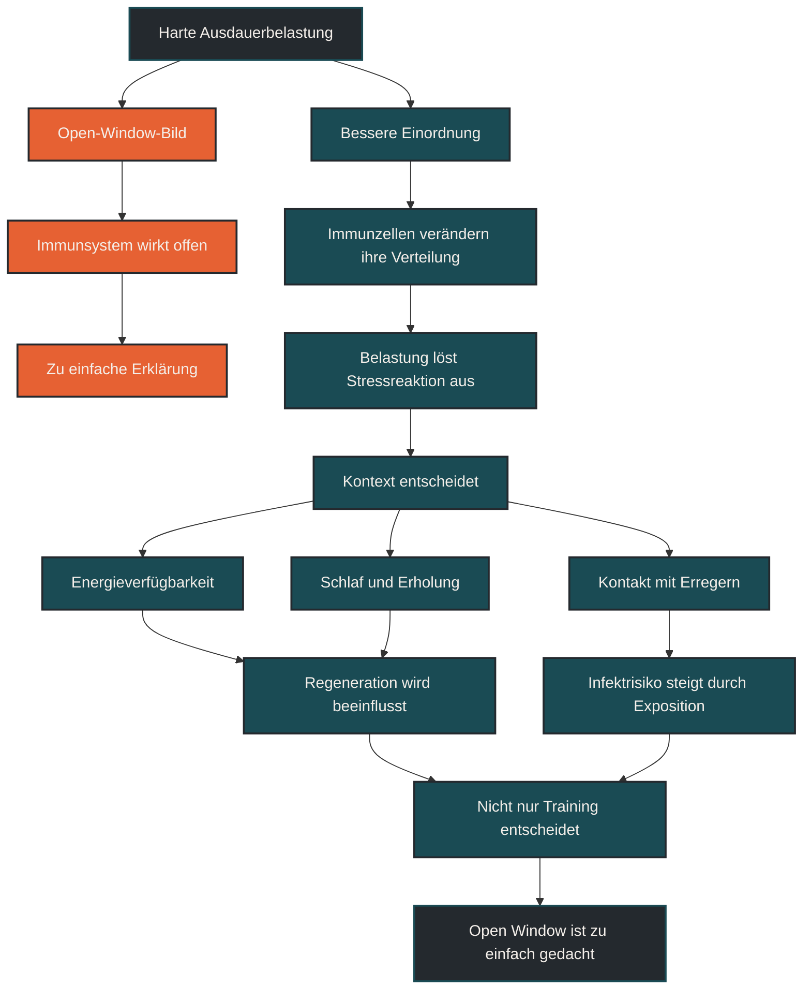

# Open Window ist zu einfach gedacht

Das Open-Window-Modell ist zu einfach gedacht. Nach langen oder sehr intensiven Belastungen verändert sich die Immunaktivität vorübergehend, aber das bedeutet nicht automatisch, dass das Immunsystem einfach „offen“ oder geschwächt ist. Häufig geht es eher um Umverteilung, Aktivierung, Erholung, Energieverfügbarkeit und Gesamtstress. [[1]](#quelle-1) [[2]](#quelle-2) [[3]](#quelle-3)

## Was mit Open Window gemeint ist

Der Open-Window-Effekt beschreibt die Vorstellung, dass nach intensiver oder langer Ausdauerbelastung ein vorübergehendes Zeitfenster entsteht, in dem Infektionen leichter auftreten können. Gemeint ist meist eine Phase nach dem Training, in der bestimmte Immunmarker verändert sind. [[1]](#quelle-1) [[2]](#quelle-2) [[5]](#quelle-5)

Diese Idee war lange sehr einprägsam: Harte Belastung, danach geschwächtes Immunsystem, dann höheres Infektrisiko. Für die Praxis klingt das logisch, ist aber zu grob.

Das Immunsystem arbeitet nicht wie eine Tür, die nach dem Training einfach offensteht. Es besteht aus vielen Zelltypen, Botenstoffen, Geweben und Regulationsmechanismen. Nach Belastung kann sich ihre Verteilung und Aktivität verändern, ohne dass daraus automatisch eine pauschale Schwäche entsteht.

## Warum der Mythos entstanden ist

Der Mythos entstand, weil nach intensiven Ausdauerbelastungen Veränderungen im Blut messbar sind. Manche Immunzellen sinken nach der Belastung vorübergehend im Blut ab. Früher wurde das oft als direkte Immunsuppression interpretiert. [[1]](#quelle-1) [[3]](#quelle-3)

Heute wird diese Interpretation vorsichtiger gesehen. Wenn weniger Immunzellen im Blut gemessen werden, heißt das nicht automatisch, dass sie verschwunden oder funktionslos sind. Sie können auch in Gewebe wandern, dort überwachen, reparieren oder regulieren.

Hinzu kommt: Viele Infekte nach Wettkämpfen oder harten Trainingsphasen entstehen nicht nur durch die einzelne Einheit. Reisen, Schlafmangel, mentale Belastung, Menschenmengen, Kälte, Energiezufuhr, Alkohol, Alltagstress und unzureichende Erholung können ebenfalls eine Rolle spielen.

## Warum Open Window zu einfach ist

Das Open-Window-Modell reduziert ein komplexes System auf eine einfache Ursache-Wirkung-Kette. In Wirklichkeit hängt die Immunreaktion auf Training stark vom Kontext ab. [[1]](#quelle-1) [[2]](#quelle-2) [[3]](#quelle-3)

Eine harte Einheit nach guter Erholung, ausreichender Energiezufuhr und stabilem Schlaf ist anders zu bewerten als dieselbe Einheit nach mehreren stressigen Tagen, wenig Schlaf und zu geringer Kohlenhydrataufnahme. Der Trainingsreiz ist also nicht allein entscheidend.

Auch die Trainingsgewohnheit spielt eine Rolle. Ein gut trainierter Körper reagiert auf Belastung oft anders als ein unvorbereiteter Körper. Regelmäßiges, sinnvoll dosiertes Ausdauertraining kann langfristig immunologisch eher unterstützend wirken, während akute Überlastung und schlechte Regeneration problematisch werden können.

## Zentrale Einflussfaktoren

### Belastungsdauer und Intensität

Lange, sehr harte oder ungewohnte Einheiten erzeugen eine stärkere akute Stressreaktion. Das betrifft unter anderem Hormone, Entzündungsprozesse, Energieverbrauch und Immunzellbewegung. Entscheidend ist aber, ob diese Belastung zur aktuellen Belastbarkeit passt.

### Energieverfügbarkeit

Zu wenig Energie oder zu wenig Kohlenhydrate rund um harte Belastungen können die Stressreaktion verstärken. Das Immunsystem benötigt Energie, Baustoffe und Mikronährstoffe, um gut zu funktionieren. [[2]](#quelle-2) [[4]](#quelle-4)

### Schlaf und Erholung

Schlaf ist ein zentraler Regenerationsfaktor. Wer schlecht schläft, sehr viel trainiert und zusätzlich Alltagsstress hat, erhöht die Gesamtbelastung. Dann kann eine intensive Einheit stärker ins Gewicht fallen.

### Exposition

Infekte entstehen nicht nur durch veränderte Immunmarker, sondern auch durch Kontakt mit Erregern. Wettkämpfe, Reisen, Gruppen, öffentliche Verkehrsmittel oder Menschenmengen können das Risiko unabhängig vom Training erhöhen. [[1]](#quelle-1) [[2]](#quelle-2) [[4]](#quelle-4)

## Bedeutung für Läufer

Für Läufer ist wichtig, das Open-Window-Modell nicht als Panikbild zu verstehen. Eine harte Einheit macht den Körper nicht automatisch schutzlos. Gleichzeitig sollte man intensive Trainings- oder Wettkampfphasen nicht isoliert betrachten.

Nach langen Läufen, Wettkämpfen oder sehr intensiven Blöcken sind einfache Maßnahmen oft sinnvoll: ausreichend essen, trinken, schlafen, warm halten, Stress reduzieren und auf frühe Warnzeichen achten. Das ist keine Angst vor Training, sondern kluge Belastungssteuerung.

Besonders relevant wird das Thema bei mehreren Belastungen gleichzeitig: hoher Trainingsumfang, Kaloriendefizit, wenig Schlaf, Arbeitstress, Reisen oder beginnende Infektsymptome. Dann kann weniger Training kurzfristig sinnvoller sein als zusätzlicher Druck.

## Häufige Fehler

Ein häufiger Fehler ist die Aussage, hartes Ausdauertraining mache das Immunsystem automatisch schwach. Das ist zu pauschal.

Ein zweiter Fehler ist, jede Erkältung nach einem Wettkampf allein dem Training zuzuschreiben. Oft wirken mehrere Faktoren zusammen, darunter Exposition, Schlaf, Stress und Ernährung.

Ein dritter Fehler ist, Warnsignale zu ignorieren. Wenn Müdigkeit, Halsschmerzen, ungewöhnlich hoher Ruhepuls, Krankheitsgefühl oder Leistungseinbruch auftreten, sollte Belastung angepasst werden.

## Praktische Einordnung

Open Window ist als Bild leicht verständlich, aber fachlich zu grob. Besser ist die Vorstellung einer vorübergehenden Immunumverteilung und Stressreaktion, die je nach Kontext gut verarbeitet oder problematisch werden kann. [[1]](#quelle-1) [[3]](#quelle-3)

Für die Praxis zählt nicht die Angst vor einem „offenen Fenster“, sondern die Steuerung der Gesamtbelastung. Training, Schlaf, Energiezufuhr, Infektexposition und Erholung müssen zusammen betrachtet werden.

Der wichtigste Merksatz lautet: Nach harter Belastung ist das Immunsystem nicht einfach offen, sondern in Bewegung.

----

----

## Häufige Fragen zu Open Window ist zu einfach gedacht

### Was bedeutet Open Window einfach erklärt?

Open Window beschreibt die Vorstellung, dass das Immunsystem nach harter Ausdauerbelastung vorübergehend anfälliger wird. Diese Erklärung ist aber zu einfach, weil Immunzellen und Immunfunktionen nicht nur abnehmen, sondern sich auch umverteilen und verändern können.

### Ist das Immunsystem nach hartem Training geschwächt?

Nicht automatisch. Nach intensiver Belastung verändert sich die Immunaktivität. Ob daraus ein Problem entsteht, hängt von Erholung, Schlaf, Energiezufuhr, Stress, Exposition und Trainingszustand ab.

### Warum werden manche Läufer nach Wettkämpfen krank?

Das kann viele Gründe haben. Neben der Belastung spielen auch Reisen, Menschenmengen, Schlafmangel, Kälte, mentale Anspannung, Ernährung und Kontakt mit Erregern eine Rolle.

### Was ist besser als das Open-Window-Bild?

Besser ist die Vorstellung einer vorübergehenden Immunumverteilung. Das Immunsystem ist nach Belastung nicht einfach ausgeschaltet, sondern anders organisiert und mit Reparatur- und Regulationsprozessen beschäftigt.

### Sollte man nach harten Einheiten besonders vorsichtig sein?

Ja, aber ohne Panik. Sinnvoll sind ausreichend Essen und Trinken, Schlaf, warme Kleidung, reduzierte Zusatzbelastung und Aufmerksamkeit für frühe Krankheitssignale.

### Wann sollte Training reduziert werden?

Wenn Krankheitsgefühl, Halsschmerzen, Fieber, ungewöhnliche Müdigkeit, deutlich erhöhter Ruhepuls oder Leistungseinbruch auftreten, sollte Belastung reduziert und bei Bedarf medizinisch abgeklärt werden.

----

## Quellen

### Quelle 1
Campbell, J. P., & Turner, J. E. (2018). Debunking the myth of exercise-induced immune suppression: redefining the impact of exercise on immunological health across the lifespan. *Frontiers in Immunology*, 9, 648.
Quelle: https://pmc.ncbi.nlm.nih.gov/articles/PMC5911985/

### Quelle 2
Nieman, D. C., & Wentz, L. M. (2019). The compelling link between physical activity and the body's defense system. *Journal of Sport and Health Science*, 8(3), 201–217.
Quelle: https://pmc.ncbi.nlm.nih.gov/articles/PMC6523821/

### Quelle 3
Peake, J. M., Neubauer, O., Walsh, N. P., & Simpson, R. J. (2017). Recovery of the immune system after exercise. *Journal of Applied Physiology*, 122(5), 1077–1087.
Quelle: https://pubmed.ncbi.nlm.nih.gov/27909225/

### Quelle 4
Walsh, N. P., Gleeson, M., Shephard, R. J., et al. (2011). Position statement. Part one: immune function and exercise. *Exercise Immunology Review*, 17, 6–63.
Quelle: https://pubmed.ncbi.nlm.nih.gov/21446352/

### Quelle 5
Gleeson, M. (2007). Immune function in sport and exercise. *Journal of Applied Physiology*, 103(2), 693–699.
Quelle: https://pubmed.ncbi.nlm.nih.gov/17303714/

----

*Hinweis: Dieser Artikel dient der allgemeinen Information und ersetzt keine medizinische oder therapeutische Beratung. Mehr dazu im [**Gesundheits- und Quellenhinweis**](/ausdauersport/disclaimer/).*
