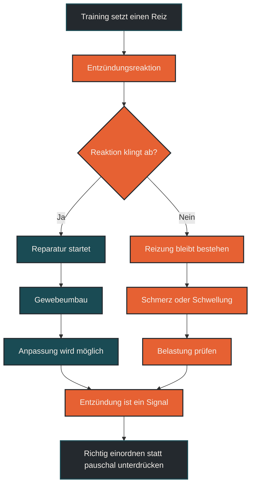

# Entzündung ist nicht immer schlecht

Entzündung ist nicht automatisch schlecht. Nach Training kann eine kontrollierte Entzündungsreaktion Teil von Reparatur, Anpassung und Gewebeumbau sein. Problematisch wird Entzündung vor allem dann, wenn sie zu stark, zu lange, wiederkehrend oder mit Schmerzen, Krankheitssymptomen und schlechter Erholung verbunden ist.

## Was Entzündung bedeutet

Entzündung ist eine Schutz- und Regulationsreaktion des Körpers. Sie kann nach Belastung, Gewebereizung, Infektion oder Verletzung auftreten. Dabei werden Immunzellen, Botenstoffe und Reparaturprozesse aktiviert.

Im Sport wird Entzündung oft negativ verstanden, weil sie mit Schmerz, Schwellung, Müdigkeit oder Verletzung verbunden sein kann. Diese Sicht ist aber zu einfach. Nicht jede Entzündungsreaktion ist ein Problem. Manche Entzündungsprozesse helfen dem Körper, Belastung zu verarbeiten und Gewebe anzupassen.

Entscheidend ist deshalb nicht nur, ob Entzündung vorhanden ist, sondern wie stark sie ist, wie lange sie anhält und in welchem Kontext sie entsteht.

## Warum der Mythos entstanden ist

Der Mythos entsteht, weil Entzündung häufig mit Beschwerden verbunden wird. Wenn etwas weh tut, warm ist, geschwollen wirkt oder schlechter belastbar ist, klingt Entzündung wie etwas, das grundsätzlich unterdrückt werden sollte.

Im Training ist die Lage komplexer. Belastung erzeugt kleine Störungen im Gewebe und im Stoffwechsel. Der Körper reagiert darauf mit Reparatur- und Anpassungsprozessen. Entzündungsbotenstoffe können dabei Signale setzen, damit Umbau, Heilung und Anpassung organisiert werden.

Wer Entzündung immer nur als Feind versteht, übersieht diese Funktion. Training wirkt nicht, weil der Körper ungestört bleibt, sondern weil er auf einen dosierten Reiz reagiert.

## Warum Entzündung nicht immer schlecht ist

Eine akute, kontrollierte Entzündungsreaktion kann sinnvoll sein. Nach intensiven oder ungewohnten Einheiten können Muskeln, Sehnen, Bindegewebe und Immunsystem vorübergehend reagieren. Das kann Teil des normalen Anpassungsprozesses sein.

Diese Reaktion hilft, beschädigte Strukturen zu erkennen, Abbau- und Reparaturprozesse zu starten und das Gewebe langfristig robuster zu machen. Ohne solche Signale wäre Training weniger wirksam.

Problematisch wird es, wenn die Belastung zu groß ist oder die Erholung nicht ausreicht. Dann kann die Entzündungsreaktion nicht sauber abklingen. Aus einem normalen Anpassungssignal kann ein Hinweis auf Überlastung werden.

## Zentrale Einflussfaktoren

### Dosis des Trainingsreizes

Ein sinnvoller Trainingsreiz fordert den Körper, ohne ihn dauerhaft zu überfordern. Zu viel Umfang, zu hohe Intensität oder ungewohnte Belastung können die Entzündungsreaktion verstärken.

### Erholung

Schlaf, Ruhetage, lockere Einheiten und ausreichende Ernährung helfen, Belastungsreaktionen zu verarbeiten. Ohne Erholung kann ein eigentlich sinnvoller Reiz problematisch werden.

### Energieverfügbarkeit

Reparatur und Anpassung brauchen Energie und Baustoffe. Wer dauerhaft zu wenig isst oder nach harten Einheiten schlecht versorgt ist, kann Entzündungs- und Regenerationsprozesse ungünstig beeinflussen.

### Wiederholung ohne Anpassung

Wenn dieselbe gereizte Struktur immer wieder belastet wird, bevor sie sich erholt hat, kann Entzündung länger bestehen bleiben. Das betrifft im Laufsport häufig Sehnen, Knochen, Muskeln und Gelenke.

## Bedeutung für Läufer

Für Läufer ist wichtig, zwischen normaler Belastungsreaktion und Warnsignal zu unterscheiden. Leichte muskuläre Müdigkeit oder Muskelkater nach ungewohnter Belastung kann normal sein. Starke Schmerzen, zunehmende Beschwerden, Schwellung, Hinken oder Leistungseinbruch sollten dagegen ernst genommen werden.

Entzündung ist also kein Grund, Training grundsätzlich zu vermeiden. Sie ist aber ein Signal, das eingeordnet werden muss. Nach harten Einheiten braucht der Körper Zeit, um die Reaktion in Anpassung umzuwandeln.

Wer ständig gegen Müdigkeit, Schmerz oder Reizung trainiert, erhöht das Risiko, dass aus einem Anpassungsreiz eine Überlastung wird.

## Häufige Fehler

Ein häufiger Fehler ist, jede Entzündung sofort als schlecht zu bewerten. Dadurch wird übersehen, dass Training kontrollierte biologische Reaktionen auslösen muss.

Ein zweiter Fehler ist, Entzündung einfach zu ignorieren. Wenn Beschwerden stärker werden oder nicht abklingen, ist das kein normales Trainingszeichen mehr.

Ein dritter Fehler ist, Erholung als passiv oder unwichtig zu betrachten. Gerade in der Erholung wird entschieden, ob aus dem Reiz eine Anpassung wird.

## Praktische Einordnung

Entzündung ist im Ausdauersport weder grundsätzlich gut noch grundsätzlich schlecht. Sie ist ein Regulationssignal. Akut, kontrolliert und passend zur Belastung kann sie Teil der Anpassung sein. Anhaltend, stark oder mit Beschwerden verbunden kann sie ein Warnsignal sein.

Für die Praxis zählt deshalb die Einordnung: Was war der Trainingsreiz? Wie fühlt sich der Körper danach an? Klingt die Reaktion ab? Wird die Belastbarkeit besser oder schlechter?

Der wichtigste Merksatz lautet: Entzündung ist nicht der Gegner, sondern ein Signal, das richtig eingeordnet werden muss.

----

----

## Häufige Fragen zu Entzündung ist nicht immer schlecht

### Ist Entzündung nach Training normal?

Ja, eine leichte und vorübergehende Entzündungsreaktion kann nach Training normal sein. Sie kann Teil von Reparatur, Anpassung und Gewebeumbau sein.

### Wann wird Entzündung problematisch?

Problematisch wird sie, wenn Beschwerden stark sind, länger anhalten, zunehmen oder mit Schwellung, Hinken, Krankheitsgefühl oder Leistungseinbruch verbunden sind.

### Sollte man Entzündung immer unterdrücken?

Nicht pauschal. Entzündung ist auch ein Signal für Reparatur und Anpassung. Ob Maßnahmen sinnvoll sind, hängt vom Kontext, den Beschwerden und der Ursache ab.

### Was hilft bei normaler Belastungsreaktion?

Oft helfen Schlaf, ausreichende Energiezufuhr, lockere Bewegung, reduzierte Belastung und Zeit. Entscheidend ist, dass die Reaktion abklingt und die Belastbarkeit wieder steigt.

### Was ist der Unterschied zwischen Anpassung und Überlastung?

Bei Anpassung klingt die Reaktion ab und der Körper wird belastbarer. Bei Überlastung bleiben Beschwerden bestehen, nehmen zu oder kehren bei ähnlicher Belastung immer wieder zurück.

### Was ist der häufigste Fehler?

Viele bewerten Entzündung entweder immer als schlecht oder ignorieren sie komplett. Sinnvoller ist die Einordnung: akut und kontrolliert kann sie hilfreich sein, anhaltend oder schmerzhaft kann sie ein Warnsignal sein.

----

*Hinweis: Dieser Artikel dient der allgemeinen Information und ersetzt keine medizinische oder therapeutische Beratung. Mehr dazu im [**Gesundheits- und Quellenhinweis**](/ausdauersport/disclaimer/).*

